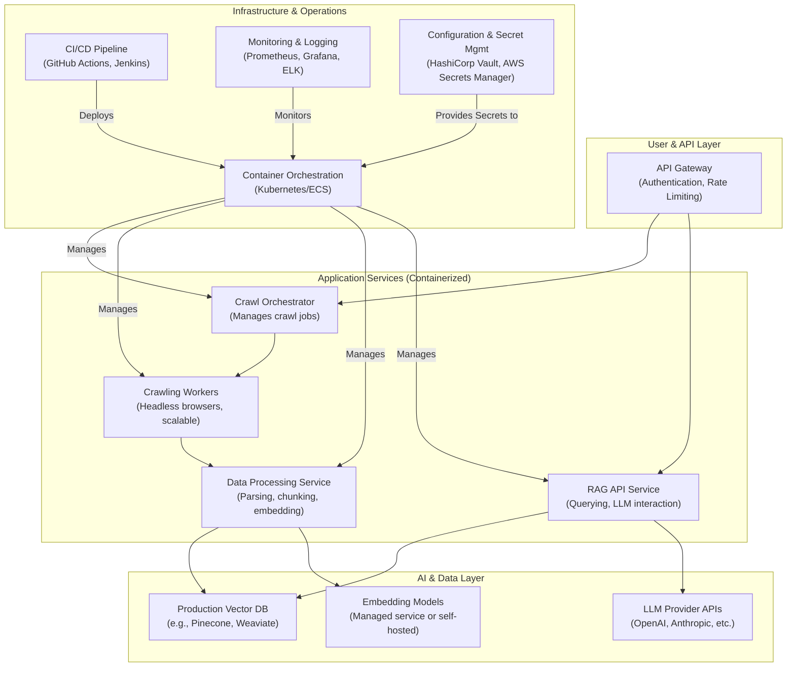

# ADR-0002: V2 System Architecture & Production Readiness Plan

**Date:** 2025-09-24  
**Status:** Proposed

## 1. Context

The Discovery phase for the HX Data Ingestion Project has concluded. The As-Is analysis of the `Crawl4AI` prototype, documented in the `2025-09-24--tech-stack--as-is.md`, has identified critical gaps in production readiness, scalability, security, and operational maturity. This document outlines the architectural decisions and the strategic plan to address these gaps in the upcoming V2 Design and Implementation phase.

The primary goal of V2 is to evolve the prototype into a robust, scalable, and secure production system while retaining the core strengths of the original design.

## 2. Decision

We will adopt a phased approach to re-architect the `Crawl4AI` system for production. The V2 architecture will be based on a containerized, microservices-oriented design, with a strong emphasis on security, scalability, and operational excellence. The following key architectural changes will be implemented:

1.  **Dependency Reduction & Core Library Development:** The existing 204 dependencies will be audited, and a minimal, curated set of core dependencies will be selected. Custom libraries will be developed to replace non-essential third-party packages.

2.  **Security-First Design:** A comprehensive security framework will be integrated, including robust authentication and authorization, data-at-rest and data-in-transit encryption, and centralized secret management.

3.  **Scalable, Distributed Architecture:** The monolithic prototype will be decomposed into a set of containerized microservices. A production-grade vector database will replace ChromaDB, and the system will be designed for horizontal scaling.

4.  **Operational Maturity:** The V2 system will include comprehensive monitoring, logging, and alerting. A CI/CD pipeline will be established for automated testing and deployment.

## 3. V2 Architecture Blueprint

## 4. Implementation Plan & Priorities

The V2 development will be divided into four main workstreams, aligned with the recommendations from the tech stack analysis.

### **Workstream 1: Core System & Dependency Optimization**

*   **Objective:** Reduce complexity and improve maintainability.
*   **Key Actions:**
    1.  Audit all 204 dependencies and categorize them as `core`, `dev`, or `unnecessary`.
    2.  Define a target dependency list of < 50 `core` packages.
    3.  Refactor the codebase to remove reliance on `unnecessary` packages.
    4.  Develop internal libraries for specialized functions where appropriate.

### **Workstream 2: Security & Compliance Hardening**

*   **Objective:** Implement a production-grade security posture.
*   **Key Actions:**
    1.  Integrate an API Gateway with authentication (e.g., OAuth 2.0) and rate limiting.
    2.  Implement `robots.txt` compliance and a configurable crawl-delay mechanism.
    3.  Encrypt all sensitive data, both in transit (TLS) and at rest (database encryption).
    4.  Integrate a centralized secret management solution (e.g., HashiCorp Vault).

### **Workstream 3: Scalability & Performance**

*   **Objective:** Ensure the system can handle production-level workloads.
*   **Key Actions:**
    1.  Select and provision a production-grade, managed vector database.
    2.  Containerize all application services using Docker.
    3.  Design for horizontal scaling using a container orchestration platform.
    4.  Implement connection pooling, caching strategies, and resource limits.

### **Workstream 4: Operations & Observability**

*   **Objective:** Enable proactive monitoring and management of the system.
*   **Key Actions:**
    1.  Implement structured logging across all services.
    2.  Integrate with a monitoring stack (e.g., Prometheus, Grafana) for metrics and dashboards.
    3.  Define and implement health check endpoints for all services.
    4.  Establish a CI/CD pipeline for automated builds, testing, and deployments.

## 5. Consequences

*   **Positive:**
    *   The V2 system will be significantly more scalable, secure, and reliable.
    *   Reduced operational overhead due to automation and improved observability.
    *   Improved developer experience through a cleaner, more modular codebase.
    *   The system will be fully prepared for production deployment and future feature enhancements.

*   **Negative:**
    *   The transition to a microservices architecture will introduce new complexities in development, testing, and deployment.
    *   Increased infrastructure costs associated with container orchestration and managed services.
    *   A significant engineering effort will be required to implement the V2 architecture.

