# Citadel Demo Architecture: As-Is to To-Be Mapping

**Purpose:** Detailed mapping between prototype "as-is" and Citadel demo "to-be" architecture  
**Scope:** Demo-focused changes only, not production architecture  
**Phase:** Explore (Demo Development)

## Architecture Mapping Overview

| **Layer** | **As-Is (Prototype)** | **To-Be (Citadel Demo)** | **Change Type** |
|-----------|----------------------|--------------------------|-----------------|
| **Product Identity** | Unnamed prototype | **Citadel** branded demo | **NEW** |
| **User Interface** | Basic Streamlit | Polished Citadel UI | **MODIFY** |
| **Core Logic** | Functional modules | Demo-optimized modules | **MODIFY** |
| **Data Storage** | ChromaDB local | ChromaDB local (demo) | **KEEP** |
| **Dependencies** | 204 packages | 204 packages (demo-safe) | **KEEP** |
| **Deployment** | Development setup | Demo deployment package | **NEW** |

## Detailed Component Mapping

### **1. Application Layer**

#### **User Interface (Streamlit App)**
```
AS-IS: prototype/crawl4ai/app/streamlit_app.py
├── Basic chat interface
├── Generic prototype branding
├── Development-focused UI
├── No feedback collection
└── Minimal error handling

TO-BE: Citadel Demo Interface
├── Consistent "Citadel" branding throughout
├── Polished demo-appropriate styling
├── Clear value proposition messaging
├── Built-in feedback collection forms
├── Demo progress indicators
├── Stakeholder-friendly navigation
├── Pre-configured demo scenarios
└── Usage analytics capture
```

**Changes Required:**
- **Brand Identity:** Replace all references with "Citadel" branding
- **UI Polish:** Improve styling for stakeholder presentations
- **Feedback Mechanisms:** Add feedback forms and usage tracking
- **Demo Scenarios:** Pre-configured datasets and example queries
- **Error Handling:** Basic error handling to prevent demo crashes

#### **Command Line Interface**
```
AS-IS: Direct script execution
├── python examples/1-crawl_single_page.py
├── python src/doc_ingest.py
├── Development-focused commands
└── No demo packaging

TO-BE: Citadel Demo CLI
├── citadel-demo start
├── citadel-demo setup
├── citadel-demo reset
├── Demo-focused commands
└── Simple deployment scripts
```

**Changes Required:**
- **Demo Commands:** Create simple demo management commands
- **Setup Scripts:** One-command demo environment setup
- **Documentation:** Clear demo deployment instructions

### **2. Business Logic Layer**

#### **RAG Agent (rag_agent.py)**
```
AS-IS: prototype/crawl4ai/src/rag_agent.py
├── Functional RAG pipeline
├── OpenAI client integration
├── Basic query processing
├── Print-based logging
└── Development error handling

TO-BE: Citadel RAG Agent
├── Same functional RAG pipeline (KEEP)
├── Demo-appropriate response formatting
├── Progress indicators for demo
├── Basic logging for troubleshooting
├── Demo scenario optimization
└── Feedback collection integration
```

**Changes Required:**
- **Response Formatting:** Optimize responses for demo presentation
- **Progress Tracking:** Add progress indicators for demo flow
- **Demo Scenarios:** Optimize for common demo queries
- **Basic Logging:** Simple logging for demo troubleshooting

#### **Document Ingestion (doc_ingest.py)**
```
AS-IS: prototype/crawl4ai/src/doc_ingest.py
├── Monolithic ingestion module
├── Direct ChromaDB integration
├── Basic error handling
├── Print-based status updates
└── Development-focused processing

TO-BE: Citadel Ingestion Module
├── Same core functionality (KEEP)
├── Demo progress indicators
├── Network timeout/retry (CRITICAL FIX)
├── Basic error handling for demos
├── Pre-configured demo datasets
└── Collection naming for demos
```

**Changes Required:**
- **Network Resilience:** Add timeout/retry for reliable demos (BL-003)
- **Progress Indicators:** Show crawling progress during demos
- **Demo Datasets:** Pre-configured demo content sources
- **Error Handling:** Prevent demo crashes from network issues

#### **Utilities (utils.py)**
```
AS-IS: prototype/crawl4ai/src/utils.py
├── ChromaDB integration functions
├── Basic CRUD operations
├── Broad exception handling
├── Development-focused logging
└── Hardcoded configurations

TO-BE: Citadel Utilities
├── Same ChromaDB integration (KEEP)
├── Demo collection management
├── Basic error handling for demos
├── Demo-appropriate logging
└── Demo configuration management
```

**Changes Required:**
- **Collection Management:** Demo-friendly collection naming
- **Error Handling:** Basic improvements for demo reliability
- **Configuration:** Demo-specific configuration options

### **3. Framework & Infrastructure Layer**

#### **Dependencies (requirements.txt)**
```
AS-IS: 204 dependencies (~2.5GB)
├── torch==2.7.0 (2.1GB)
├── Full ML/AI stack
├── Development tools
├── All optional dependencies
└── Unoptimized for deployment

TO-BE: Same 204 dependencies (DEMO CONSTRAINT)
├── Keep current dependency structure
├── Document known issues for future
├── Ensure demo-safe installation
├── Add dependency documentation
└── Defer optimization to post-demo
```

**Changes Required:**
- **Documentation:** Document dependency constraints
- **Installation Guide:** Demo-specific setup instructions
- **Known Issues:** Document dependency-related demo limitations

#### **Data Storage (ChromaDB)**
```
AS-IS: Local ChromaDB storage
├── chromadb==1.0.7
├── Local file storage
├── Single-user access
├── Development persistence
└── No backup/restore

TO-BE: Demo ChromaDB
├── Same ChromaDB version (KEEP)
├── Demo collection organization
├── Pre-populated demo data
├── Demo reset capabilities
└── Simple backup for demos
```

**Changes Required:**
- **Demo Collections:** Organized demo datasets
- **Pre-population:** Sample data for immediate demo
- **Reset Capability:** Quick demo environment reset

### **4. Deployment & Operations Layer**

#### **Development Environment**
```
AS-IS: Local development setup
├── Manual dependency installation
├── Local file storage
├── Development configuration
├── No deployment packaging
└── Developer-focused documentation

TO-BE: Citadel Demo Package
├── One-command setup script
├── Demo environment configuration
├── Deployment documentation
├── Demo troubleshooting guide
└── Stakeholder-friendly setup
```

**Changes Required:**
- **Setup Automation:** Single-command demo deployment
- **Documentation:** Stakeholder-friendly setup guide
- **Configuration:** Demo-specific environment settings
- **Troubleshooting:** Common demo issue resolution

## Critical Demo Fixes Required

### **High Priority (Demo Blocking)**

#### **BL-003: Network Timeout/Retry**
```
AS-IS: requests.get() calls without timeouts
├── Can hang indefinitely
├── No retry logic
├── Demo reliability risk
└── Silent failures possible

TO-BE: Demo-safe network calls
├── 30-second timeouts
├── 3-retry attempts
├── Graceful failure handling
└── Demo continuation capability
```

#### **BL-005: Error Handling**
```
AS-IS: Silent failures with success exit codes
├── Scripts can fail silently
├── No error propagation
├── Demo crash risk
└── Difficult troubleshooting

TO-BE: Demo-appropriate error handling
├── Visible error messages
├── Graceful degradation
├── Demo continuation where possible
└── Clear error reporting
```

### **Medium Priority (Demo Enhancement)**

#### **BL-006: Structured Logging**
```
AS-IS: Print statements only
├── print() for all output
├── No log levels
├── No structured data
└── Difficult troubleshooting

TO-BE: Basic demo logging
├── Simple logging setup
├── Demo troubleshooting info
├── Progress indicators
└── Error tracking
```

## Demo Architecture Diagram

```mermaid
graph TB
    subgraph "Citadel Demo Interface"
        UI["🏰 Citadel Streamlit UI<br/>• Branded interface<br/>• Feedback forms<br/>• Demo scenarios"]
        CLI["⚡ Demo CLI<br/>• citadel-demo commands<br/>• Setup automation"]
    end

    subgraph "Demo Business Logic"
        RAG["🧠 RAG Agent<br/>• Same core logic<br/>• Demo formatting<br/>• Progress tracking"]
        INGEST["📥 Ingestion Module<br/>• Network resilience<br/>• Demo datasets<br/>• Progress indicators"]
        UTILS["🔧 Utilities<br/>• Demo collections<br/>• Basic error handling"]
    end

    subgraph "Demo Infrastructure"
        CHROME["💾 ChromaDB (Local)<br/>• Demo collections<br/>• Pre-populated data<br/>• Reset capability"]
        DEPS["📦 Dependencies (204)<br/>• Same as prototype<br/>• Demo-safe install<br/>• Documented constraints"]
    end

    subgraph "Demo Deployment"
        SETUP["🚀 Setup Scripts<br/>• One-command deploy<br/>• Demo configuration"]
        DOCS["📚 Demo Documentation<br/>• Stakeholder guide<br/>• Troubleshooting"]
    end

    UI --> RAG
    UI --> INGEST
    CLI --> SETUP
    RAG --> UTILS
    INGEST --> UTILS
    UTILS --> CHROME
    SETUP --> DEPS
    SETUP --> CHROME
```



## Implementation Priority

### **Phase 1: Core Demo Functionality**
1. **Citadel Branding:** Update all UI references and messaging
2. **Critical Fixes:** Network timeout/retry, basic error handling
3. **Demo Scenarios:** Pre-configured datasets and queries

### **Phase 2: Demo Polish**
1. **UI Enhancement:** Progress indicators, feedback forms
2. **Deployment Package:** Setup scripts and documentation
3. **Demo Management:** Reset capabilities, troubleshooting

### **Phase 3: Feedback Collection**
1. **Analytics Integration:** Usage tracking and feedback capture
2. **Stakeholder Materials:** Presentation deck and demo script
3. **Demo Optimization:** Based on initial feedback sessions

## Success Metrics

- **Demo Reliability:** 95% successful demo completion rate
- **Setup Time:** <10 minutes from zero to working demo
- **Demo Duration:** 15-20 minutes for complete workflow demonstration
- **Feedback Collection:** Structured feedback from 5+ stakeholder sessions

---

**Note:** This mapping maintains demo focus while preserving the prototype's functional capabilities. All production architecture concerns are deferred to post-demo phases.
