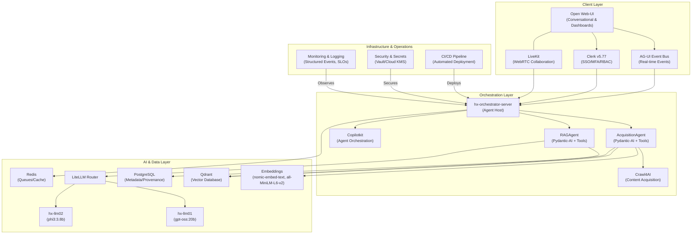

# ADR-0002: V2 System Architecture & Production Readiness Plan (Updated)

**Date:** 2025-09-25  
**Status:** Proposed  
**Supersedes:** Discovery/2025-09-24--v2-design-plan--adr.md

## 1. Context

The Discovery phase for the HX Data Ingestion Project has concluded with comprehensive analysis of the Crawl4AI prototype. The As-Is analysis identified critical gaps in production readiness, scalability, security, and operational maturity. This updated ADR incorporates stakeholder feedback and aligns with the agent-first development approach and confirmed technology stack decisions for Citadel V2.

The primary goal of V2 is to evolve the prototype into a robust, scalable, and secure production system while implementing an agent-first architecture with event-driven user experience and enterprise-grade integrations.

## 2. Decision

We will adopt a phased approach to re-architect the Crawl4AI system for production as **Citadel**. The V2 architecture will be based on an agent-first, event-driven design with confirmed technology stack components, emphasizing security, scalability, and operational excellence.

### **Key Architectural Decisions**

**Technology Stack Confirmations:**
- **Vector Database:** Qdrant (managed/self-hosted) for production scalability and cost control
- **LLM Router:** LiteLLM providing unified interface to hx-llm01/hx-llm02 inference servers
- **Authentication:** Clerk v5.77 with SSO/MFA/RBAC and tenant scoping
- **Real-Time Communication:** LiveKit for WebRTC voice/video/data collaboration
- **Event Architecture:** AG-UI Event Bus for real-time UX and provenance tracking
- **Web UI:** Open Web-UI replacing Streamlit for production user experience

**Architectural Principles:**
1. **Agent-First Design:** Pydantic-AI agents with typed tools, not standalone microservices
2. **Event-Driven UX:** AG-UI events power real-time progress, provenance, and observability
3. **Security-by-Design:** Comprehensive security framework with tenant isolation
4. **Production Readiness:** Enterprise-grade monitoring, logging, and operational tooling

## 3. V2 Architecture Blueprint

## 4. Agent-First Architecture Components

### **Core Agents & Tools**
- **AcquisitionAgent:** Orchestrates data ingestion using specialized tools (crawl, chunk, embed, upsert)
- **RAGAgent:** Handles query processing and response generation with provenance tracking
- **Tool Interfaces:** ICrawler, IEmbedder, IVectorStore, IRetriever following SOLID principles

### **Event-Driven Communication**
**AG-UI Event Schema:**
| Event Type | Purpose | Key Fields |
|------------|---------|------------|
| AcquisitionStarted | Job initiation | job_id, source, type, timestamp |
| AcquisitionProgress | Real-time updates | job_id, percent_complete, stage |
| AcquisitionCompleted | Job completion | job_id, total_docs, duration, success_rate |
| QueryIssued | Query processing | query_id, collection, parameters |
| QueryResponse | Answer delivery | query_id, answer, sources, confidence |

### **Enhanced RAG Pipeline**
- **Hybrid Search:** BM25 + dense vector search for improved precision
- **Cross-Collection Queries:** Unified relevance ranking across multiple collections
- **Recency Bias:** Time-aware retrieval prioritizing recent content
- **Provenance-First Responses:** Complete source tracking and confidence scoring
- **Feedback Loops:** User ratings feeding back into retrieval and ranking

## 5. Implementation Plan & Workstreams

### **Workstream 1: Core System & Dependency Optimization**
**Objective:** Implement agent-first architecture with SOLID principles

**Key Actions:**
1. Convert five example scripts to agent tools with typed interfaces
2. Implement ICrawler, IEmbedder, IVectorStore interfaces for dependency injection
3. Reduce 204 dependencies to < 50 core packages through systematic audit
4. Develop internal libraries for specialized Citadel functions

**Agent-First Deliverables:**
- AcquisitionAgent with tool composition capabilities
- RAGAgent with hybrid search and provenance tracking
- Tool interface implementations supporting testing and extensibility

### **Workstream 2: Security & Compliance Hardening**
**Objective:** Implement enterprise-grade security with tenant isolation

**Key Actions:**
1. Integrate Clerk v5.77 with SSO/MFA/RBAC and tenant-scoped tokens
2. Implement collection-level RBAC with audit trail
3. Enforce robots.txt compliance and domain allow/deny lists
4. Integrate secrets management via Vault/Cloud KMS

**Security Framework:**
- Multi-factor authentication required for all user accounts
- Tenant-scoped JWT tokens with time-based expiration
- Collection-level permissions with fine-grained access control
- PII redaction policies and consent management

### **Workstream 3: Scalability & Performance**
**Objective:** Achieve production-scale performance with confirmed technology stack

**Key Actions:**
1. Provision Qdrant with optimized HNSW parameters and shard planning
2. Implement LiteLLM router with rate limits and failover to hx-llm01/02
3. Deploy Redis queues for acquisition job management with back-pressure
4. Establish horizontal scaling patterns for orchestration services

**Performance Targets:**
- Retrieval P95 ≤ 2.0s (excluding token streaming)
- Acquisition progress events ≤ 500ms end-to-end
- Support ≥ 200 RPS retrieval queries per cluster
- Handle ≥ 10 concurrent acquisition operations

### **Workstream 4: Operations & Observability**
**Objective:** Enable proactive monitoring with event-driven dashboards

**Key Actions:**
1. Implement AG-UI event dashboards showing acquisition stages and provenance KPIs
2. Establish SLO monitoring with burn-rate alerts for availability targets
3. Deploy structured logging with tenant and collection IDs on every entry
4. Create CI gates for schema and event compatibility validation

**Observability Framework:**
- Core API availability ≥ 99.9%
- Event bus availability ≥ 99.95%
- Distributed tracing with job_id correlation across services
- Per-stage metrics (docs/min, tokens/sec, vector upserts/sec)

## 6. Non-Functional Requirements

### **Performance & Scalability**
- **Retrieval Latency:** P95 ≤ 2.0 seconds (excluding token streaming)
- **Event Latency:** Acquisition progress events ≤ 500ms end-to-end
- **Throughput:** ≥ 200 RPS retrieval queries, ≥ 10 concurrent acquisitions
- **Availability:** Core APIs ≥ 99.9%, Event bus ≥ 99.95%

### **Security & Compliance**
- **Authentication:** Multi-factor authentication with enterprise SSO integration
- **Authorization:** Collection-level RBAC with tenant isolation
- **Data Protection:** Encryption at rest and in transit, PII redaction capabilities
- **Audit:** Immutable audit logs with complete provenance tracking

### **Operational Excellence**
- **Monitoring:** Real-time dashboards with SLO burn-rate alerting
- **Deployment:** Automated CI/CD with feature flags and canary releases
- **Recovery:** Mean time to recovery ≤ 15 minutes for critical issues
- **Scalability:** Horizontal scaling support for all services

## 7. Migration Strategy

### **Phase 1: Foundation (Weeks 1-4)**
- Establish hx-orchestrator-server with basic agent framework
- Implement Clerk authentication integration
- Deploy AG-UI event bus with core event types
- Migrate from Streamlit to Open Web-UI foundation

### **Phase 2: Agent Implementation (Weeks 5-8)**
- Deploy AcquisitionAgent with tool interfaces
- Implement RAGAgent with hybrid search capabilities
- Integrate Qdrant with PostgreSQL metadata storage
- Establish LiteLLM routing to hx-llm01/02

### **Phase 3: Production Hardening (Weeks 9-12)**
- Complete security framework implementation
- Deploy comprehensive monitoring and alerting
- Implement performance optimization and caching
- Establish operational runbooks and recovery procedures

## 8. Technology Decision Records

### **ADR-A: Vector Database = Qdrant (Accepted)**
**Rationale:** Production scalability, advanced filtering capabilities, cost control compared to managed services like Pinecone

### **ADR-B: LLM Router = LiteLLM (Accepted)**
**Rationale:** Unified interface, load balancing, failover capabilities, integration with hx-llm infrastructure

### **ADR-C: UX Bus = AG-UI (Accepted)**
**Rationale:** Real-time user experience, provenance tracking, event-driven architecture support

### **ADR-D: Authentication = Clerk v5.77 (Accepted)**
**Rationale:** Enterprise SSO/MFA/RBAC, tenant scoping, comprehensive audit capabilities

### **ADR-E: Real-Time Communication = LiveKit (Accepted)**
**Rationale:** WebRTC collaboration, voice/video integration, data channel synchronization

## 9. Success Criteria & Validation

### **Technical Validation**
- All performance targets met in load testing
- Security framework passes penetration testing
- Agent-first architecture demonstrates composability and extensibility
- Event-driven UX provides real-time feedback with < 500ms latency

### **Operational Validation**
- SLO compliance demonstrated over 30-day period
- Automated deployment pipeline with zero-downtime releases
- Monitoring and alerting system catches issues before user impact
- Recovery procedures tested and documented

### **User Experience Validation**
- Stakeholder feedback demonstrates improved usability over prototype
- Real-time progress indicators enhance user confidence
- Provenance tracking provides transparency and trust
- Multi-tenant capabilities support organizational scaling

## 10. Consequences

### **Positive Outcomes**
- **Agent-First Architecture:** Enables natural language interfaces and composable workflows
- **Event-Driven UX:** Provides real-time feedback and comprehensive provenance tracking
- **Production Readiness:** Enterprise-grade security, monitoring, and operational capabilities
- **Technology Alignment:** Confirmed stack reduces integration risk and enables HX-Infrastructure synergies

### **Challenges & Mitigations**
- **Complexity Management:** Agent-first patterns require developer training and documentation
- **Event System Reliability:** AG-UI event bus becomes critical path requiring high availability design
- **Multi-Tenant Security:** Tenant isolation requires careful implementation and testing
- **Performance Optimization:** Hybrid search and real-time events require careful tuning

### **Risk Mitigation**
- **Phased Implementation:** Gradual migration reduces risk and enables learning
- **Comprehensive Testing:** Unit, integration, and load testing at each phase
- **Operational Readiness:** Monitoring and alerting deployed before production traffic
- **Rollback Capabilities:** Feature flags and deployment automation enable rapid recovery

---

**Document Control**
- **Created:** 2025-09-25
- **Supersedes:** Discovery/2025-09-24--v2-design-plan--adr.md
- **Status:** Proposed for Explore phase validation
- **Next Review:** Upon completion of technical architecture specification
