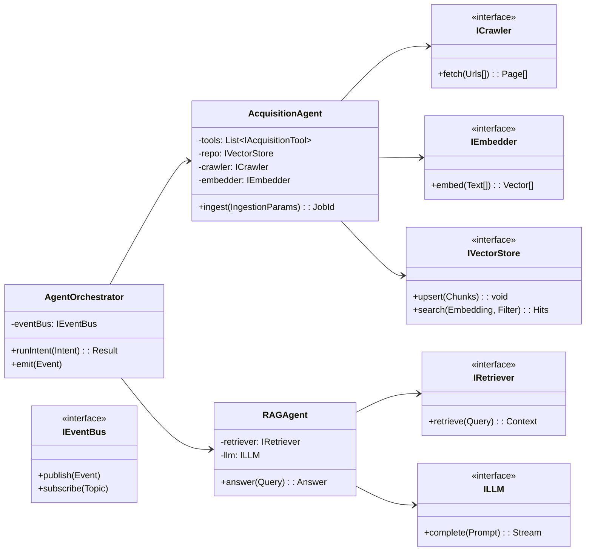

# Citadel Agent-First Development Approach

**Document Purpose:** Define the agent-first development methodology that guides Citadel's architecture, implementation patterns, and operational practices at component (L3) and code (L4) levels.

**Scope:** Technical development approach, architectural patterns, and implementation guidelines for Citadel V2 development.

## 1. Development Philosophy & Approach

### **Agent-First Paradigm**
Citadel adopts an agent-first development approach where capabilities are systematically exposed as typed tools built on top of Pydantic-AI agents. This architectural decision enables sophisticated interaction patterns while maintaining clean separation of concerns and testability.

**Core Interaction Patterns:**
- **Agent-to-Agent Collaboration:** Orchestrated pipelines with tool chaining capabilities for complex workflows
- **Human-to-Agent Interaction:** Natural language interfaces through AG-UI event streaming and Open Web-UI conversational interfaces
- **System Integration:** Event-driven architecture with progress tracking and provenance management

**Benefits of Agent-First Design:**
- **Natural Language Interfaces:** Business actions expressed as intents rather than technical commands
- **Composable Architecture:** Tools can be combined and orchestrated for complex workflows
- **Testability:** Clear interfaces and dependency injection enable comprehensive testing strategies
- **Extensibility:** New capabilities can be added as tools without modifying existing agents

### **SOLID Design Principles**
The agent-first approach is grounded in SOLID object-oriented design principles that ensure maintainable, extensible, and testable code.

**Principle Application:**
- **Single Responsibility:** Each tool performs one specific function (crawl, chunk, embed, store)
- **Open/Closed:** New tools (e.g., PDF ingestion) can be added without modifying existing agents
- **Liskov Substitution:** Interface implementations can be swapped (Qdrant → mock) without breaking callers
- **Interface Segregation:** Separate interfaces (ICrawler, IEmbedder, IVectorStore) prevent fat client dependencies
- **Dependency Inversion:** Agents depend on interfaces with implementations injected at runtime

## 2. Architectural Principles & Guidelines

### **Event-Driven Architecture**
Citadel implements a comprehensive event-driven architecture that decouples components and enables real-time user experience.

**Event Categories:**
- **Acquisition Events:** AcquisitionStarted, AcquisitionProgress, AcquisitionCompleted, AcquisitionError
- **Query Events:** QueryIssued, QueryResponse with provenance and confidence metadata
- **System Events:** CollectionCreated, CollectionUpdated, DocumentFetched, ChunkEmbedded

**Event Benefits:**
- **Reduced Coupling:** UI and systems react to events rather than direct API calls
- **Real-Time Updates:** Progress indicators and status updates stream to users
- **Audit Trail:** Complete event history provides comprehensive system observability
- **Scalability:** Event-driven patterns support horizontal scaling and load distribution

### **Contract-Based Integration**
All system interactions are governed by explicit contracts that ensure compatibility and enable independent component evolution.

**Contract Types:**
- **Data Contracts:** Pydantic models for AcquisitionJob, Chunk, Provenance, Query, Answer
- **API Contracts:** REST/gRPC interfaces with OpenAPI specifications
- **Event Contracts:** Versioned event schemas with backward compatibility guarantees
- **Security Contracts:** Every interaction carries tenant_id, roles, scopes, and collection context

### **Security-by-Design Framework**
Security considerations are integrated into every architectural decision and implementation pattern.

**Security Integration Points:**
- **Identity Management:** Clerk-backed authentication with SSO, MFA, and RBAC
- **Token Management:** Tenant-scoped JWT tokens with time-based expiration
- **Collection Security:** Fine-grained permissions with audit trail
- **Data Protection:** Encryption at rest and in transit with PII redaction capabilities

## 3. Component Architecture (L3)

### **System Component Overview**
The L3 architecture defines clear component boundaries and responsibilities within the distributed system.

```mermaid
graph TD
    subgraph Client_Layer
        UI[Open Web-UI]
        AG[AG-UI Event Bus]
        Clerk[Clerk Auth]
        LK[LiveKit RTC]
    end

    subgraph Orchestration_Layer
        ORCH[hx-orchestrator-server]
        AGEN[Agents: Acquisition & RAG]
        COP[Copilotkit]
        C4AI[Crawl4AI]
    end

    subgraph Data_Model_Layer
        QD[Qdrant]
        PG[PostgreSQL]
        RD[Redis]
        LLM[LiteLLM Router]
        L1[hx-llm01]
        L2[hx-llm02]
        EMB[Embeddings]
    end

    subgraph Observability_Layer
        OBS[Logs|Metrics|Traces]
    end

    UI --> AG
    UI --> Clerk
    UI --- LK

    AG --> ORCH
    Clerk --> ORCH
    LK --> ORCH

    ORCH --> AGEN
    AGEN --> C4AI
    AGEN --> EMB
    ORCH --> LLM
    AGEN --> QD
    AGEN --> PG
    ORCH --> RD

    LLM --> L1
    LLM --> L2

    ORCH --> OBS
    AGEN --> OBS
    QD --> OBS
    L1 --> OBS
    L2 --> OBS
    AG --> OBS
```

### **Component Responsibilities**
Each component has clearly defined responsibilities that support the overall system architecture.

**Client Layer Components:**
- **Open Web-UI:** Provides conversational retrieval interfaces, system dashboards, and collection management capabilities
- **AG-UI Event Bus:** Streams real-time events (progress, results, errors) between backend services and user interfaces
- **Clerk Authentication:** Manages authentication and authorization with SSO, MFA, and RBAC capabilities
- **LiveKit RTC:** Enables optional real-time communication for voice, video, and data collaboration

**Orchestration Layer Components:**
- **hx-orchestrator-server:** Central hub hosting agents, scheduling jobs, and enforcing policy and tenancy controls
- **Agents (Acquisition & RAG):** Domain-specific agents that encapsulate business logic for ingestion, chunking, embedding, retrieval, and answer generation
- **Crawl4AI:** Specialized framework for fetching and normalizing content at scale with parallel processing capabilities
- **Copilotkit:** Agent orchestration framework for complex multi-step workflows

**Data & Model Layer Components:**
- **Qdrant:** Production vector database providing scalable vector storage with metadata filtering and search capabilities
- **PostgreSQL:** Relational database managing metadata, job tracking, provenance records, and audit logs
- **Redis:** In-memory data store supporting queues, rate limiting, and ephemeral caching
- **LiteLLM Router:** Unified interface for multiple LLM providers with load balancing and failover
- **LLM Hosts (hx-llm01/02):** Dedicated inference servers providing gpt-oss:20b and phi3:3.8b model access
- **Embeddings Service:** Specialized service providing text-to-vector conversion using nomic-embed-text and all-MiniLM-L6-v2 models

## 4. Implementation Patterns (L4)

### **Class Design & Interface Architecture**
The L4 design implements clean interfaces and dependency injection patterns that support testing and extensibility.



### **Implementation Template Patterns**
Core implementation patterns demonstrate how SOLID principles are applied in practice.

**Interface Definition Pattern:**
```python
class IVectorStore(Protocol):
    """Vector storage interface supporting upsert and search operations."""
    def upsert(self, chunks: list[Chunk]) -> None:
        """Store vector chunks with metadata."""
        ...
    
    def search(self, embedding: Vector, filter_params: dict) -> list[Hit]:
        """Perform similarity search with metadata filtering."""
        ...
```

**Agent Implementation Pattern:**
```python
class AcquisitionAgent:
    """Agent responsible for data acquisition workflows."""
    
    def __init__(self, 
                 crawler: ICrawler, 
                 embedder: IEmbedder, 
                 store: IVectorStore, 
                 events: IEventBus):
        self.crawler = crawler
        self.embedder = embedder
        self.store = store
        self.events = events
    
    async def ingest(self, params: IngestionParams) -> str:
        """Execute complete data acquisition workflow."""
        job_id = generate_job_id()
        
        # Emit start event
        self.events.publish(AcquisitionStarted(job_id, params))
        
        try:
            # Fetch content
            pages = await self.crawler.fetch(
                [params.url], 
                depth=params.depth, 
                mode=params.mode
            )
            
            # Process content
            chunks = chunker.by_headers(pages)
            vectors = await self.embedder.embed([c.text for c in chunks])
            
            # Store results
            self.store.upsert(attach_metadata(chunks, vectors, params.collection))
            
            # Emit completion event
            stats = calculate_stats(pages, chunks)
            self.events.publish(AcquisitionCompleted(job_id, stats))
            
            return job_id
            
        except Exception as e:
            self.events.publish(AcquisitionError(job_id, str(e)))
            raise
```

### **Dependency Injection & Testing**
The architecture supports comprehensive testing through dependency injection and interface-based design.

**Test Implementation Pattern:**
```python
class TestAcquisitionAgent:
    """Test suite demonstrating dependency injection for testing."""
    
    def setup_method(self):
        """Setup test dependencies with mocks."""
        self.mock_crawler = Mock(spec=ICrawler)
        self.mock_embedder = Mock(spec=IEmbedder)
        self.mock_store = Mock(spec=IVectorStore)
        self.mock_events = Mock(spec=IEventBus)
        
        self.agent = AcquisitionAgent(
            self.mock_crawler,
            self.mock_embedder,
            self.mock_store,
            self.mock_events
        )
    
    async def test_successful_ingestion(self):
        """Test complete ingestion workflow."""
        # Setup mock responses
        self.mock_crawler.fetch.return_value = [mock_page]
        self.mock_embedder.embed.return_value = [mock_vector]
        
        # Execute
        job_id = await self.agent.ingest(mock_params)
        
        # Verify interactions
        self.mock_events.publish.assert_any_call(
            AcquisitionStarted(job_id, mock_params)
        )
        self.mock_store.upsert.assert_called_once()
        self.mock_events.publish.assert_any_call(
            AcquisitionCompleted(job_id, mock_stats)
        )
```

## 5. Development Workflow & Quality Assurance

### **Design & Documentation Process**
All significant architectural decisions follow a structured documentation and review process.

**Design Process:**
- **Architecture Decision Records (ADRs):** Document significant decisions with context, options, and rationale
- **Contract Updates:** Maintain Pydantic models, OpenAPI specifications, and event schemas
- **Interface Evolution:** Ensure backward compatibility and provide migration paths
- **Review Process:** Peer review of ADRs and interface changes before implementation

### **Coding Standards & Practices**
Development follows established standards that ensure code quality and maintainability.

**Technical Standards:**
- **Python 3.12:** Latest Python version with modern language features
- **Type Safety:** MyPy type checking with strict configuration
- **Code Quality:** Ruff linting with comprehensive rule set
- **Async Safety:** Proper async/await patterns for I/O-bound operations
- **Documentation:** Comprehensive docstrings with type hints and examples

### **Testing Strategy**
Comprehensive testing strategy covers all levels of the system architecture.

**Testing Levels:**
- **Unit Tests:** Individual tools and adapters with mocked dependencies (IVectorStore, ICrawler interfaces)
- **Contract Tests:** Event schemas and API contracts with golden payload validation
- **Integration Tests:** End-to-end workflows including acquisition → embedding → upsert and retrieval with provenance
- **Non-Functional Tests:** Load testing (parallel sitemap processing), chaos engineering (LLM timeouts), soak testing

**Test Implementation:**
- **Mock Strategy:** Interface-based mocking for isolated unit testing
- **Test Data:** Synthetic data generation with realistic characteristics
- **Assertion Patterns:** Behavior verification and state validation
- **Performance Testing:** Latency and throughput validation against SLOs

### **CI/CD Pipeline**
Automated pipeline ensures code quality and deployment reliability.

**Pipeline Stages:**
- **Static Analysis:** Type checking, linting, security scanning
- **Unit Testing:** Fast feedback on component functionality
- **Contract Testing:** Schema validation and API compatibility
- **Integration Testing:** End-to-end workflow validation
- **Deployment:** Feature flags and canary deployments with rollback capabilities

## 6. Security & Compliance Framework

### **Identity & Access Management**
Comprehensive security framework built on Clerk authentication platform.

**Authentication Features:**
- **SSO Integration:** SAML, OIDC, and enterprise identity provider support
- **Multi-Factor Authentication:** Required for all user accounts with multiple factor options
- **Service Tokens:** Short-lived JWT tokens with least-privilege scopes for service-to-service communication

**Authorization Model:**
- **Role-Based Access Control:** Admin, Analyst, Developer roles with hierarchical permissions
- **Collection-Level Security:** Fine-grained permissions at the data collection level
- **Tenant Isolation:** Complete separation of data and operations across organizational boundaries

### **Data Protection & Compliance**
Data protection measures ensure compliance with enterprise security requirements.

**Protection Mechanisms:**
- **Robots.txt Compliance:** Automatic respect for website crawling restrictions
- **Domain Allow/Deny Lists:** Configurable restrictions on data source access
- **Rate Limiting:** Per-tenant and per-user rate limits to prevent abuse
- **Audit Logging:** Immutable audit trail for all data access and modification operations

**Privacy Controls:**
- **PII Redaction:** Configurable personally identifiable information detection and redaction
- **Data Retention:** Automated lifecycle management with compliance-driven retention policies
- **Consent Management:** User consent tracking and enforcement for data processing

## 7. Observability & Performance Management

### **Monitoring & Metrics**
Comprehensive observability framework supporting operational excellence and SLO management.

**Key Metrics:**
- **Throughput Metrics:** Documents per minute, tokens per second, vector upserts per second
- **Latency Metrics:** Query response times (P95), acquisition progress event latency
- **Quality Metrics:** Retrieval relevance scores, user satisfaction ratings
- **System Metrics:** Resource utilization, error rates, availability percentages

**Observability Implementation:**
- **Structured Logging:** JSON-formatted logs with tenant and collection IDs on every entry
- **Distributed Tracing:** End-to-end trace spans with job_id correlation across services
- **Metrics Collection:** Prometheus-compatible metrics with Grafana dashboards
- **Alerting:** SLO burn rate alerts with escalation procedures

### **Service Level Objectives**
Clear performance targets guide system design and operational practices.

**Performance Targets:**
- **Retrieval Latency:** P95 ≤ 2.0 seconds (excluding token streaming)
- **Event Latency:** Acquisition progress events ≤ 500ms end-to-end
- **API Availability:** ≥ 99.9% uptime for core APIs
- **Event Bus Availability:** ≥ 99.95% uptime for real-time communication

**Quality Targets:**
- **Acquisition Success Rate:** ≥ 95% successful data ingestion operations
- **Query Relevance:** ≥ 90% user satisfaction with retrieval results
- **System Reliability:** Mean time to recovery ≤ 15 minutes for critical issues

## 8. Evolution & Decision Management

### **Architectural Evolution**
Systematic approach to architectural evolution ensures system longevity and adaptability.

**Decision Tracking:**
- **Technology Decisions:** Qdrant selection, LiteLLM adoption, AG-UI integration
- **Integration Decisions:** Clerk authentication, LiveKit communication, streaming strategies
- **Design Decisions:** Tool granularity, event schema design, interface boundaries

**Change Management:**
- **Backward Compatibility:** Versioned APIs and event schemas with deprecation windows
- **Migration Strategies:** Phased rollouts with rollback capabilities
- **Impact Assessment:** Comprehensive analysis of changes on existing functionality

### **Continuous Improvement**
Regular review and improvement processes ensure the architecture remains effective.

**Review Processes:**
- **Architecture Reviews:** Quarterly assessment of architectural decisions and patterns
- **Performance Reviews:** Regular analysis of SLO compliance and optimization opportunities
- **Security Reviews:** Ongoing assessment of security posture and threat landscape
- **Developer Experience Reviews:** Feedback collection and improvement of development workflows

## 9. Glossary & Definitions

### **Core Concepts**
- **Agent:** Intent-driven component that selects and orchestrates tools to accomplish business objectives
- **Tool:** Narrow capability (crawl, chunk, embed, upsert) with typed inputs and outputs
- **Event Bus (AG-UI):** Stream of domain events connecting backend services and user interfaces
- **Collection:** Named vector index with associated metadata and RBAC scoping
- **Provenance:** Complete tracking of data origin, processing history, and transformation chain

### **Technical Terms**
- **L3 Architecture:** Component-level architectural view showing service boundaries and interactions
- **L4 Architecture:** Code-level architectural view showing classes, interfaces, and implementation patterns
- **Contract:** Explicit specification of inputs, outputs, and behavior for system interfaces
- **Tenant:** Organizational boundary for data and access control isolation

---

**Document Control**
- **Created:** 2025-09-25
- **Type:** Development methodology and architectural guidance
- **Audience:** Development team, architects, technical stakeholders
- **Related Documents:** Target architecture specifications, security framework, testing strategy
