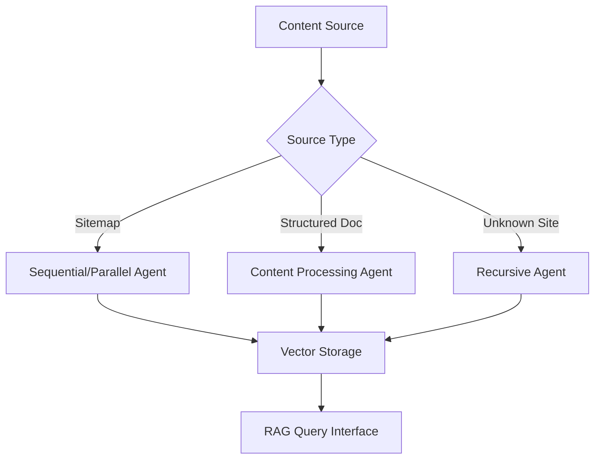

# Pydantic AI Agent Patterns Analysis

**Purpose:** Analysis of agent-based crawling patterns for Citadel target architecture  
**Source:** Prototype example scripts converted to pydantic-ai agents  
**Relevance:** DEL-001 (Process Flows), DEL-002 (Data Flows), DEL-005 (Solution Architecture)

## Agent Architecture Patterns

### **1. Sequential Sitemap Agent (2-crawl_docs_sequential.py)**

**Agent Specialization:** Methodical, resource-light crawling  
**Core Tool:** `crawl_sitemap_sequentially`

**Process Flow:**
```
Sitemap URL → XML Parse → URL List → Sequential Crawl → Success Count
```

**Key Characteristics:**
- **Resource Management:** One URL at a time, minimal memory footprint
- **Error Handling:** Individual URL failures don't stop the process
- **Use Case:** Large sitemaps where resource constraints matter
- **Trade-off:** Speed vs. resource consumption

**Architecture Implications:**
- Suitable for environments with limited concurrent connections
- Predictable resource usage patterns
- Linear scaling with sitemap size

### **2. Parallel Sitemap Agent (3-crawl_sitemap_in_parallel.py)**

**Agent Specialization:** High-performance, concurrent crawling  
**Core Tool:** `crawl_sitemap_in_parallel`

**Process Flow:**
```
Sitemap URL → XML Parse → URL List → Parallel Dispatch → Concurrent Crawl → Aggregated Results
```

**Key Characteristics:**
- **Concurrency Control:** `MemoryAdaptiveDispatcher` with configurable limits
- **Performance Optimization:** Simultaneous browser sessions
- **Use Case:** Fast bulk ingestion when resources allow
- **Trade-off:** Resource consumption vs. speed

**Architecture Implications:**
- Requires robust resource management
- Network and memory intensive
- Exponential performance gains with proper tuning

### **3. Content Processing Agent (4-crawl_llms_txt.py)**

**Agent Specialization:** Content analysis and semantic chunking  
**Core Tool:** `chunk_content_from_url`

**Process Flow:**
```
URL → Content Fetch → Markdown Extraction → Header Detection → Semantic Chunking → Structured Output
```

**Key Characteristics:**
- **Content Intelligence:** Markdown header-based chunking
- **Semantic Awareness:** Preserves document structure
- **Use Case:** Structured documents requiring intelligent parsing
- **Output:** List of semantically meaningful chunks

**Architecture Implications:**
- Content-aware processing beyond simple text extraction
- Structured data preparation for vector storage
- Foundation for intelligent document understanding

### **4. Recursive Exploration Agent (5-crawl_site_recursively.py)**

**Agent Specialization:** Autonomous website discovery  
**Core Tool:** `crawl_site_recursively`

**Process Flow:**
```
Start URL → Crawl → Link Extraction → Internal Link Filter → Depth Control → Recursive Discovery → Site Map
```

**Key Characteristics:**
- **Autonomous Discovery:** Self-directed link following
- **Boundary Control:** Depth limits and internal link filtering
- **State Management:** Visited URL tracking
- **Use Case:** Complete site ingestion without prior knowledge

**Architecture Implications:**
- Requires sophisticated state management
- Network-intensive with exponential growth potential
- Enables comprehensive site coverage

## Architectural Patterns Analysis

### **Agent Specialization Strategy**

Each agent embodies a specific crawling strategy:

| **Agent Type** | **Optimization** | **Resource Profile** | **Use Case** |
|----------------|------------------|---------------------|--------------|
| **Sequential** | Memory efficiency | Low, predictable | Large sitemaps, constrained environments |
| **Parallel** | Speed | High, variable | Bulk ingestion, performance-critical |
| **Content Processing** | Intelligence | Medium, CPU-intensive | Structured documents, semantic parsing |
| **Recursive** | Coverage | High, exponential | Site discovery, comprehensive ingestion |

### **Tool-Based Architecture**

**Pattern:** Core logic encapsulated in agent tools
- **Benefit:** Reusable, testable components
- **Flexibility:** Tools can be combined across agents
- **Maintainability:** Clear separation of concerns

### **Async-First Design**

**Consistent Pattern:** All agents use `AsyncWebCrawler`
- **Scalability:** Non-blocking I/O operations
- **Resource Efficiency:** Concurrent operation support
- **Performance:** Optimal for I/O-bound crawling tasks

## Target Architecture Implications

### **For DEL-001 (End-to-End Process Flows)**

**Multi-Strategy Ingestion Pipeline:**


### **For DEL-002 (Data Flow Diagrams)**

**Agent-Based Data Processing:**
- **Input:** URLs, sitemaps, content sources
- **Processing:** Agent-specific crawling and parsing
- **Transformation:** Content chunking and structuring
- **Output:** Structured data ready for vector storage

### **For DEL-005 (Solution Architecture)**

**Agent Framework Integration:**
- **Pydantic AI:** Agent orchestration and tool management
- **Crawl4AI:** Core crawling capabilities
- **Async Architecture:** Scalable concurrent processing
- **Tool Composition:** Reusable crawling components

## Recommendations for Citadel Architecture

### **1. Agent Orchestration Layer**
Implement a meta-agent that selects appropriate crawling strategies based on:
- Source type (sitemap, single page, unknown site)
- Resource constraints
- Performance requirements
- Content characteristics

### **2. Unified Tool Library**
Extract common tools for reuse across agents:
- `get_urls_from_sitemap`
- `chunk_content_by_headers`
- `extract_internal_links`
- `manage_crawl_state`

### **3. Adaptive Resource Management**
Implement dynamic resource allocation:
- Monitor system resources
- Adjust concurrency limits
- Switch between sequential/parallel strategies
- Graceful degradation under load

### **4. Content Intelligence Pipeline**
Extend content processing capabilities:
- Multi-format support (PDF, DOCX, etc.)
- Advanced chunking strategies
- Metadata extraction
- Content classification

---

**Key Insight:** The agent patterns demonstrate a mature approach to specialized crawling strategies. The target architecture should leverage this specialization while adding orchestration and resource management layers for production deployment.
