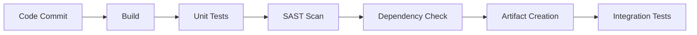
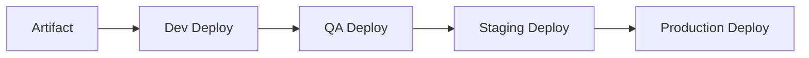
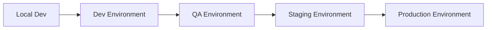
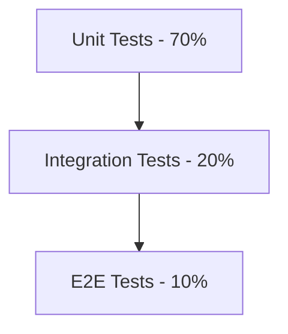

# Development Approach: [Project Name]

**Document Owner:** [Engineering Manager]  
**Last Updated:** [Date]  
**Status:** [Draft/Review/Approved]  
**Reviewers:** [Engineering Director, DevOps, Product, QA]

## 1. Development Overview

### **Purpose**
Explain how we will build the solution: process, tooling, and build vs. buy decisions.

### **Development Philosophy**
- [Philosophy 1: e.g., Agile/iterative development]
- [Philosophy 2: e.g., Quality-first approach]
- [Philosophy 3: e.g., Automation over manual processes]
- [Philosophy 4: e.g., Security by design]

## 2. SDLC & Ways of Working

### **Development Methodology**
- **Framework:** [Scrum/Kanban/Hybrid]
- **Sprint Duration:** [Duration, e.g., 2 weeks]
- **Team Structure:** [Team composition and roles]
- **Ceremonies:** [Sprint planning, daily standups, reviews, retrospectives]

### **Sprint Planning**
- **Sprint Goals:** [How sprint goals are defined]
- **Capacity Planning:** [How team capacity is calculated]
- **Story Estimation:** [Estimation technique, e.g., story points]
- **Definition of Ready:** [Criteria for stories to enter sprint]

### **Backlog Management**
- **Grooming Cadence:** [Weekly/bi-weekly backlog refinement]
- **Prioritization:** [How priorities are determined]
- **Story Breakdown:** [How epics are broken into stories]
- **Acceptance Criteria:** [How acceptance criteria are defined]

### **Stakeholder Engagement**
- **Sprint Reviews:** [Frequency and format]
- **Stakeholder Feedback:** [How feedback is collected and incorporated]
- **Architecture Review Board:** [Monthly architecture reviews]
- **Product Owner Involvement:** [Role and responsibilities]

## 3. Branching Strategy & Version Control

### **Git Workflow**
- **Strategy:** [Trunk-based/GitFlow/GitHub Flow]
- **Branch Naming:** [Naming conventions]
- **Merge Strategy:** [Merge commits/squash/rebase]

### **Branch Protection**
- **Main Branch:** [Protection rules for main/master]
- **Pull Request Requirements:** [Review requirements, checks]
- **Code Owners:** [CODEOWNERS file usage]

### **Example Workflow**
```mermaid
gitgraph
    commit id: "Initial"
    branch feature/new-feature
    checkout feature/new-feature
    commit id: "Feature work"
    commit id: "More work"
    checkout main
    merge feature/new-feature
    commit id: "Release"
```

## 4. CI/CD Pipeline

### **Continuous Integration**


### **Pipeline Stages**

#### **Build Stage**
- **Compilation:** [Build tools and process]
- **Dependency Management:** [Package management approach]
- **Artifact Creation:** [Container images, packages]
- **Versioning:** [Semantic versioning strategy]

#### **Test Stage**
- **Unit Tests:** [Coverage requirements, tools]
- **Integration Tests:** [Test scope and tools]
- **Contract Tests:** [API contract validation]
- **Performance Tests:** [Load testing integration]

#### **Security Stage**
- **SAST (Static Analysis):** [Tools and thresholds]
- **DAST (Dynamic Analysis):** [Tools and scope]
- **Dependency Scanning:** [Vulnerability scanning]
- **Secrets Scanning:** [Secret detection tools]
- **IaC Scanning:** [Infrastructure as Code security]

#### **Quality Gates**
- **Code Coverage:** [Minimum coverage thresholds]
- **Security Vulnerabilities:** [Fail-the-build criteria]
- **Performance Budgets:** [Performance thresholds]
- **Code Quality:** [Static analysis thresholds]

### **Continuous Deployment**


#### **Deployment Strategy**
- **Blue-Green:** [For zero-downtime deployments]
- **Canary:** [For gradual rollouts]
- **Feature Flags:** [For feature toggles]
- **Rollback:** [Automated rollback triggers]

## 5. COTS vs. Custom Development

### **Decision Framework**
| **Criteria** | **Weight** | **Evaluation Method** |
|--------------|------------|----------------------|
| Functional Fit | 30% | [How fit is assessed] |
| Total Cost of Ownership | 25% | [Cost calculation method] |
| Time to Market | 20% | [Timeline assessment] |
| Risk Assessment | 15% | [Risk evaluation criteria] |
| Strategic Alignment | 10% | [Strategic fit assessment] |

### **Build vs. Buy Matrix**
| **Capability** | **Options** | **Fit (H/M/L)** | **Cost** | **Time-to-Value** | **Risk** | **Decision** | **ADR** |
|----------------|-------------|-----------------|----------|-------------------|----------|--------------|---------|
| Authentication & IAM | [Vendor A / Vendor B / Build] | H | $$ | Fast | Low | Vendor A | ADR-007 |
| Search Engine | [Service X / Build] | M | $$$ | Medium | Medium | Service X | ADR-010 |
| ETL Pipeline | [Tool Y / Build] | L | $$ | Fast | Low | Tool Y | ADR-012 |
| Vector Database | [Qdrant / ChromaDB / Build] | H | $ | Fast | Low | Qdrant | ADR-015 |

### **Vendor Evaluation Criteria**
- **Functional Requirements:** [How well does it meet our needs]
- **Non-Functional Requirements:** [Performance, security, scalability]
- **Integration Capabilities:** [APIs, data formats, protocols]
- **Support & Maintenance:** [Vendor support quality and SLAs]
- **Licensing & Costs:** [Licensing model and total costs]
- **Vendor Stability:** [Vendor financial health and roadmap]

## 6. Technology Stack

### **Programming Languages**
| **Language** | **Use Case** | **Rationale** | **Version** |
|--------------|--------------|---------------|-------------|
| [Language 1] | [Backend/Frontend/Scripts] | [Why chosen] | [Version] |
| [Language 2] | [Backend/Frontend/Scripts] | [Why chosen] | [Version] |
| [Language 3] | [Backend/Frontend/Scripts] | [Why chosen] | [Version] |

### **Frameworks & Libraries**
| **Framework** | **Purpose** | **Rationale** | **Version** |
|---------------|-------------|---------------|-------------|
| [Framework 1] | [Web/API/Data] | [Why chosen] | [Version] |
| [Framework 2] | [Web/API/Data] | [Why chosen] | [Version] |
| [Framework 3] | [Web/API/Data] | [Why chosen] | [Version] |

### **Infrastructure & Platform**
| **Component** | **Technology** | **Rationale** | **Configuration** |
|---------------|----------------|---------------|-------------------|
| Container Platform | [Docker/Kubernetes] | [Why chosen] | [Config details] |
| Cloud Provider | [AWS/Azure/GCP] | [Why chosen] | [Services used] |
| Database | [PostgreSQL/MongoDB] | [Why chosen] | [Configuration] |
| Message Queue | [RabbitMQ/Kafka] | [Why chosen] | [Configuration] |

## 7. Development Environment

### **Environment Strategy**


### **Environment Parity Matrix**
| **Aspect** | **Local** | **Dev** | **QA** | **Staging** | **Production** |
|------------|-----------|---------|--------|-------------|----------------|
| Infrastructure | [Config] | [Config] | [Config] | [Config] | [Config] |
| Data Volume | [Size] | [Size] | [Size] | [Size] | [Size] |
| Security | [Level] | [Level] | [Level] | [Level] | [Level] |
| Monitoring | [Tools] | [Tools] | [Tools] | [Tools] | [Tools] |

### **Local Development**
- **Setup:** [How developers set up local environment]
- **Dependencies:** [How dependencies are managed locally]
- **Data:** [Local data setup and seeding]
- **Testing:** [Local testing capabilities]

### **Environment Provisioning**
- **Infrastructure as Code:** [Terraform/CloudFormation/ARM]
- **Configuration Management:** [Ansible/Chef/Puppet]
- **Secrets Management:** [HashiCorp Vault/AWS Secrets Manager]
- **Environment Lifecycle:** [Creation, updates, teardown]

## 8. Coding Standards & Quality

### **Code Standards**
- **Style Guides:** [Language-specific style guides]
- **Linting:** [ESLint/Pylint/SonarQube configuration]
- **Formatting:** [Prettier/Black/gofmt configuration]
- **Documentation:** [Code documentation standards]

### **Code Review Process**
- **Review Requirements:** [Number of reviewers, expertise requirements]
- **Review Checklist:** [What reviewers should check]
- **Approval Process:** [How approvals are managed]
- **Review Tools:** [GitHub/GitLab/Bitbucket features]

### **Quality Metrics**
| **Metric** | **Target** | **Measurement** | **Action Threshold** |
|------------|------------|-----------------|---------------------|
| Code Coverage | >80% | [Tool] | <70% fails build |
| Cyclomatic Complexity | <10 | [Tool] | >15 fails review |
| Technical Debt | <5% | [Tool] | >10% requires plan |
| Security Vulnerabilities | 0 Critical | [Tool] | Any critical fails build |

## 9. Testing Strategy Integration

### **Test Pyramid Implementation**


### **Automated Testing**
- **Unit Testing:** [Frameworks, coverage targets, execution]
- **Integration Testing:** [Scope, tools, data management]
- **Contract Testing:** [Pact/Spring Cloud Contract]
- **Performance Testing:** [JMeter/k6 integration in pipeline]

### **Test Data Management**
- **Synthetic Data:** [Generation tools and strategies]
- **Data Masking:** [PII protection in non-prod environments]
- **Test Data Refresh:** [Frequency and automation]

## 10. Security Integration

### **Secure Development Lifecycle**
- **Threat Modeling:** [When and how threat modeling is done]
- **Security Reviews:** [Code review security checklist]
- **Penetration Testing:** [Frequency and scope]
- **Security Training:** [Developer security training program]

### **Security Tools Integration**
- **SAST Tools:** [Static analysis tools in pipeline]
- **DAST Tools:** [Dynamic analysis tools and scheduling]
- **Dependency Scanning:** [Vulnerability scanning tools]
- **Secrets Management:** [How secrets are handled in development]

## 11. Monitoring & Observability

### **Development Monitoring**
- **Build Metrics:** [Build success rates, duration]
- **Deployment Metrics:** [Deployment frequency, success rates]
- **Quality Metrics:** [Code quality trends, technical debt]
- **Team Metrics:** [Velocity, cycle time, lead time]

### **Application Observability**
- **Logging:** [Structured logging standards]
- **Metrics:** [Application metrics collection]
- **Tracing:** [Distributed tracing implementation]
- **Dashboards:** [Development and operational dashboards]

## 12. Team Structure & Roles

### **Development Team**
| **Role** | **Responsibilities** | **Skills Required** |
|----------|---------------------|-------------------|
| Tech Lead | [Responsibilities] | [Skills] |
| Senior Developer | [Responsibilities] | [Skills] |
| Developer | [Responsibilities] | [Skills] |
| DevOps Engineer | [Responsibilities] | [Skills] |
| QA Engineer | [Responsibilities] | [Skills] |

### **Communication & Collaboration**
- **Daily Standups:** [Format and focus]
- **Technical Discussions:** [Architecture reviews, design sessions]
- **Knowledge Sharing:** [Tech talks, documentation, pair programming]
- **Cross-team Collaboration:** [How teams coordinate]

## 13. Risk Management

### **Development Risks**
| **Risk** | **Probability** | **Impact** | **Mitigation** | **Owner** |
|----------|-----------------|------------|----------------|-----------|
| [Risk 1] | [H/M/L] | [H/M/L] | [Mitigation strategy] | [Owner] |
| [Risk 2] | [H/M/L] | [H/M/L] | [Mitigation strategy] | [Owner] |
| [Risk 3] | [H/M/L] | [H/M/L] | [Mitigation strategy] | [Owner] |

### **Technical Debt Management**
- **Identification:** [How technical debt is identified]
- **Tracking:** [How technical debt is tracked and prioritized]
- **Remediation:** [How technical debt is addressed]
- **Prevention:** [How new technical debt is prevented]

## 14. Toolchain

### **Development Tools**
| **Category** | **Tool** | **Purpose** | **License** |
|--------------|----------|-------------|-------------|
| IDE/Editor | [Tool] | [Purpose] | [License] |
| Version Control | [Tool] | [Purpose] | [License] |
| Build Tools | [Tool] | [Purpose] | [License] |
| Testing | [Tool] | [Purpose] | [License] |
| Security | [Tool] | [Purpose] | [License] |

### **Infrastructure Tools**
| **Category** | **Tool** | **Purpose** | **License** |
|--------------|----------|-------------|-------------|
| CI/CD | [Tool] | [Purpose] | [License] |
| Container Registry | [Tool] | [Purpose] | [License] |
| Monitoring | [Tool] | [Purpose] | [License] |
| Logging | [Tool] | [Purpose] | [License] |

## 15. Knowledge Management

### **Documentation Strategy**
- **Architecture Documentation:** [Where and how architecture is documented]
- **API Documentation:** [OpenAPI/Swagger, automated generation]
- **Runbooks:** [Operational procedures and troubleshooting]
- **Decision Records:** [ADR process and storage]

### **Knowledge Sharing**
- **Code Comments:** [When and how to comment code]
- **README Files:** [Standard README structure]
- **Wiki/Confluence:** [Team knowledge base]
- **Tech Talks:** [Regular knowledge sharing sessions]

## 16. Approval & Sign-off

### **Review Checklist**
- [ ] CI/CD pipeline defined with quality gates
- [ ] COTS vs. custom decisions documented with ADRs
- [ ] Environment parity matrix agreed upon
- [ ] Security integration points defined
- [ ] Team structure and roles clarified
- [ ] Toolchain selected and licensed

### **Approvals**
- [ ] **Engineering Manager:** [Name] - [Date] - [Signature]
- [ ] **Engineering Director:** [Name] - [Date] - [Signature]
- [ ] **DevOps Lead:** [Name] - [Date] - [Signature]
- [ ] **Product Manager:** [Name] - [Date] - [Signature]

---

**Document Control**
- **Template Version:** 1.0
- **Last Updated:** [Date]
- **Next Review:** [Date]
- **Related Documents:** [Links to architecture, testing strategy, etc.]
