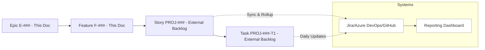
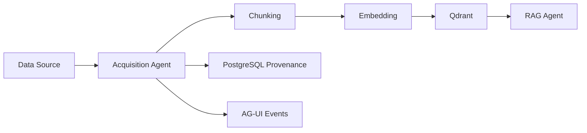
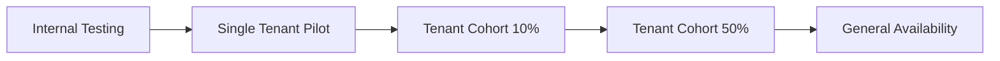
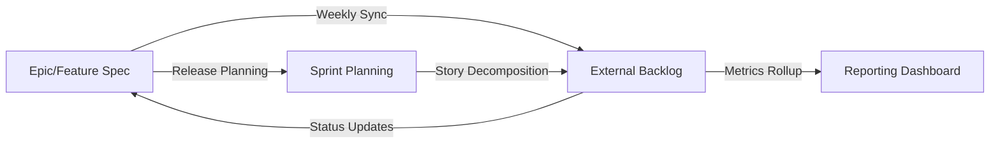

# Epic & Feature Specification: [Project Name]

**Document Owner:** [Product Lead + UX Lead]  
**Last Updated:** [Date]  
**Status:** [Draft/Review/Approved]  
**Specification Tier:** [Epic/Standard/Minor]  
**Reviewers:** [Engineering, QA, Design, Architecture]  
**Related Documents:** [Links to Discovery inputs, ADRs, Architecture docs]

---

## At‑a‑Glance Traceability & Tooling



**Cross-References:**  
- For rollout details, see [§9.2 Progressive Exposure Pattern](#progressive-exposure-pattern-default).  
- For risk responses, see [§8.2 Risk Escalation Matrix](#risk-escalation-matrix).  
- For story/task handling, see [Appendix D](#appendix-d-storytask-companion-template).

> **Glossary**  
> **AG‑UI events**: Application-generated UI events that stream progress/telemetry from backend jobs to the UI in near‑real time (<500ms target). Used for user feedback, monitoring, and success metrics.

---

## Quick Start Guide

### Specification Tiers
- **Epic (Tier 1):** Full template – major capabilities requiring complete specification
- **Standard (Tier 2):** Sections 1–6, 8–10 – regular features with moderate complexity
- **Minor (Tier 3):** Sections 1, 4 (simplified), 9–10 – small enhancements or fixes

### Template Navigation
- **Discovery Integration:** Section 2 links to foundational Discovery work
- **Agent Specifications:** Section 6 for agent‑first architecture
- **Examples:** Look for 💡 icons for Citadel‑specific examples
- **Appendices:** See the [Appendix Map](#appendix-map) for examples, usage, checklists, and the companion story/task template

---

## 1. Executive Summary

### Purpose
Brief description of what we're building and why it matters to Citadel's mission.

### Value Proposition
- **Business Value:** [Quantifiable business impact]
- **User Value:** [How this improves user experience]
- **Technical Value:** [Architecture improvements/debt reduction]

### Success Metrics
| **Metric** | **Baseline** | **Target** | **Measurement Method** |
|------------|--------------|------------|------------------------|
| [Business KPI] | [Current] | [Goal] | [How measured] |
| [User Metric] | [Current] | [Goal] | [Analytics/Testing] |
| [Technical Metric] | [Current] | [Goal] | [APM/Monitoring] |
| [Cost Metric] | [Current] | [Goal] | [Cloud metrics] |

💡 **Example:** "Acquisition Success Rate | 75% | 95% | AG‑UI completion events"

---

## 2. Discovery Phase Integration

### Foundational Inputs
| **Discovery Artifact** | **Reference** | **Key Findings** | **How This Feature Addresses** |
|------------------------|---------------|------------------|--------------------------------|
| Prototype Analysis | [Link to As‑Is spec] | [Summary] | [Resolution approach] |
| Engineering Audit | [Link to audit report] | [Critical findings] | [How we fix them] |
| Stakeholder Workshop | [Link to requirements] | [User needs] | [How we meet them] |
| Technical Debt | [Link to backlog] | [Debt items] | [How we resolve them] |

### Evidence Base
- **Audit Finding Resolution:** [Which specific audit items this addresses – BL‑XXX]
- **Backlog Item Mapping:** [Discovery backlog items being implemented]
- **Gap Analysis:** [Specific gaps from Discovery this feature closes]

### Improvement Metrics
| **Current State (Discovery)** | **Future State (This Feature)** | **Improvement** |
|-------------------------------|----------------------------------|-----------------|
| [As‑Is metric] | [To‑Be metric] | [% improvement] |

💡 **Example:** "ChromaDB local‑only | Qdrant distributed | 10x scalability improvement"

---

## 3. Feature Hierarchy

### Epic Structure
- **L1 Epic:** High‑level capability area
- **L2 Features:** Specific functional capabilities  
- **L3 Stories:** User stories (managed in external backlog – see [Appendix D](#appendix-d-storytask-companion-template))
- **L4 Tasks:** Implementation tasks (managed in external backlog – see [Appendix D](#appendix-d-storytask-companion-template))

> **Scope of this document:** L1 & L2 only.

### Feature Catalog

#### Epic: [Epic Name]
**Epic ID:** E‑[###]  
**External Tracking:** [Jira Epic Key / Azure DevOps ID / GitHub Issue #]  
**Description:** [High‑level capability description]  
**Business Value:** [Value proposition]  
**User Impact:** [Impact on user experience]

**Mandatory Success Metrics:**
| **Category** | **Metric** | **Baseline** | **Target** | **Owner/Source** | **Measurement** |
|--------------|------------|--------------|------------|------------------|-----------------|
| **Business** | [Required KPI] | [Current] | [Goal] | [Person/System] | [Method] |
| **User** | [Required UX metric] | [Current] | [Goal] | [Person/System] | [Method] |
| **Technical** | [Required tech metric] | [Current] | [Goal] | [Person/System] | [Method] |

💡 **Example:** "Business | Revenue per query | $0.05 | $0.03 | Finance/Billing API | Monthly P&L report"

**L2 Features:**
| **Feature ID** | **Feature Name** | **External ID** | **Priority** | **Complexity** | **Release** |
|----------------|------------------|-----------------|--------------|----------------|-------------|
| F‑001 | [Name] | [Jira/ADO ID] | [Critical/High/Medium/Low] | [S/M/L/XL] | [v1.0/v1.1/Backlog] |
| F‑002 | [Name] | [Jira/ADO ID] | [Critical/High/Medium/Low] | [S/M/L/XL] | [v1.0/v1.1/Backlog] |

---

## 4. Detailed Feature Specifications

### F‑001: [Feature Name]

#### Basic Information
- **Feature ID:** F‑001
- **External Tracking:** [Jira Story Key / Azure DevOps ID / GitHub Issue #]
- **Parent Epic:** E‑001
- **Owner (DRI):** [Single responsible individual]
- **Status:** [Discovery/Design/Ready/In Progress/Complete]
- **Target Release:** [v1.0/v1.1/Backlog]

#### Feature Definition
**Problem Statement:**
[What problem from Discovery are we solving? Why now?]

**User Story:**
As a `[persona]`, I want `[capability]` so that `[benefit]`.

💡 **Example:** "As a knowledge worker, I want to ingest a company sitemap so that I can query across all company documentation"

**Description:**
[Detailed scope, key flows, constraints, Discovery insights addressed]

**User Personas Impacted:**
- Primary: [Persona and use case]
- Secondary: [Persona and use case]

#### Design & UX
- **Wireframes/Mockups:** [URL to Figma/Sketch]
- **Interaction Flow:** [URL to flow diagram]
- **AG‑UI Events:** [Real‑time events for user feedback]
- **Error States:** [How errors are handled and displayed]
- **Empty States:** [What users see with no data]
- **Loading States:** [Progressive loading with AG‑UI events]

#### Acceptance Criteria
```gherkin
Scenario 1: [Primary Happy Path]
  Given [precondition including tenant context]
  When [action triggering AG‑UI events]
  Then [expected result with provenance]
  And [AG‑UI event confirmation]

Scenario 2: [Multi‑tenant Isolation]
  Given [multiple tenant contexts]
  When [cross‑tenant action attempted]
  Then [proper isolation enforced]

Scenario 3: [Real‑time Progress]
  Given [long‑running operation]
  When [operation in progress]
  Then [AG‑UI progress events stream < 500ms]
```

💡 **Example Scenario:**
```gherkin
Scenario: Sitemap Acquisition with Progress
  Given I am authenticated with tenant "acme‑corp"
  When I initiate sitemap acquisition for "https://acme.com/sitemap.xml"
  Then I receive AcquisitionStarted event within 500ms
  And I receive AcquisitionProgress events every 2 seconds
  And AcquisitionCompleted includes total_docs and duration
```

#### Citadel Technology Stack Integration

**Vector Database (Qdrant):**
- **Collection Design:** [Collection structure and metadata schema]
- **Indexing Strategy:** [HNSW parameters, shard planning]
- **Query Patterns:** [Expected search patterns and filters]
- **Performance Targets:** [Latency and throughput requirements]

**LLM Router (LiteLLM):**
- **Model Selection:** [Which models for which operations]
- **Token Budgets:** [Max tokens per operation]
- **Fallback Strategy:** [Handling of model failures]
- **Cost Controls:** [Per‑tenant token limits]

**Authentication (Clerk):**
- **Required Scopes:** [RBAC permissions needed]
- **Tenant Isolation:** [How multi‑tenancy is enforced]
- **Audit Events:** [What gets logged for compliance]

**Event Bus (AG‑UI):**
- **Published Events:** [List of events this feature emits]
- **Event Schema:** [Structure of event payloads]
- **Subscription Patterns:** [Who consumes these events]

**Real‑time (LiveKit):**
- **Collaboration Features:** [If applicable]
- **Data Channels:** [Real‑time data synchronization needs]

---

## 5. Non‑Functional Requirements

### Performance Requirements
| **NFR ID** | **Requirement** | **Target** | **Measurement** | **Validation** |
|------------|-----------------|------------|-----------------|----------------|
| NFR‑P01 | Retrieval Latency | < 2.0s P95 | APM monitoring | Load testing |
| NFR‑P02 | Event Streaming | < 500ms | AG‑UI metrics | Integration tests |
| NFR‑P03 | Acquisition Rate | > 10 docs/sec | Performance tests | Benchmarking |
| NFR‑P04 | Vector Upserts | > 1000/sec | Qdrant metrics | Stress testing |
| NFR‑P05 | Cross-Collection Query | < 1.5s P95 | APM monitoring | Load testing |
| NFR‑P06 | Concurrent Users | > 100 simultaneous | Load testing | Stress testing |

💡 **Example:** "Acquisition progress events must stream to UI within 500ms"

### Security Requirements
| **NFR ID** | **Requirement** | **Implementation** | **Validation** |
|------------|-----------------|-------------------|----------------|
| NFR‑S01 | Tenant Isolation | Collection‑level RBAC | Security testing |
| NFR‑S02 | Data Encryption | AES‑256/TLS 1.3 | Compliance audit |
| NFR‑S03 | Token Scoping | JWT with tenant_id | Auth testing |
| NFR‑S04 | Robots.txt | Compliance checking | Crawler validation |

### Operational Requirements
| **NFR ID** | **Requirement** | **Target** | **Implementation** |
|------------|-----------------|------------|-------------------|
| NFR‑O01 | Observability | Structured logs with job_id | JSON logging |
| NFR‑O02 | Monitoring | SLO dashboards | Grafana |
| NFR‑O03 | Alerting | < 5min detection | PagerDuty |
| NFR‑O04 | Recovery | < 15min MTTR | Runbooks |

---

## 6. Agent & Tool Specifications

### Agent Requirements
- **Agent Type:** [AcquisitionAgent/RAGAgent/Custom]
- **Pydantic‑AI Version:** [Version requirements]
- **Tool Dependencies:** [List of required tool interfaces]
- **State Management:** [How agent maintains state across operations]

### Tool Interface Specifications

#### Interface Definitions
```python
class IVectorStore(Protocol):
    """Interface for vector storage operations."""
    def upsert(self, chunks: list[Chunk], collection: str) -> None: ...
    def search(self, embedding: Vector, filters: dict) -> list[Hit]: ...

class ICrawler(Protocol):
    """Interface for content acquisition."""
    def fetch(self, urls: list[str], config: CrawlConfig) -> list[Page]: ...
```

#### Pydantic Models
```python
class AcquisitionParams(BaseModel):
    """Input validation for acquisition operations."""
    source_url: HttpUrl
    source_type: Literal["sitemap", "recursive", "single"]
    max_depth: int = Field(default=3, ge=1, le=6)
    chunk_size: int = Field(default=1000, ge=100, le=5000)
    collection_name: str = Field(pattern="^[a-z0-9-]+$")
```

### Event Publishing Patterns
```python
# Example event publishing
await event_bus.publish(AcquisitionStarted(
    job_id=job_id,
    source=params.source_url,
    tenant_id=context.tenant_id,
    timestamp=datetime.utcnow()
))
```

### Testing Strategy
- **Mock Implementations:** [How interfaces are mocked for testing]
- **Contract Tests:** [Ensuring interface compliance]
- **Integration Tests:** [End‑to‑end agent testing]

💡 **Example:** "AcquisitionAgent uses ICrawler, IEmbedder, IVectorStore interfaces with dependency injection for testability"

---

## 7. Data Architecture

### Data Flow


### Data Models
| **Entity** | **Storage** | **Schema** | **Retention** | **PII Class** |
|------------|-------------|------------|---------------|---------------|
| Documents | Qdrant | [Schema link] | 90 days | Medium |
| Provenance | PostgreSQL | [Schema link] | 1 year | Low |
| User Sessions | Redis | [Schema link] | 24 hours | High |

### Collection Design (Qdrant)
```yaml
collection_config:
  name: "{tenant_id}-{collection_name}"
  vector_size: 1536
  distance: Cosine
  hnsw_config:
    m: 16
    ef_construct: 100
  optimizer_config:
    indexing_threshold: 20000
```

---

## 8. Risk Management

### Risk Register
| **Risk ID** | **Description** | **Probability** | **Impact** | **Score** | **Trigger Metric** | **Mitigation** | **Owner** | **Status** |
|-------------|-----------------|-----------------|------------|-----------|-------------------|----------------|-----------|-----------|
| R‑001 | Qdrant performance degradation | Medium | High | 6 | P95 latency > 3s | Implement caching layer | [Name] | Monitoring |
| R‑002 | LLM rate limits | High | Medium | 6 | 429 errors > 5/min | LiteLLM fallback routing | [Name] | Mitigated |
| R‑003 | Tenant data leakage | Low | Critical | 6 | Any cross‑tenant query | Collection isolation audit | [Name] | Validated |
| R‑004 | Memory exhaustion | Medium | High | 6 | Memory usage > 85% | Batch size reduction | [Name] | Monitoring |

💡 **Example Trigger:** "If P95 latency exceeds 3 seconds for 5 consecutive minutes, trigger performance investigation runbook"

### Risk Escalation Matrix
| **Trigger Condition** | **Action** | **Owner** | **SLA** |
|----------------------|------------|-----------|---------|
| Any trigger metric exceeded | Alert to feature owner | DRI | 15 min |
| Critical risk triggered | Incident response team activation | On‑call | Immediate |
| Multiple risks triggered | Executive escalation | Tech Lead | 1 hour |

---

## 9. Implementation Considerations

### Architecture Review Requirements
Features requiring architecture review:
- [ ] Changes to agent interfaces
- [ ] New AG‑UI event types
- [ ] Qdrant schema modifications
- [ ] Cross‑tenant operations
- [ ] New LiteLLM model integrations

### Migration & Rollout Strategy

#### Progressive Exposure Pattern (Default)


**Rollout Configuration:**
- **Feature Flags:** [Flag names with tenant‑level control]
- **Tenant Selection:** [Criteria for pilot tenants]
- **Cohort Definition:** [How cohorts are selected]
- **Success Gates:** [Metrics required to proceed]
- **Rollback Triggers:** [Automatic rollback conditions]

**Monitoring During Rollout:**
- **Per‑Tenant Metrics:** Error rates, latency, usage
- **Cohort Comparison:** A/B performance analysis
- **Progressive Validation:** Automated gate checks

### Dependency Management
| **Dependency** | **Type** | **Version** | **Risk** | **Alternative** |
|----------------|----------|-------------|----------|-----------------|
| Qdrant | Critical | 1.7+ | Low | Pinecone |
| LiteLLM | Critical | 1.0+ | Medium | Direct OpenAI |
| Clerk | Critical | 5.77 | Low | Auth0 |

---

## 10. Quality Assurance

### Citadel‑Specific Definition of Ready
- [ ] User story includes tenant context and AG‑UI events
- [ ] Agent interfaces and tools specified
- [ ] Qdrant collection design defined
- [ ] Discovery gaps mapped to solutions
- [ ] Acceptance criteria include multi‑tenant scenarios
- [ ] Performance targets include event streaming latency

### Citadel‑Specific Definition of Done
- [ ] Agent interfaces implemented with dependency injection
- [ ] AG‑UI events tested for < 500ms delivery
- [ ] Multi‑tenant isolation verified with security tests
- [ ] Qdrant integration performance validated
- [ ] Discovery phase gaps demonstrably addressed
- [ ] LiteLLM integration tested with fallback scenarios
- [ ] Clerk RBAC permissions verified
- [ ] Cross‑collection query performance meets targets

### Testing Strategy
- **Unit Tests:** Agent interfaces with mocked dependencies
- **Integration Tests:** End‑to‑end workflows with real services
- **Performance Tests:** Load testing against NFR targets
- **Security Tests:** Multi‑tenant isolation and RBAC validation
- **Contract Tests:** API and event schema compliance

---

## 11. Approval & Sign‑off

### Review Checklist
- [ ] All L1/L2 specs complete with acceptance tests
- [ ] NFRs mapped to each critical feature with Citadel‑specific targets
- [ ] Priority and capacity aligned for target release
- [ ] Dependencies identified and planned
- [ ] User journeys validated with stakeholders
- [ ] Discovery phase traceability established
- [ ] Agent interfaces and event schemas defined
- [ ] Architecture review completed (if required)

### Approvals
- [ ] **Product Lead:** [Name] - [Date] - [Signature]
- [ ] **UX Lead:** [Name] - [Date] - [Signature]
- [ ] **Engineering Lead:** [Name] - [Date] - [Signature]
- [ ] **QA Lead:** [Name] - [Date] - [Signature]
- [ ] **Architecture Review:** [Name] - [Date] - [Signature] (if required)

---

## Appendix A: Examples & Templates

### Example Epic
**Epic ID:** E‑001  
**Name:** Multi‑Source Data Acquisition  
**Description:** Enable Citadel to acquire data from multiple source types (sitemaps, recursive crawls, file uploads) with real‑time progress tracking and tenant isolation.

#### Example User Story
"As a knowledge worker at a multi‑tenant organization, I want to create a private collection from our internal documentation sitemap, so that I can use RAG to query our company knowledge base without exposing it to other tenants."

#### Example NFR
"The system must stream AcquisitionProgress events to the UI via AG‑UI within 500ms of state changes, enabling real‑time user feedback during long‑running acquisition operations."

#### Example Agent Tool
```python
class WebCrawler(ICrawler):
    """Crawl4AI‑based implementation of ICrawler interface."""
    
    async def fetch(self, urls: list[str], config: CrawlConfig) -> list[Page]:
        """Fetch pages respecting robots.txt and rate limits."""
        # Implementation with timeout/retry logic
        # AG‑UI event publishing
        # Provenance tracking
```

### Appendix B: Template Usage Guide

#### Tier Selection Guide
- **Use Epic Tier for:** Major features, new agents, architectural changes
- **Use Standard Tier for:** Regular features, UI additions, workflow changes  
- **Use Minor Tier for:** Bug fixes, small enhancements, configuration changes

#### Progressive Disclosure
Start with sections marked as required for your tier:
- **Epic:** All sections
- **Standard:** Sections 1–6, 8–10
- **Minor:** Sections 1, 4 (simplified), 9–10

### Appendix C: Integration Checklist

#### Discovery Phase Inputs
- [ ] Review relevant As‑Is specifications
- [ ] Map audit findings to feature solutions
- [ ] Link backlog items being addressed
- [ ] Quantify improvements over current state

#### Architecture Alignment
- [ ] Verify agent‑first patterns
- [ ] Confirm event‑driven approach
- [ ] Validate technology stack usage
- [ ] Ensure security framework compliance

### Appendix D: Story/Task Companion Template

This Epic & Feature Specification (L1/L2) connects to Stories and Tasks (L3/L4) managed in external systems.

#### Synchronization Process


**Sync Cadence & Process:**
- **Weekly:** Feature owner syncs epic/feature status with external backlog
- **Sprint Planning:** Features decomposed into stories in external system
- **Daily:** Task progress tracked in external system only
- **Release:** Metrics rolled up from Task → Story → Feature → Epic

**Preventing Drift:**
- **Single Source of Truth:** This doc for L1/L2, external system for L3/L4
- **Automated Integration:** [If applicable – webhook/API sync between systems]
- **Review Gates:** Feature changes require update in both places
- **Audit Trail:** Change history maintained in both systems

#### User Story Template (L3) – Managed in [Jira/Azure DevOps/GitHub]
```yaml
Story ID: [PROJ-123]
Parent Feature: [F-001]
Epic Link: [E-001]
Title: [User story title]
As a: [persona]
I want: [capability]
So that: [benefit]
Acceptance Criteria:
  - [ ] Criterion 1 (includes agent interface implementation)
  - [ ] Criterion 2 (includes AG-UI event validation)
  - [ ] Criterion 3 (includes multi-tenant testing)
Story Points: [1,2,3,5,8,13]
Sprint: [Sprint number]
Dependencies: [Other story IDs]
Sync Date: [Last sync with feature spec]
Agent Interface: [ICrawler/IEmbedder/IVectorStore/etc.]
Event Schema: [AG-UI events to implement]
```

💡 **Citadel Story Example:**
```yaml
Story ID: CIT-123
Title: Implement sitemap acquisition with progress events
As a: knowledge worker
I want: real-time progress during sitemap ingestion
So that: I know the system is working and can estimate completion time
Acceptance Criteria:
  - [ ] ICrawler interface implemented for sitemap parsing
  - [ ] AcquisitionStarted event published within 500ms
  - [ ] AcquisitionProgress events stream every 2 seconds
  - [ ] Tenant isolation verified in collection naming
Agent Interface: ICrawler
Event Schema: AcquisitionStarted, AcquisitionProgress, AcquisitionCompleted
```

#### Task Template (L4) – Managed in [Jira/Azure DevOps/GitHub]
```yaml
Task ID: [PROJ-123-T1]
Parent Story: [PROJ-123]
Feature Link: [F-001]
Title: [Technical task]
Description: [What needs to be done]
Type: [Frontend/Backend/Database/Testing/Documentation]
Effort: [Hours or points]
Assignee: [Developer name]
Status: [To Do/In Progress/Review/Done]
Agent Component: [Which agent/tool this affects]
Interface Changes: [Any interface modifications]
```

💡 **Citadel Task Example:**
```yaml
Task ID: CIT-123-T1
Title: Implement ICrawler.fetch() for sitemap parsing
Description: Create sitemap parser that respects robots.txt and publishes events
Type: Backend
Effort: 8 hours
Agent Component: AcquisitionAgent
Interface Changes: None (implementing existing ICrawler interface)
```

#### Traceability Chain
```
Epic (E-001) → Feature (F-001) → Story (PROJ-123) → Task (PROJ-123-T1)
   ↓                ↓                 ↓                    ↓
This Doc        This Doc         External System     External System
   ↓                ↓                 ↓                    ↓
Weekly Sync    Weekly Sync      Daily Updates       Daily Updates
```

#### Integration Points
- **Epic Planning:** Create Epic & Features in this document
- **Sprint Planning:** Decompose Features into Stories in external system
- **Daily Execution:** Manage Tasks in external system
- **Reporting:** Roll up Task → Story → Feature → Epic metrics
- **Change Management:** Bidirectional updates for scope changes

---

**Document Control**
- **Template Version:** 4.2
- **Last Updated:** [Date]
- **Changes from v4.1:**
  - Enhanced NFR section with Citadel-specific performance targets
  - Added cross-collection query latency and concurrent user requirements
  - Expanded Appendix D with Citadel-specific story/task examples
  - Added agent interface and event schema fields to story template
- **Next Review:** [After first 3 features implemented]
- **Feedback:** [Link to template feedback form]
