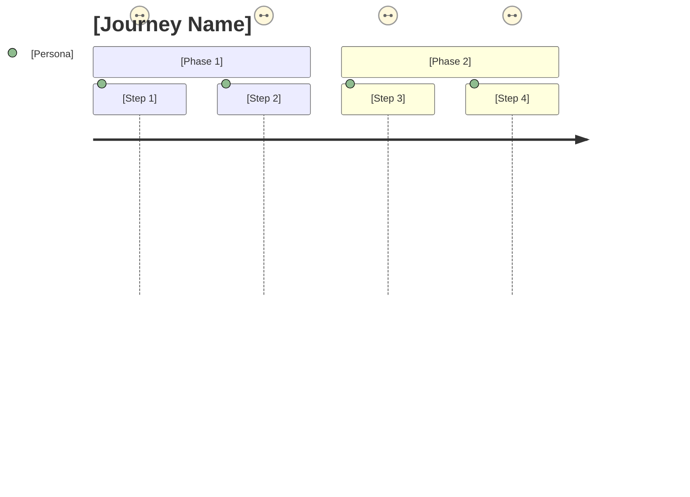

# Functional/Feature Specification (EPIC): [Project Name]

**Document Owner:** [Product Lead + UX Lead]  
**Last Updated:** [Date]  
**Status:** [Draft/Review/Approved]  
**Reviewers:** [Engineering, QA, Design]

## 1. Feature Overview

### **Purpose**
Detail what we are building with L1 themes → L2 features → L3 stories structure.

### **Feature Hierarchy**
- **L1 Themes:** High-level capability areas
- **L2 Features:** Specific functional capabilities
- **L3 Stories:** Detailed user stories (if needed)

## 2. Feature Catalog

### **Feature Template (Per Feature)**

#### **Feature ID:** F-[###]
#### **Feature Name:** [Descriptive Name]
#### **Level:** [L1/L2/L3]

**User Story:**
As a `[persona]`, I want `[capability]` so that `[benefit]`.

**Description:**
[Detailed scope, key flows, UX notes, wireframe links]

**Priority:** [Critical/High/Medium/Low]
**Complexity:** [High/Medium/Low]
**Release Plan:** [v2/v2.x/backlog]

**NFR Mapping:**
- **Performance:** [Requirements]
- **Security:** [Requirements]
- **Availability:** [Requirements]
- **Privacy:** [Requirements]
- **Accessibility:** [Requirements]

**Data Requirements:**
- **Entities:** [Data entities involved]
- **Ownership:** [Data ownership model]
- **Lifecycle:** [Data lifecycle management]
- **PII Classification:** [PII/sensitive data handling]

**Integrations:**
- **Upstream APIs:** [Dependencies]
- **Downstream APIs:** [Consumers]
- **Contracts:** [API contracts/SLAs]

**Acceptance Tests:**
```gherkin
Given [precondition]
When [action]
Then [expected result]
```

**Constraints/Decisions:**
- [ADR references]
- [Technical constraints]
- [Business constraints]

---

## 3. L1 Themes

### **Theme 1: [Theme Name]**
**Description:** [High-level capability description]
**Business Value:** [Value proposition]
**User Impact:** [Impact on user experience]

#### **L2 Features:**
- F-001: [Feature Name]
- F-002: [Feature Name]
- F-003: [Feature Name]

### **Theme 2: [Theme Name]**
**Description:** [High-level capability description]
**Business Value:** [Value proposition]
**User Impact:** [Impact on user experience]

#### **L2 Features:**
- F-004: [Feature Name]
- F-005: [Feature Name]
- F-006: [Feature Name]

### **Theme 3: [Theme Name]**
**Description:** [High-level capability description]
**Business Value:** [Value proposition]
**User Impact:** [Impact on user experience]

#### **L2 Features:**
- F-007: [Feature Name]
- F-008: [Feature Name]
- F-009: [Feature Name]

## 4. Detailed Feature Specifications

### **F-001: [Feature Name]**
- **User Story:** As a [persona], I want [capability] so that [benefit]
- **Level:** L2
- **Description:** [Detailed description with scope and key flows]
- **UX Notes:** [User experience considerations]
- **Wireframe/Mockup:** [Link to designs]

**NFR Mapping:**
- Performance: [Specific requirements, e.g., response time < 2s]
- Security: [Security requirements, e.g., authentication required]
- Availability: [Availability requirements, e.g., 99.9% uptime]
- Privacy: [Privacy requirements, e.g., PII handling]
- Accessibility: [Accessibility requirements, e.g., WCAG 2.2 AA]

**Data Requirements:**
- Entities: [Entity1, Entity2, Entity3]
- Ownership: [Data ownership model]
- Lifecycle: [Retention, archival policies]
- PII Classification: [None/Low/Medium/High]

**Integrations:**
- Upstream: [API dependencies]
- Downstream: [API consumers]
- Contracts: [SLA requirements]

**Acceptance Tests:**
```gherkin
Scenario: [Test scenario name]
Given [precondition]
When [user action]
Then [expected outcome]
And [additional verification]
```

**Constraints/Decisions:**
- [Reference to relevant ADRs]
- [Technical constraints]
- [Business rule constraints]

**Release Plan:** [v2/v2.x/backlog]

---

*[Repeat template for each feature F-002, F-003, etc.]*

## 5. Feature Matrix

### **Traceability Matrix**
| **Feature ID** | **Theme** | **Priority** | **NFRs** | **Test Cases** | **Risks** | **Owner** | **Release** |
|----------------|-----------|--------------|----------|----------------|-----------|-----------|-------------|
| F-001 | [Theme] | [Priority] | [NFR IDs] | [Test IDs] | [Risk IDs] | [Owner] | [Release] |
| F-002 | [Theme] | [Priority] | [NFR IDs] | [Test IDs] | [Risk IDs] | [Owner] | [Release] |
| F-003 | [Theme] | [Priority] | [NFR IDs] | [Test IDs] | [Risk IDs] | [Owner] | [Release] |

### **Dependency Matrix**
| **Feature ID** | **Depends On** | **Blocks** | **Impact** | **Mitigation** |
|----------------|----------------|------------|------------|----------------|
| F-001 | [Dependencies] | [Blocked features] | [Impact] | [Mitigation] |
| F-002 | [Dependencies] | [Blocked features] | [Impact] | [Mitigation] |
| F-003 | [Dependencies] | [Blocked features] | [Impact] | [Mitigation] |

## 6. Prioritization Framework

### **RICE Scoring**
| **Feature ID** | **Reach** | **Impact** | **Confidence** | **Effort** | **RICE Score** | **Priority** |
|----------------|-----------|------------|----------------|------------|----------------|--------------|
| F-001 | [Score] | [Score] | [%] | [Points] | [Score] | [Rank] |
| F-002 | [Score] | [Score] | [%] | [Points] | [Score] | [Rank] |
| F-003 | [Score] | [Score] | [%] | [Points] | [Score] | [Rank] |

### **MoSCoW Analysis**
- **Must Have:** [Critical features for v2]
- **Should Have:** [Important but not critical]
- **Could Have:** [Nice to have if capacity allows]
- **Won't Have:** [Explicitly out of scope for v2]

## 7. User Personas & Journeys

### **Primary Personas**
#### **Persona 1: [Name/Role]**
- **Goals:** [Primary goals]
- **Pain Points:** [Current challenges]
- **Success Criteria:** [How they measure success]

#### **Persona 2: [Name/Role]**
- **Goals:** [Primary goals]
- **Pain Points:** [Current challenges]
- **Success Criteria:** [How they measure success]

### **User Journey Maps**
#### **Journey 1: [Journey Name]**


## 8. Non-Functional Requirements (NFRs)

### **Performance Requirements**
| **NFR ID** | **Requirement** | **Target** | **Measurement** | **Features** |
|------------|-----------------|------------|-----------------|--------------|
| NFR-P01 | API Response Time | < 250ms P95 | APM monitoring | F-001, F-003 |
| NFR-P02 | Bulk Processing | < 2s per batch | Performance tests | F-002 |
| NFR-P03 | Concurrent Users | 1000 simultaneous | Load testing | All features |

### **Security Requirements**
| **NFR ID** | **Requirement** | **Implementation** | **Features** |
|------------|-----------------|-------------------|--------------|
| NFR-S01 | Authentication | OAuth 2.0/OIDC | All features |
| NFR-S02 | Data Encryption | AES-256 at rest, TLS 1.3 in transit | Data features |
| NFR-S03 | Access Control | RBAC with principle of least privilege | Admin features |

### **Availability Requirements**
| **NFR ID** | **Requirement** | **Target** | **Features** |
|------------|-----------------|------------|--------------|
| NFR-A01 | System Uptime | 99.9% monthly | Critical path |
| NFR-A02 | Recovery Time | RTO < 4 hours | All features |
| NFR-A03 | Data Recovery | RPO < 1 hour | Data features |

## 9. Quality Assurance

### **Definition of Ready (DoR)**
- [ ] User story clearly defined
- [ ] Acceptance criteria specified
- [ ] Dependencies identified
- [ ] NFRs mapped
- [ ] Design mockups available (if UI)
- [ ] Technical approach agreed

### **Definition of Done (DoD)**
- [ ] Code complete and reviewed
- [ ] Unit tests written and passing
- [ ] Integration tests passing
- [ ] Acceptance criteria verified
- [ ] NFRs validated
- [ ] Documentation updated
- [ ] Security review completed (if applicable)

## 10. Release Planning

### **Version 2.0 Scope**
- **Must Have Features:** [List of F-IDs]
- **Should Have Features:** [List of F-IDs]
- **Capacity Estimate:** [Story points/effort]
- **Timeline:** [Estimated duration]

### **Future Versions**
- **Version 2.1:** [Planned features]
- **Version 2.2:** [Planned features]
- **Backlog:** [Deferred features]

## 11. Approval & Sign-off

### **Review Checklist**
- [ ] All L1/L2 specs complete with acceptance tests
- [ ] NFRs mapped to each critical feature
- [ ] Priority and capacity aligned for v2
- [ ] Dependencies identified and planned
- [ ] User journeys validated with stakeholders

### **Approvals**
- [ ] **Product Lead:** [Name] - [Date] - [Signature]
- [ ] **UX Lead:** [Name] - [Date] - [Signature]
- [ ] **Engineering Lead:** [Name] - [Date] - [Signature]
- [ ] **QA Lead:** [Name] - [Date] - [Signature]

---

**Document Control**
- **Template Version:** 1.0
- **Last Updated:** [Date]
- **Next Review:** [Date]
- **Related Documents:** [Links to scope document, architecture document, etc.]
