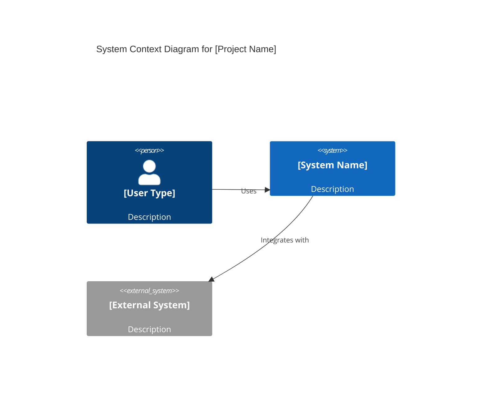
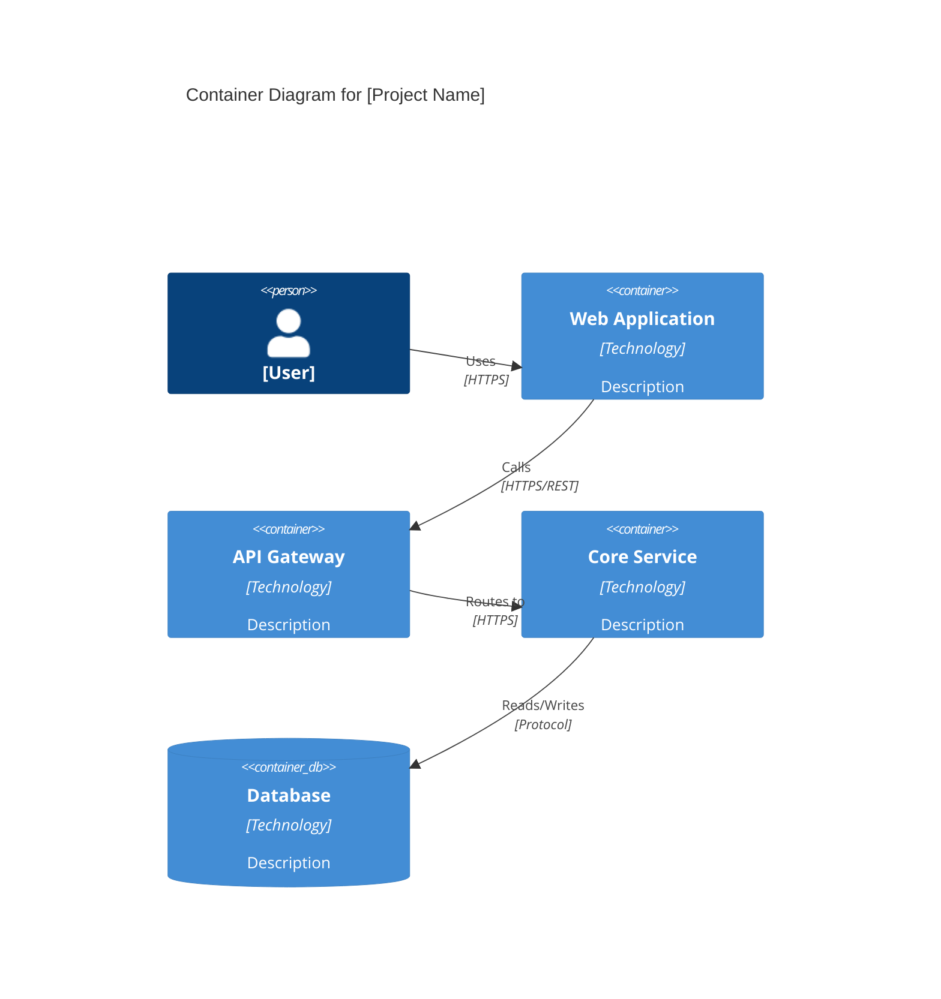
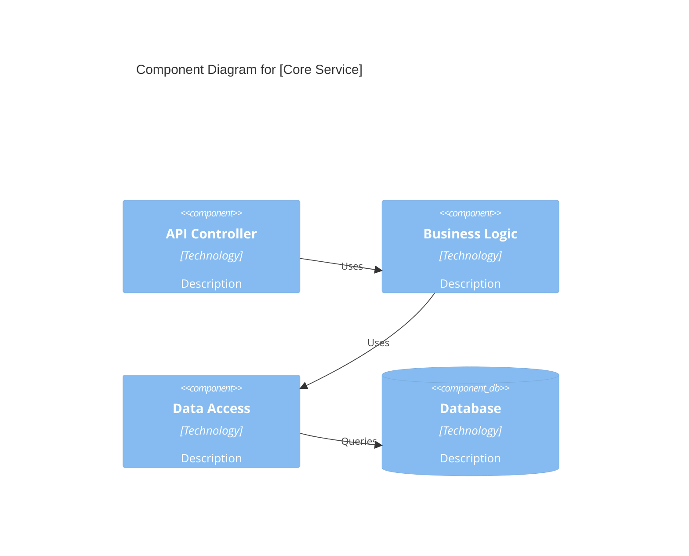
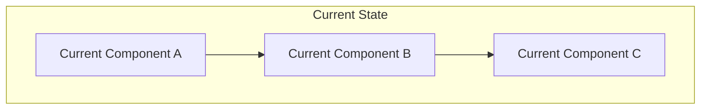
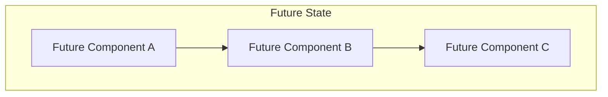
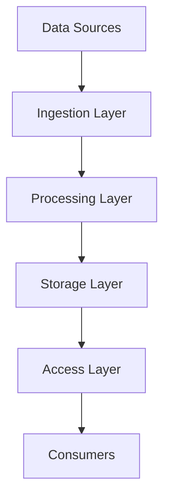
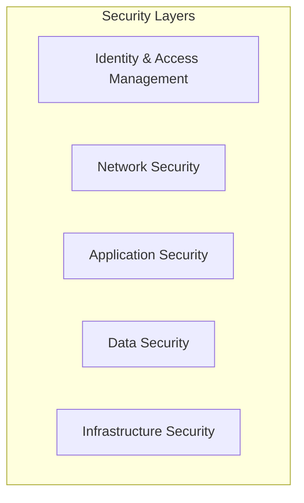
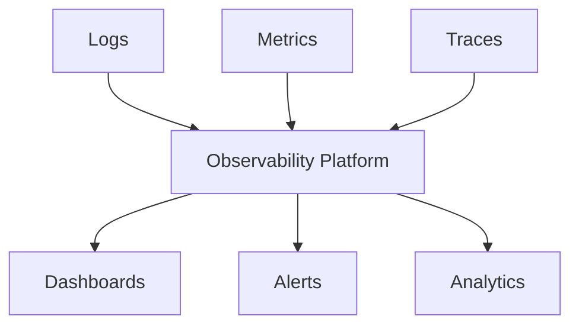

# Target Architecture: [Project Name]

**Document Owner:** [Lead Architect]  
**Last Updated:** [Date]  
**Status:** [Draft/Review/Approved]  
**Reviewers:** [Engineering Director, SecOps, DevOps, PM]

## 1. Architecture Overview

### **Purpose**
Define how the system should evolve from current to future state with explicit trade-offs.

### **Architecture Principles**
- [Principle 1: e.g., API-first design]
- [Principle 2: e.g., Security by design]
- [Principle 3: e.g., Cloud-native approach]
- [Principle 4: e.g., Data-driven decisions]

### **Key Architectural Drivers**
- [Driver 1: e.g., Scalability requirements]
- [Driver 2: e.g., Security compliance]
- [Driver 3: e.g., Performance targets]
- [Driver 4: e.g., Cost optimization]

## 2. C4 Architecture Diagrams

### **Context Diagram (C1)**


### **Container Diagram (C2)**


### **Component Diagram (C3)**


## 3. Current vs. Future State

### **Current State Architecture**


**Current State Characteristics:**
- [Characteristic 1: e.g., Monolithic design]
- [Characteristic 2: e.g., Local database]
- [Characteristic 3: e.g., Manual deployment]

**Current State Limitations:**
- [Limitation 1: e.g., Scalability constraints]
- [Limitation 2: e.g., Security gaps]
- [Limitation 3: e.g., Maintenance burden]

### **Future State Architecture**


**Future State Characteristics:**
- [Characteristic 1: e.g., Microservices architecture]
- [Characteristic 2: e.g., Cloud-native database]
- [Characteristic 3: e.g., Automated CI/CD]

**Future State Benefits:**
- [Benefit 1: e.g., Horizontal scalability]
- [Benefit 2: e.g., Enhanced security]
- [Benefit 3: e.g., Reduced operational overhead]

## 4. Transition Roadmap

### **Migration Strategy**
- **Approach:** [Strangler pattern/Big bang/Phased migration]
- **Duration:** [Estimated timeline]
- **Risk Level:** [High/Medium/Low]

### **Implementation Phases**
```mermaid
gantt
    title Architecture Migration Roadmap
    dateFormat  YYYY-MM-DD
    section Phase 1
    Component A Migration    :active, p1a, [start-date], [duration]
    Component B Migration    :        p1b, [start-date], [duration]
    section Phase 2
    Component C Migration    :        p2a, [start-date], [duration]
    Integration Testing      :        p2b, [start-date], [duration]
    section Phase 3
    Production Cutover       :        p3a, [start-date], [duration]
    Legacy Decommission      :        p3b, [start-date], [duration]
```

### **Phase Details**

#### **Phase 1: Foundation**
- **Scope:** [What will be migrated]
- **Duration:** [Timeline]
- **Success Criteria:** [Measurable outcomes]
- **Rollback Plan:** [How to revert if needed]

#### **Phase 2: Core Migration**
- **Scope:** [What will be migrated]
- **Duration:** [Timeline]
- **Success Criteria:** [Measurable outcomes]
- **Rollback Plan:** [How to revert if needed]

#### **Phase 3: Optimization**
- **Scope:** [What will be migrated]
- **Duration:** [Timeline]
- **Success Criteria:** [Measurable outcomes]
- **Rollback Plan:** [How to revert if needed]

## 5. Non-Functional Requirements (NFRs)

### **Performance Targets**
| **NFR ID** | **Requirement** | **Current** | **Target** | **Measurement** |
|------------|-----------------|-------------|------------|-----------------|
| NFR-P01 | API Response Time (P95) | [Current] | ≤ 250ms | APM monitoring |
| NFR-P02 | Bulk Processing | [Current] | ≤ 2s per batch | Performance tests |
| NFR-P03 | Concurrent Users | [Current] | 10,000 | Load testing |
| NFR-P04 | Throughput | [Current] | [Target] TPS | Monitoring |

### **Availability Targets**
| **NFR ID** | **Requirement** | **Target** | **Measurement** |
|------------|-----------------|------------|-----------------|
| NFR-A01 | System Uptime | ≥ 99.9% monthly | SLO monitoring |
| NFR-A02 | Recovery Time Objective (RTO) | ≤ 4 hours | Disaster recovery tests |
| NFR-A03 | Recovery Point Objective (RPO) | ≤ 1 hour | Backup validation |

### **Scalability Targets**
| **NFR ID** | **Requirement** | **Target** | **Implementation** |
|------------|-----------------|------------|-------------------|
| NFR-S01 | Horizontal Scaling | Auto-scale 2-20 instances | Container orchestration |
| NFR-S02 | Database Scaling | Read replicas + sharding | Database architecture |
| NFR-S03 | Storage Scaling | Unlimited with tiering | Cloud storage |

## 6. Data Architecture

### **Data Flow Diagram**


### **Data Entities**
| **Entity** | **Source** | **Owner** | **Lifecycle** | **Privacy Class** |
|------------|------------|-----------|---------------|-------------------|
| [Entity 1] | [Source] | [Owner] | [Retention policy] | [PII/Non-PII] |
| [Entity 2] | [Source] | [Owner] | [Retention policy] | [PII/Non-PII] |
| [Entity 3] | [Source] | [Owner] | [Retention policy] | [PII/Non-PII] |

### **Data Governance**
- **Data Lineage:** [How data flows are tracked]
- **Data Quality:** [Quality assurance measures]
- **Data Retention:** [Retention policies and implementation]
- **Data Residency:** [Geographic data storage requirements]
- **Data Cataloging:** [Metadata management approach]

## 7. Security & Compliance

### **Security Architecture**


### **Security Controls**
| **Control ID** | **Control** | **Implementation** | **Compliance** |
|----------------|-------------|-------------------|----------------|
| SEC-001 | Authentication | OAuth 2.0/OIDC | [Standard] |
| SEC-002 | Authorization | RBAC with ABAC | [Standard] |
| SEC-003 | Data Encryption | AES-256 at rest, TLS 1.3 in transit | [Standard] |
| SEC-004 | Secrets Management | Key vault with rotation | [Standard] |
| SEC-005 | Audit Logging | Centralized audit trail | [Standard] |

### **Threat Model (STRIDE)**
| **Threat** | **Asset** | **Impact** | **Likelihood** | **Mitigation** |
|------------|-----------|------------|----------------|----------------|
| Spoofing | [Asset] | [Impact] | [H/M/L] | [Mitigation] |
| Tampering | [Asset] | [Impact] | [H/M/L] | [Mitigation] |
| Repudiation | [Asset] | [Impact] | [H/M/L] | [Mitigation] |
| Information Disclosure | [Asset] | [Impact] | [H/M/L] | [Mitigation] |
| Denial of Service | [Asset] | [Impact] | [H/M/L] | [Mitigation] |
| Elevation of Privilege | [Asset] | [Impact] | [H/M/L] | [Mitigation] |

### **Compliance Requirements**
- **Privacy:** [GDPR/CCPA requirements and implementation]
- **Security:** [SOC 2/ISO 27001 requirements]
- **Industry:** [Industry-specific compliance requirements]

## 8. Reliability & Resilience

### **Service Level Objectives (SLOs)**
| **Service** | **SLI** | **SLO** | **Error Budget** |
|-------------|---------|---------|------------------|
| [Service 1] | [Indicator] | [Objective] | [Budget] |
| [Service 2] | [Indicator] | [Objective] | [Budget] |
| [Service 3] | [Indicator] | [Objective] | [Budget] |

### **Redundancy Model**
- **Application Tier:** [Redundancy approach]
- **Data Tier:** [Redundancy approach]
- **Network Tier:** [Redundancy approach]

### **Disaster Recovery**
- **RTO:** [Recovery Time Objective]
- **RPO:** [Recovery Point Objective]
- **Backup Strategy:** [Backup approach and frequency]
- **Recovery Procedures:** [Step-by-step recovery process]

### **Incident Response**
- **Detection:** [How incidents are detected]
- **Response:** [Response procedures and escalation]
- **Communication:** [Stakeholder communication plan]
- **Post-Incident:** [Post-mortem and improvement process]

## 9. Observability

### **Monitoring Strategy**


### **Golden Signals**
- **Latency:** [How response time is measured]
- **Traffic:** [How request volume is measured]
- **Errors:** [How error rates are measured]
- **Saturation:** [How resource utilization is measured]

### **Dashboards & Alerting**
- **Business Metrics:** [Key business indicators]
- **System Metrics:** [System health indicators]
- **Application Metrics:** [Application performance indicators]
- **Alert Policies:** [When and how alerts are triggered]

## 10. Technology Stack

### **Current vs. Target Technology**
| **Layer** | **Current** | **Target** | **Rationale** | **Migration Effort** |
|-----------|-------------|------------|---------------|---------------------|
| Frontend | [Current tech] | [Target tech] | [Why changing] | [Effort estimate] |
| Backend | [Current tech] | [Target tech] | [Why changing] | [Effort estimate] |
| Database | [Current tech] | [Target tech] | [Why changing] | [Effort estimate] |
| Infrastructure | [Current tech] | [Target tech] | [Why changing] | [Effort estimate] |

### **Technology Decisions**
- **Programming Languages:** [Choices and rationale]
- **Frameworks:** [Choices and rationale]
- **Databases:** [Choices and rationale]
- **Infrastructure:** [Choices and rationale]
- **Third-party Services:** [Choices and rationale]

## 11. Architecture Decision Records (ADRs)

### **Decision Summary**
| **ADR ID** | **Title** | **Status** | **Date** | **Owner** |
|------------|-----------|------------|----------|-----------|
| ADR-001 | [Decision title] | [Accepted/Proposed/Superseded] | [Date] | [Owner] |
| ADR-002 | [Decision title] | [Accepted/Proposed/Superseded] | [Date] | [Owner] |
| ADR-003 | [Decision title] | [Accepted/Proposed/Superseded] | [Date] | [Owner] |

### **Key Decisions**
- [Link to ADR-001: Decision description]
- [Link to ADR-002: Decision description]
- [Link to ADR-003: Decision description]

## 12. Implementation Considerations

### **Quick Wins**
- [Low risk/high value items for early delivery]
- [Estimated effort and timeline]
- [Success criteria]

### **Feature Flags & Rollout Strategy**
- **Feature Toggle Strategy:** [How features will be controlled]
- **Rollout Plan:** [Staged rollout approach]
- **Monitoring:** [How rollout success is measured]

### **Backward Compatibility**
- **API Versioning:** [How API changes are managed]
- **Data Migration:** [How data is migrated]
- **Client Compatibility:** [How client compatibility is maintained]

### **Cutover & Rollback Plans**
- **Cutover Criteria:** [When to switch to new system]
- **Rollback Triggers:** [When to rollback]
- **Rollback Procedures:** [How to rollback safely]

## 13. Quality Gates

### **Architecture Review Checkpoints**
- [ ] C4 diagrams (Context/Container/Component) published
- [ ] NFR targets defined with fit criteria
- [ ] Transition plan and rollback defined
- [ ] Security review (threat model) complete
- [ ] Performance targets validated
- [ ] Scalability approach confirmed

### **Technical Validation**
- [ ] Proof of concepts completed for high-risk areas
- [ ] Technology stack decisions validated
- [ ] Integration patterns tested
- [ ] Security controls validated

## 14. Approval & Sign-off

### **Review Checklist**
- [ ] Architecture principles defined and agreed
- [ ] Current vs. future state clearly documented
- [ ] Migration strategy and timeline realistic
- [ ] NFRs defined with measurable targets
- [ ] Security and compliance requirements addressed
- [ ] Technology decisions documented with rationale

### **Approvals**
- [ ] **Lead Architect:** [Name] - [Date] - [Signature]
- [ ] **Engineering Director:** [Name] - [Date] - [Signature]
- [ ] **Security Lead:** [Name] - [Date] - [Signature]
- [ ] **DevOps Lead:** [Name] - [Date] - [Signature]

---

**Document Control**
- **Template Version:** 1.0
- **Last Updated:** [Date]
- **Next Review:** [Date]
- **Related Documents:** [Links to ADRs, feature specs, etc.]
