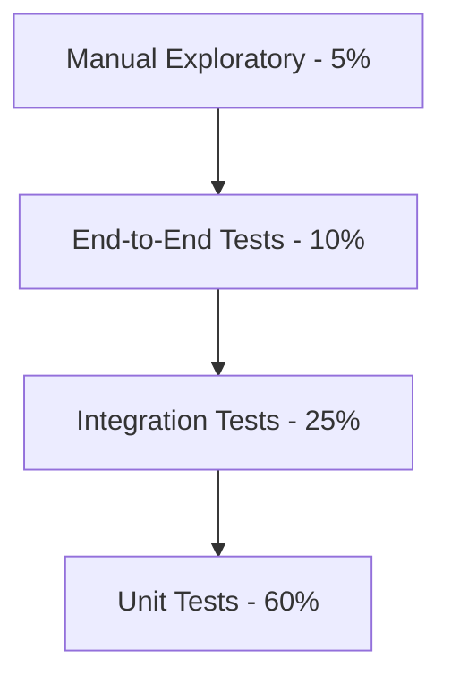
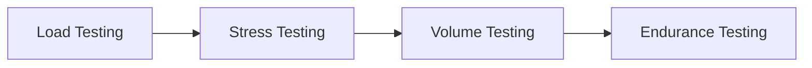
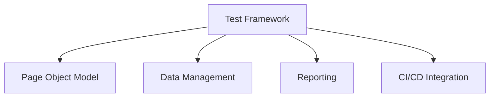
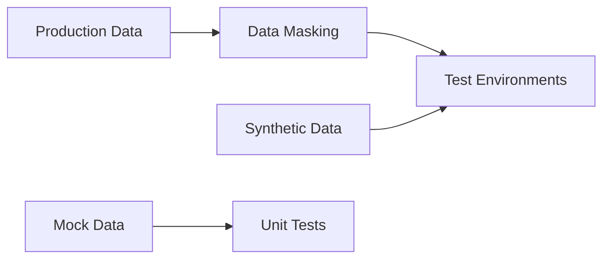
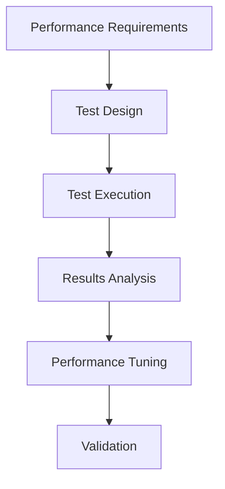
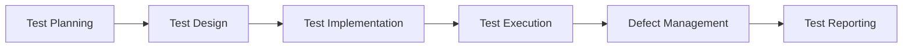
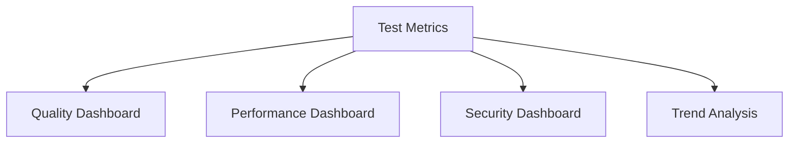

# Testing Strategy: [Project Name]

**Document Owner:** [QA Lead]  
**Last Updated:** [Date]  
**Status:** [Draft/Review/Approved]  
**Reviewers:** [QA Manager, Engineering, Product]

## 1. Testing Overview

### **Purpose**
Define how we will validate that the solution works as intended, reliably and securely.

### **Testing Philosophy**
- [Philosophy 1: e.g., Shift-left testing approach]
- [Philosophy 2: e.g., Automation-first strategy]
- [Philosophy 3: e.g., Risk-based testing prioritization]
- [Philosophy 4: e.g., Continuous testing integration]

### **Quality Objectives**
- [Objective 1: e.g., Achieve 99.9% system reliability]
- [Objective 2: e.g., Maintain <250ms API response times]
- [Objective 3: e.g., Zero critical security vulnerabilities]
- [Objective 4: e.g., 95% user satisfaction score]

## 2. Test Pyramid Strategy

### **Test Distribution**

### **Test Level Definitions**

#### **Unit Tests (60%)**
- **Scope:** Individual functions, methods, classes
- **Characteristics:** Fast, isolated, deterministic
- **Tools:** [JUnit/pytest/Jest]
- **Coverage Target:** ≥80% line coverage
- **Execution:** Every code commit

#### **Integration Tests (25%)**
- **Scope:** Component interactions, API contracts
- **Characteristics:** Medium speed, focused integration points
- **Tools:** [TestContainers/Postman/REST Assured]
- **Coverage Target:** All critical integration paths
- **Execution:** Every build

#### **End-to-End Tests (10%)**
- **Scope:** Complete user workflows
- **Characteristics:** Slow, comprehensive, realistic
- **Tools:** [Selenium/Playwright/Cypress]
- **Coverage Target:** Critical user journeys
- **Execution:** Pre-deployment

#### **Manual Exploratory (5%)**
- **Scope:** Usability, edge cases, creative testing
- **Characteristics:** Human insight, unscripted
- **Tools:** [Manual testing, user feedback]
- **Coverage Target:** New features, complex scenarios
- **Execution:** Sprint reviews, UAT

## 3. Testing Types & Phases

### **Functional Testing**

#### **API Testing**
- **Scope:** REST/GraphQL API endpoints
- **Test Cases:** Happy path, error handling, edge cases
- **Tools:** [Postman/Newman/REST Assured]
- **Automation:** 100% of API endpoints
- **Data:** Contract-based testing with schema validation

#### **UI Testing**
- **Scope:** User interface functionality
- **Test Cases:** User workflows, form validation, navigation
- **Tools:** [Selenium/Playwright/Cypress]
- **Automation:** Critical user paths
- **Cross-browser:** Chrome, Firefox, Safari, Edge

#### **Database Testing**
- **Scope:** Data integrity, CRUD operations
- **Test Cases:** Data validation, constraints, triggers
- **Tools:** [SQL scripts/DBUnit]
- **Automation:** Database migration tests
- **Data:** Synthetic test data sets

### **Non-Functional Testing**

#### **Performance Testing**

**Performance Test Types:**
| **Test Type** | **Purpose** | **Load Profile** | **Success Criteria** |
|---------------|-------------|------------------|---------------------|
| Load Testing | Normal expected load | [X] concurrent users | Response time <250ms P95 |
| Stress Testing | Breaking point | 150% of max load | Graceful degradation |
| Volume Testing | Large data sets | [X] GB of data | No performance degradation |
| Endurance Testing | Extended periods | Normal load for 24h | No memory leaks |

**Performance Budgets:**
- API Response Time: <250ms (P95), <500ms (P99)
- Page Load Time: <2s first load, <1s subsequent
- Database Query Time: <100ms (P95)
- Batch Processing: <2s per 1000 records

#### **Security Testing**
- **SAST (Static Analysis):** Code vulnerability scanning
- **DAST (Dynamic Analysis):** Runtime vulnerability testing
- **Dependency Scanning:** Third-party vulnerability assessment
- **Penetration Testing:** Ethical hacking assessment
- **Security Code Review:** Manual security-focused reviews

#### **Accessibility Testing**
- **Standards:** WCAG 2.2 AA compliance
- **Tools:** [axe-core/Pa11y/WAVE]
- **Scope:** All user-facing interfaces
- **Testing:** Automated + manual validation
- **Assistive Technology:** Screen readers, keyboard navigation

#### **Compatibility Testing**
- **Browsers:** Chrome, Firefox, Safari, Edge (latest 2 versions)
- **Operating Systems:** Windows, macOS, Linux
- **Mobile Devices:** iOS, Android (responsive design)
- **Screen Resolutions:** 1920x1080, 1366x768, mobile viewports

## 4. Test Automation Strategy

### **Automation Framework**

### **Automation Coverage Targets**
| **Test Level** | **Coverage Target** | **Rationale** |
|----------------|-------------------|---------------|
| Unit Tests | ≥80% line coverage | Fast feedback, comprehensive logic coverage |
| API Tests | 100% endpoints | Critical integration points |
| UI Tests | Critical paths (≥90% user journeys) | High-value user scenarios |
| Performance Tests | Key transactions | Performance-critical operations |

### **Test Data Management**
- **Synthetic Data:** Generated test data for consistent testing
- **Data Masking:** PII protection in non-production environments
- **Test Data Refresh:** Automated data seeding and cleanup
- **Data Isolation:** Independent test data per test suite

### **Test Environment Management**
- **Environment Provisioning:** Infrastructure as Code for test environments
- **Data Seeding:** Automated test data setup
- **Environment Reset:** Clean state between test runs
- **Parallel Execution:** Concurrent test execution capabilities

## 5. Test Environments

### **Environment Strategy**
| **Environment** | **Purpose** | **Data** | **Automation Level** | **Access** |
|-----------------|-------------|----------|---------------------|------------|
| Unit Test | Developer testing | Mock/stub data | 100% automated | Developers |
| Integration | Component testing | Synthetic data | 100% automated | CI/CD pipeline |
| QA | Feature testing | Masked production data | 80% automated | QA team |
| Staging | Pre-production validation | Production-like data | 60% automated | All teams |
| Production | Live system | Real data | Monitoring only | Operations |

### **Environment Parity**
- **Infrastructure:** Consistent configuration across environments
- **Data Volume:** Scaled-down but representative data sets
- **Security:** Production-like security controls
- **Monitoring:** Observability tools in all environments

### **Test Data Strategy**

## 6. Security Testing

### **Security Test Types**
| **Test Type** | **Tool/Method** | **Frequency** | **Scope** |
|---------------|-----------------|---------------|-----------|
| SAST | [SonarQube/Checkmarx] | Every commit | Source code |
| DAST | [OWASP ZAP/Burp Suite] | Nightly | Running application |
| Dependency Scan | [Snyk/WhiteSource] | Every build | Third-party libraries |
| Container Scan | [Clair/Trivy] | Every image build | Container images |
| IaC Scan | [Checkov/Terrascan] | Every infrastructure change | Infrastructure code |

### **Security Test Cases**
- **Authentication:** Login, logout, session management
- **Authorization:** Role-based access control, privilege escalation
- **Input Validation:** SQL injection, XSS, CSRF protection
- **Data Protection:** Encryption at rest and in transit
- **API Security:** Rate limiting, input sanitization, output encoding

### **Penetration Testing**
- **Frequency:** Quarterly or before major releases
- **Scope:** Full application stack and infrastructure
- **Method:** External security firm engagement
- **Reporting:** Detailed findings with remediation priorities

## 7. Performance Testing

### **Performance Test Strategy**

### **Load Testing Scenarios**
| **Scenario** | **Users** | **Duration** | **Ramp-up** | **Success Criteria** |
|--------------|-----------|--------------|-------------|---------------------|
| Normal Load | [X] users | 30 minutes | 5 minutes | <250ms P95 response time |
| Peak Load | [Y] users | 15 minutes | 3 minutes | <500ms P95 response time |
| Stress Test | [Z] users | Until failure | 10 minutes | Graceful degradation |
| Endurance | [X] users | 24 hours | 30 minutes | No performance degradation |

### **Performance Monitoring**
- **Real-time Metrics:** Response time, throughput, error rate
- **Resource Monitoring:** CPU, memory, disk, network utilization
- **Application Metrics:** Database connections, cache hit rates
- **Business Metrics:** Transaction success rates, user experience

## 8. Test Execution & Management

### **Test Planning**
- **Test Plan Creation:** Per feature/release test planning
- **Risk Assessment:** Risk-based test prioritization
- **Resource Allocation:** Team capacity and skill planning
- **Timeline Planning:** Test execution scheduling

### **Test Execution Process**

### **Defect Management**
| **Severity** | **Definition** | **Response Time** | **Resolution Time** |
|--------------|----------------|-------------------|-------------------|
| Critical | System down/data loss | 1 hour | 4 hours |
| High | Major functionality broken | 4 hours | 24 hours |
| Medium | Minor functionality issues | 24 hours | 1 week |
| Low | Cosmetic/enhancement | 1 week | Next release |

### **Test Reporting**
- **Daily Reports:** Test execution status, pass/fail rates
- **Sprint Reports:** Feature testing completion, quality metrics
- **Release Reports:** Overall quality assessment, risk analysis
- **Metrics Dashboard:** Real-time test execution and quality metrics

## 9. Quality Gates & Exit Criteria

### **Quality Gates by Phase**
| **Phase** | **Entry Criteria** | **Exit Criteria** |
|-----------|-------------------|-------------------|
| Unit Testing | Code complete, peer reviewed | ≥80% coverage, all tests pass |
| Integration Testing | Unit tests pass, components deployed | All integration tests pass |
| System Testing | Integration tests pass, system deployed | All critical tests pass, NFRs met |
| UAT | System tests pass, user stories complete | User acceptance, business approval |

### **Release Exit Criteria**
- [ ] All critical and high severity defects resolved
- [ ] Performance targets met (SLO compliance)
- [ ] Security scan results acceptable (no critical vulnerabilities)
- [ ] Accessibility compliance validated (WCAG 2.2 AA)
- [ ] User acceptance testing completed successfully
- [ ] Production readiness checklist completed
- [ ] Rollback plan tested and validated

### **Go/No-Go Decision Framework**
| **Criteria** | **Weight** | **Threshold** | **Current Status** | **Go/No-Go** |
|--------------|------------|---------------|-------------------|--------------|
| Functional Quality | 30% | 95% critical tests pass | [Status] | [Decision] |
| Performance | 25% | SLO targets met | [Status] | [Decision] |
| Security | 20% | No critical vulnerabilities | [Status] | [Decision] |
| User Acceptance | 15% | 90% user satisfaction | [Status] | [Decision] |
| Operational Readiness | 10% | All runbooks complete | [Status] | [Decision] |

## 10. Test Metrics & KPIs

### **Quality Metrics**
| **Metric** | **Target** | **Measurement** | **Frequency** |
|------------|------------|-----------------|---------------|
| Test Coverage | ≥80% | Code coverage tools | Every build |
| Defect Density | <5 defects/KLOC | Defect tracking | Sprint end |
| Test Pass Rate | ≥95% | Test execution results | Daily |
| Defect Escape Rate | <2% | Production defects | Monthly |

### **Efficiency Metrics**
| **Metric** | **Target** | **Measurement** | **Frequency** |
|------------|------------|-----------------|---------------|
| Test Automation Rate | ≥80% | Automated vs manual tests | Sprint end |
| Test Execution Time | <2 hours | Pipeline execution time | Every build |
| Mean Time to Detection | <1 hour | Monitoring alerts | Continuous |
| Mean Time to Resolution | <4 hours | Incident tracking | Per incident |

### **Reporting Dashboard**

## 11. Tools & Technology

### **Test Automation Tools**
| **Category** | **Tool** | **Purpose** | **License** |
|--------------|----------|-------------|-------------|
| Unit Testing | [JUnit/pytest/Jest] | Unit test execution | [License] |
| API Testing | [Postman/REST Assured] | API test automation | [License] |
| UI Testing | [Selenium/Playwright] | Web UI automation | [License] |
| Performance | [JMeter/k6] | Load and performance testing | [License] |
| Security | [OWASP ZAP/SonarQube] | Security testing | [License] |

### **Test Management Tools**
| **Category** | **Tool** | **Purpose** | **License** |
|--------------|----------|-------------|-------------|
| Test Management | [TestRail/Zephyr] | Test case management | [License] |
| Defect Tracking | [Jira/Azure DevOps] | Bug tracking and management | [License] |
| CI/CD Integration | [Jenkins/GitHub Actions] | Test automation execution | [License] |
| Reporting | [Allure/ExtentReports] | Test result reporting | [License] |

## 12. Team Structure & Responsibilities

### **Testing Team Roles**
| **Role** | **Responsibilities** | **Skills Required** |
|----------|---------------------|-------------------|
| QA Lead | Test strategy, planning, team management | Leadership, strategy, technical |
| Test Architect | Framework design, tool selection | Architecture, automation, tools |
| Automation Engineer | Test automation development | Programming, frameworks, CI/CD |
| Performance Tester | Performance test design and execution | Performance tools, analysis |
| Security Tester | Security test design and execution | Security knowledge, tools |
| Manual Tester | Exploratory testing, UAT support | Domain knowledge, testing skills |

### **Collaboration Model**
- **Embedded QA:** QA engineers work within development teams
- **Cross-functional Teams:** Shared responsibility for quality
- **Quality Champions:** Developers with testing expertise
- **Community of Practice:** Regular knowledge sharing sessions

## 13. Risk Management

### **Testing Risks**
| **Risk** | **Probability** | **Impact** | **Mitigation** | **Owner** |
|----------|-----------------|------------|----------------|-----------|
| Insufficient test coverage | Medium | High | Automated coverage monitoring | QA Lead |
| Test environment instability | High | Medium | Infrastructure as Code | DevOps |
| Test data quality issues | Medium | Medium | Automated data validation | QA Team |
| Late defect discovery | Low | High | Shift-left testing approach | Dev Team |

### **Quality Risks**
- **Performance Degradation:** Continuous performance monitoring
- **Security Vulnerabilities:** Integrated security testing
- **User Experience Issues:** Regular usability testing
- **Data Integrity Problems:** Comprehensive data validation

## 14. Continuous Improvement

### **Test Process Improvement**
- **Retrospectives:** Regular testing process retrospectives
- **Metrics Analysis:** Trend analysis and improvement identification
- **Tool Evaluation:** Regular assessment of testing tools
- **Training:** Continuous skill development for team members

### **Innovation & Research**
- **Emerging Technologies:** AI/ML in testing, visual testing
- **Industry Best Practices:** Conference attendance, community engagement
- **Proof of Concepts:** Experimentation with new approaches
- **Knowledge Sharing:** Internal tech talks and documentation

## 15. Approval & Sign-off

### **Review Checklist**
- [ ] Test pyramid strategy defined with coverage targets
- [ ] Automation plan and tools selected
- [ ] Performance budgets and scenarios defined
- [ ] Security testing approach comprehensive
- [ ] Quality gates and exit criteria clear
- [ ] Test environments and data strategy defined

### **Approvals**
- [ ] **QA Lead:** [Name] - [Date] - [Signature]
- [ ] **QA Manager:** [Name] - [Date] - [Signature]
- [ ] **Engineering Lead:** [Name] - [Date] - [Signature]
- [ ] **Product Manager:** [Name] - [Date] - [Signature]

---

**Document Control**
- **Template Version:** 1.0
- **Last Updated:** [Date]
- **Next Review:** [Date]
- **Related Documents:** [Links to feature specs, architecture, development approach]
