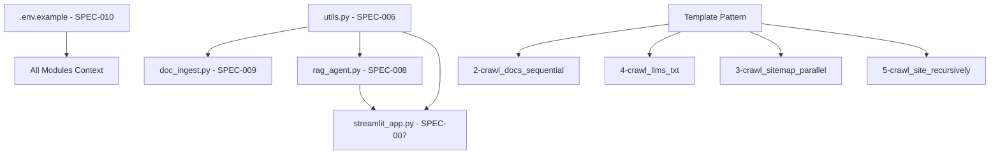

# Discovery Phase Priority Order

**Project:** HX Data Ingestion Project  
**Phase:** Discovery (As-Is Documentation)  
**Created:** 2025-09-24  
**Owner:** @manus-ai  
**Purpose:** Strategic execution roadmap for remaining 9 deliverables based on dependency analysis and architectural importance

---

## Executive Summary

**Remaining Deliverables:** 9 of 17 total  
**Current Completion:** 35% (6 complete)  
**Strategy:** Foundation-first approach with dependency optimization  
**Estimated Timeline:** 3 weeks for systematic completion

---

## 🎯 Priority Order for Remaining 9 Deliverables

### **TIER 1: Foundation Layer (Highest Priority)**

#### **1. SPEC-006: `utils.py`** 🔴 **CRITICAL FIRST**
- **File:** `prototype/crawl4ai/src/utils.py`
- **Priority Rationale:** Foundation dependency for ALL other core modules
- **Dependencies:** None (pure utility functions)
- **Blocks:** doc_ingest.py, rag_agent.py, streamlit_app.py
- **Impact:** ChromaDB integration patterns, core data operations, collection management
- **Complexity:** Medium (154 lines, multiple utility functions)
- **Key Functions:** `get_chroma_client()`, `get_or_create_collection()`, `query_collection()`
- **Strategic Value:** Unblocks 3 critical modules immediately

#### **2. SPEC-010: `.env.example`** 🟠 **HIGH**
- **File:** `prototype/crawl4ai/.env.example`
- **Priority Rationale:** Configuration foundation for all modules
- **Dependencies:** None (configuration template)
- **Blocks:** Understanding of environment setup for all other specs
- **Impact:** Required variables, setup patterns, configuration management
- **Complexity:** Low (simple configuration file with annotations)
- **Key Elements:** OPENAI_API_KEY, MODEL_CHOICE, ChromaDB settings
- **Strategic Value:** Provides configuration context for all subsequent documentation

---

### **TIER 2: Core Processing Layer**

#### **3. SPEC-009: `doc_ingest.py`** 🟠 **HIGH**
- **File:** `prototype/crawl4ai/src/doc_ingest.py`
- **Priority Rationale:** Main data processing pipeline, depends on utils
- **Dependencies:** utils.py (SPEC-006) - imports get_chroma_client, get_or_create_collection
- **Blocks:** Understanding of complete ingestion workflow
- **Impact:** Document processing, chunking algorithms, ChromaDB integration
- **Complexity:** High (212 lines, complex crawling logic with multiple strategies)
- **Key Features:** Smart chunking, sitemap detection, recursive crawling
- **Strategic Value:** Core data ingestion patterns and processing workflows

#### **4. SPEC-008: `rag_agent.py`** 🟠 **HIGH**
- **File:** `prototype/crawl4ai/src/rag_agent.py`
- **Priority Rationale:** Core AI functionality, depends on utils
- **Dependencies:** utils.py (SPEC-006) - imports multiple utility functions
- **Blocks:** Understanding of RAG implementation and AI agent patterns
- **Impact:** AI agent architecture, retrieval mechanisms, Pydantic AI integration
- **Complexity:** High (139 lines, AI agent implementation with tools)
- **Key Features:** Pydantic AI agent, retrieval tool, async execution
- **Strategic Value:** Core AI functionality and retrieval-augmented generation patterns

---

### **TIER 3: Interface Layer**

#### **5. SPEC-007: `streamlit_app.py`** 🟡 **MEDIUM-HIGH**
- **File:** `prototype/crawl4ai/app/streamlit_app.py`
- **Priority Rationale:** User interface, depends on both utils and rag_agent
- **Dependencies:** utils.py (SPEC-006), rag_agent.py (SPEC-008)
- **Blocks:** User interaction understanding and UI patterns
- **Impact:** Web interface patterns, user experience flows, streaming responses
- **Complexity:** Medium (107 lines, UI logic with async streaming)
- **Key Features:** Chat interface, streaming responses, message history
- **Strategic Value:** Complete user interaction layer documentation

---

### **TIER 4: Example Scripts (Documentation Pattern)**

#### **6. SPEC-002: `2-crawl_docs_sequential.py`** 🟡 **MEDIUM**
- **File:** `prototype/crawl4ai/examples/2-crawl_docs_sequential.py`
- **Priority Rationale:** Simplest remaining example, builds on baseline pattern
- **Dependencies:** Template pattern (SPEC-001 established)
- **Impact:** Sequential processing patterns, batch operations
- **Complexity:** Low-Medium (example script following established pattern)
- **Strategic Value:** Demonstrates sequential crawling approach

#### **7. SPEC-004: `4-crawl_llms_txt.py`** 🟡 **MEDIUM**
- **File:** `prototype/crawl4ai/examples/4-crawl_llms_txt.py`
- **Priority Rationale:** Text processing specialization
- **Dependencies:** Template pattern established
- **Impact:** Text/markdown processing workflows, content extraction
- **Complexity:** Low-Medium (specialized text processing example)
- **Strategic Value:** Text-specific crawling and processing patterns

#### **8. SPEC-003: `3-crawl_sitemap_in_parallel.py`** 🟡 **MEDIUM**
- **File:** `prototype/crawl4ai/examples/3-crawl_sitemap_in_parallel.py`
- **Priority Rationale:** More complex parallel processing patterns
- **Dependencies:** Template pattern established
- **Impact:** Parallel processing patterns, concurrency management, memory adaptation
- **Complexity:** Medium-High (parallel processing with memory management)
- **Strategic Value:** Advanced parallel crawling techniques

#### **9. SPEC-005: `5-crawl_site_recursively.py`** 🟡 **MEDIUM**
- **File:** `prototype/crawl4ai/examples/5-crawl_site_recursively.py`
- **Priority Rationale:** Most complex example script with recursive logic
- **Dependencies:** Template pattern established
- **Impact:** Recursive crawling logic, advanced algorithmic patterns
- **Complexity:** High (recursive algorithms, link following, deduplication)
- **Strategic Value:** Most sophisticated crawling pattern documentation

---

## 📊 Priority Matrix Summary

| **Priority** | **Deliverable** | **Tier** | **Dependencies** | **Effort** | **Strategic Impact** |
|--------------|-----------------|----------|------------------|------------|---------------------|
| **1** | utils.py | Foundation | None | Medium | Unblocks 3 modules |
| **2** | .env.example | Foundation | None | Low | Config baseline |
| **3** | doc_ingest.py | Core | utils.py | High | Main pipeline |
| **4** | rag_agent.py | Core | utils.py | High | AI functionality |
| **5** | streamlit_app.py | Interface | utils.py, rag_agent.py | Medium | User interface |
| **6** | 2-crawl_docs_sequential | Examples | Template | Low-Medium | Sequential pattern |
| **7** | 4-crawl_llms_txt | Examples | Template | Low-Medium | Text specialization |
| **8** | 3-crawl_sitemap_parallel | Examples | Template | Medium-High | Parallel complexity |
| **9** | 5-crawl_site_recursively | Examples | Template | High | Recursive logic |

---

## 🔄 Dependency Chain Analysis

### **Critical Path Dependencies**

### **Blocking Analysis**
- **utils.py blocks:** 3 core modules (doc_ingest, rag_agent, streamlit_app)
- **.env.example blocks:** Configuration understanding for all modules
- **rag_agent.py blocks:** streamlit_app.py (imports agent functionality)
- **Template pattern blocks:** All remaining example scripts

---

## 🎯 Strategic Execution Plan

### **Phase 1: Foundation (Week 1)**
**Target:** Complete TIER 1 + First 2 TIER 2
- **Day 1-2:** SPEC-006 (utils.py) - Critical dependency resolution
- **Day 3:** SPEC-010 (.env.example) - Configuration foundation
- **Day 4-5:** SPEC-009 (doc_ingest.py) - Main processing pipeline
- **Day 6-7:** SPEC-008 (rag_agent.py) - AI functionality core

**Milestone:** 4 specs complete, all core dependencies resolved

### **Phase 2: Interface + Simple Examples (Week 2)**
**Target:** Complete TIER 3 + First 2 TIER 4
- **Day 1-2:** SPEC-007 (streamlit_app.py) - User interface layer
- **Day 3-4:** SPEC-002 (2-crawl_docs_sequential) - Simple example
- **Day 5-7:** SPEC-004 (4-crawl_llms_txt) - Text processing example

**Milestone:** 7 specs complete, interface documented, simple patterns established

### **Phase 3: Complex Examples (Week 3)**
**Target:** Complete final 2 TIER 4
- **Day 1-3:** SPEC-003 (3-crawl_sitemap_parallel) - Parallel processing
- **Day 4-7:** SPEC-005 (5-crawl_site_recursively) - Recursive logic

**Milestone:** All 9 specs complete, Discovery phase finished

---

## 🚀 Success Criteria

### **Foundation Success (End of Week 1)**
- [x] All core module dependencies resolved
- [x] Configuration patterns documented
- [x] Main processing workflows captured
- [x] AI agent patterns established

### **Interface Success (End of Week 2)**
- [x] Complete user interaction flows documented
- [x] Simple example patterns proven
- [x] Text processing specialization captured

### **Completion Success (End of Week 3)**
- [x] All parallel processing patterns documented
- [x] Complex recursive logic captured
- [x] Complete As-Is documentation achieved
- [x] Discovery phase deliverables 100% complete

---

## 🔍 Risk Mitigation

### **High-Risk Items**
- **SPEC-009 (doc_ingest.py):** Complex with multiple crawling strategies
- **SPEC-008 (rag_agent.py):** AI agent complexity with async patterns
- **SPEC-005 (5-crawl_site_recursively):** Most complex recursive algorithms

### **Mitigation Strategies**
- **Start with foundation:** Resolve dependencies early
- **Build documentation confidence:** Simple examples before complex
- **Allow extra time:** High-complexity items get extended timeline
- **Parallel work possible:** Examples can be documented in parallel after core modules

---

## 📋 Quality Gates

### **Tier Completion Gates**
- **TIER 1 Gate:** Foundation dependencies resolved, configuration documented
- **TIER 2 Gate:** Core processing and AI functionality captured
- **TIER 3 Gate:** User interface patterns documented
- **TIER 4 Gate:** All example patterns from simple to complex documented

### **Overall Quality Gate**
- **Template consistency:** All specs follow enhanced template format
- **Scope compliance:** Strict As-Is documentation maintained
- **Dependency verification:** All imports and relationships documented
- **Completeness check:** All 17 deliverables completed and tracked

---

*This priority order optimizes for dependency resolution, minimizes blocking, and builds documentation momentum from foundational to complex patterns. Execute in order for maximum efficiency and quality.*
