> **How to use**: This spec captures the **current behavior** of `1-crawl_single_page.py` strictly **as‑is** (no future‑state design).

---

## Scope
This spec captures the **current behavior** of `1-crawl_single_page.py` under `prototype/crawl4ai/examples/`. It documents **what/where/when/why/how** and includes **Mermaid diagrams** (sequence + data‑flow) for clear understanding.

---

## 1) What: Functional Purpose
This script's single function is to perform a basic, non-recursive crawl of a single, specified URL. It acts as the simplest possible demonstration and functional test of the Crawl4AI library's core capability: to launch a headless browser, navigate to a page, extract its content, and convert it into a clean Markdown format. 📄➡️📝

**Primary Goal:** To serve as a "hello world" for the crawling subsystem, validating that the core dependencies (Crawl4AI, Playwright, asyncio) are installed and functioning correctly. It provides a baseline for all other, more complex crawling operations in the prototype.

---

## 2) Where: System Context & Dependencies
- **Directory:** `prototype/crawl4ai/examples/1-crawl_single_page.py`
- **Execution Context:** Run from the command line (directly or via a launcher script that sets `PYTHONPATH`).  
- **Key Dependencies:**
  - **Python:** 3.11+ (for modern `asyncio` features)
  - **Runtime libs:** asyncio (built-in), Playwright (via Crawl4AI)  
  - **Project libs:** Crawl4AI==0.6.2 (AsyncWebCrawler, BrowserConfig)  
- **Relationship to App/Subsystem:** Foundational action that `src/doc_ingest.py` builds on; both call the crawler's `arun()` under the hood.

---

## 3) When: Use Cases & Triggers
- **Initial Environment Setup:** First script to verify Playwright browsers and Crawl4AI run correctly.
- **Basic Sanity Checks:** Quick validation that a target website is crawlable and Markdown quality is acceptable.
- **Debugging & Isolation:** Minimal test case when complex crawls fail—helps separate core crawling issues from batching/recursion logic.
- **Educational Tool:** Easiest entry point to understand Crawl4AI's async model.

---

## 4) Why: Engineering Rationale
- **Demonstrates Core Value:** Immediate HTML→Markdown extraction without extra complexity—useful for demos and stakeholder buy‑in. 🎯
- **Provides a Testable Unit:** De facto integration test for Crawl4AI + Playwright; pass/fail signals crawler health.
- **Enforces Modularity:** Encourages building complex features from simple building blocks.
- **Reduces Onboarding Friction:** Entire logic is understandable in minutes.

---

## 5) How: Technical Implementation Deep‑Dive
The script runs fully asynchronously under Python's `asyncio`. It demonstrates the minimal viable crawling pattern using Crawl4AI's context manager approach.

### Code (As‑Is)
```python
import asyncio
from crawl4ai import AsyncWebCrawler, BrowserConfig

async def main():
    async with AsyncWebCrawler() as crawler:
        result = await crawler.arun(
            url="https://ai.pydantic.dev/",
        )
        print(result.markdown)

if __name__ == "__main__":
    asyncio.run(main())
```

### Execution Flow Analysis
1. **Asynchronous Context Manager (`async with AsyncWebCrawler() as crawler`):** Enters crawler lifecycle; `__aenter__` launches Playwright + headless browser (e.g., Chromium). Browser persists for block duration; `__aexit__` does a clean teardown.
2. **Asynchronous Crawl (`await crawler.arun(...)`):** Event loop manages non‑blocking steps: navigate → wait for stable page → extract content → convert HTML→Markdown. Returns `CrawlerRunResult`.
3. **Process the Result (`print(result.markdown)`):** Prints extracted Markdown to stdout. Result object also has `success`, `error_message`, `links` properties (not used).
4. **Start Event Loop (`asyncio.run(main())`):** Creates, runs, and closes the event loop bridging sync entry to async execution.
5. **Implicit Browser Teardown:** Context manager automatically closes browser and cleans up resources on exit.

### Mermaid — Sequence Diagram (as‑is)

```mermaid
sequenceDiagram
    participant User as Command Line
    participant Script as 1-crawl_single_page.py
    participant Crawler as AsyncWebCrawler
    participant Target as ai.pydantic.dev

    User->>Script: python 1-crawl_single_page.py
    Script->>Crawler: async with AsyncWebCrawler()
    Script->>Crawler: await arun(url="https://ai.pydantic.dev/")
    Crawler->>Target: HTTP GET / (via Playwright)
    Target-->>Crawler: Return HTML content
    Crawler-->>Crawler: Process HTML → Markdown
    Crawler-->>Script: Return CrawlerRunResult
    Script->>User: print(result.markdown)
    Script->>Crawler: Context manager cleanup
```


### Mermaid — Data Flow Diagram (as‑is)
```mermaid
graph TD
    A[User / CLI] --> B[1-crawl_single_page.py]
    B --> C[asyncio event loop]
    C --> D[AsyncWebCrawler]
    D --> E[Headless Browser - Playwright]
    E --> F[ai.pydantic.dev]
    F --> E
    E --> G[DOM / HTML Content]
    G --> H[HTML → Markdown Converter]
    H --> I[CrawlerRunResult.markdown]
    I --> J[stdout via print()]
```

---

## Environment & Run Steps (As‑Is)
- **OS / Host:** Ubuntu 22.04 linux/amd64 (tested)
- **Python:** 3.11+ (requires modern asyncio features)
- **Install deps:** `pip install -r prototype/crawl4ai/requirements.txt`  
- **Install browsers/tools:** `playwright install`  
- **Run command:** `python prototype/crawl4ai/examples/1-crawl_single_page.py`  
- **Env vars:** None required
- **PYTHONPATH:** Not needed (script only imports crawl4ai)

## Inputs/Outputs & Exit Semantics (As‑Is)
- **Inputs:** None. URL is **hardcoded** as "https://ai.pydantic.dev/" in the script  
- **Outputs:** Prints `result.markdown` to **stdout** only; no files written; no structured logs  
- **Exit behavior:** Does **not** check `result.success`; typically exits **0** even if crawl failed silently. Non‑zero exit occurs only if an **exception** bubbles (e.g., Playwright launch/network error)

## Output Artifacts & Performance (As‑Is)
- **Sample output files:** None - output goes to stdout only
- **Output location:** stdout (terminal)
- **File naming pattern:** N/A - no files created
- **Performance characteristics:** 
  - **Typical runtime:** 2-5 seconds for single page crawl
  - **Resource usage:** ~50-100MB RAM for browser instance, minimal CPU
  - **Throughput:** Single page only, no batching

## Known Limitations (As‑Is)
- **No configuration:** URL, timeouts, UA, and `wait_until` use library **defaults**; `BrowserConfig` is imported but not used
- **No politeness controls:** robots.txt not consulted; no rate limiting or delays
- **No retries / error handling:** Transient failures may yield empty Markdown with exit code 0
- **Dynamic pages:** Cookie/consent walls or JS rendering can cause partial/empty output
- **First‑run overhead:** Requires Playwright browsers to be installed; initial launch may be slow
- **Networking:** Proxy/SSL issues are not handled by this script
- **No output persistence:** Results are only printed to stdout, not saved

---

<!-- Optional: only include if you explicitly want forward‑looking notes -->
## (Optional) Enhancements — To Consider Later
- **Configuration:** Externalize URL via CLI; demonstrate optional `BrowserConfig` usage (UA, timeouts)
- **Error handling:** Check `result.success`; handle `error_message`; return non‑zero on failure
- **Output persistence:** Optionally write `result.markdown` to a file for downstream ingestion
- **Logging:** Add structured logging for debugging and monitoring
