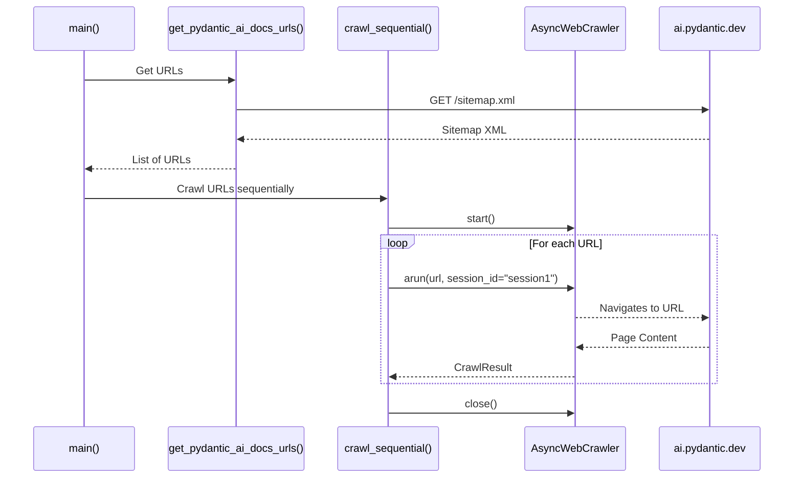
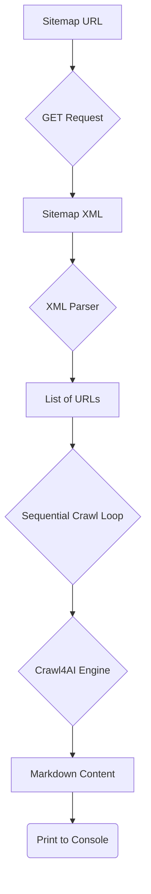

# As-Is Specification: `2-crawl_docs_sequential.py`

**Analysis Date:** 2025-09-24  
**Component:** `2-crawl_docs_sequential.py`  
**Version:** `96b1cdb`  
**Analyst:** @manus-ai  

---

## 1. Component Overview

### **What is this component?**
`2-crawl_docs_sequential.py` is an example script that demonstrates how to crawl a list of URLs one by one (sequentially). It first fetches a list of all documentation URLs from a website's `sitemap.xml` and then iterates through them, crawling each page to generate Markdown content.

### **Where is this component?**
- **Location:** `prototype/crawl4ai/examples/2-crawl_docs_sequential.py`
- **Type:** Example Script

### **Why does this component exist?**
This script serves as a practical example of a common use case: ingesting all pages of a documentation site. It illustrates how to efficiently reuse a single browser session (`session_id`) across multiple crawl operations to avoid the overhead of starting a new browser for each URL.

### **When is this component used?**
This script is used as a reference for developers who need to perform bulk crawling of a known list of URLs. It's a step up in complexity from crawling a single page.

---

## 2. Execution Analysis

### **How is this component executed?**
The script is executed directly from the command line without any arguments.

#### **Execution Context**
- **Prerequisites:** `PYTHONPATH` must be set correctly.
- **Command:** `PYTHONPATH=prototype/crawl4ai python prototype/crawl4ai/examples/2-crawl_docs_sequential.py`

#### **Step-by-Step Flow**
1.  **URL Fetching:** The `main` function first calls `get_pydantic_ai_docs_urls()`.
2.  **Sitemap Request:** This function sends an HTTP GET request to `https://ai.pydantic.dev/sitemap.xml`.
3.  **XML Parsing:** It parses the returned XML content using Python's built-in `xml.etree.ElementTree`.
4.  **URL Extraction:** It extracts all URL strings found within `<loc>` tags in the sitemap and returns them as a list.
5.  **Crawler Initialization:** The `crawl_sequential` function is called with the list of URLs. It initializes an `AsyncWebCrawler` and starts the browser instance.
6.  **Sequential Loop:** The script then enters a `for` loop, iterating through each URL in the list.
7.  **Crawl Operation:** Inside the loop, `crawler.arun()` is called for the current URL. A constant `session_id` is used for all calls, ensuring the same browser tab and session are reused.
8.  **Process Result:** For each result, it checks if the crawl was successful. If so, it prints a success message and the length of the generated Markdown. If not, it prints an error message.
9.  **Crawler Shutdown:** After the loop completes, the `finally` block ensures that `crawler.close()` is called, which gracefully shuts down the browser instance.

### **Verbatim Code Block (As-Is)**
```python
# Full code of 2-crawl_docs_sequential.py is omitted for brevity but is identical to the version in the repository at commit 96b1cdb
# Key sections are analyzed in the flow description above.
```

---

## 3. Visual Diagrams

### **Sequence Diagram**


### **Data-Flow Diagram**


---

## 4. Environment & Dependencies

### **Environment**
- **Python Version:** 3.11+

### **Dependencies**
- **`crawl4ai`:** The core crawling library.
- **`requests`:** For making the HTTP request to fetch the sitemap.
- **`xml.etree.ElementTree`:** (Python standard library) For parsing the sitemap XML.

---

## 5. Inputs, Outputs & Limitations

### **Inputs**
- **Primary:** The hardcoded sitemap URL: `https://ai.pydantic.dev/sitemap.xml`.

### **Outputs**
- **Primary:** Status messages and Markdown lengths are printed to standard output for each crawled URL.

### **Exit Semantics**
- **Success:** Exits with code 0 after processing all URLs.
- **Failure:** If fetching the sitemap fails, it prints an error and exits gracefully. Individual crawl failures within the loop do not stop the script; they are simply reported.

### **Known Limitations**
- **No Parallelism:** The script processes URLs one at a time. This is inefficient for a large number of URLs.
- **Hardcoded URL:** The sitemap URL is hardcoded, making the script inflexible.
- **Basic Error Handling:** While it reports individual crawl failures, it doesn't have any retry logic or more sophisticated error handling.
- **No Data Persistence:** The generated Markdown is not saved; it is only measured and then discarded.

---

## 6. Performance Characteristics

- **Execution Time:** The total runtime is the sum of the time taken to crawl each page individually. For the ~40 URLs in the Pydantic AI sitemap, this can take several minutes.
- **Resource Usage:** Memory and CPU usage are relatively low and stable, as only one browser instance and one active crawl operation are running at any given time.

---

## 7. Optional Enhancements (Future State)

- **Parallel Execution:** The most obvious enhancement is to run the crawl operations in parallel, as demonstrated in `3-crawl_sitemap_in_parallel.py`.
- **Configurable URL:** Allow the sitemap URL to be passed as a command-line argument.
- **Save Output:** Add functionality to save the generated Markdown for each page to a file.

---

## 8. Conclusion

`2-crawl_docs_sequential.py` is a valuable example that bridges the gap between single-page and complex, parallel crawling. It effectively demonstrates the important concept of session reuse for efficiency and provides a clear, easy-to-understand pattern for processing a list of URLs. Its limitations highlight the need for the more advanced patterns shown in subsequent examples.

