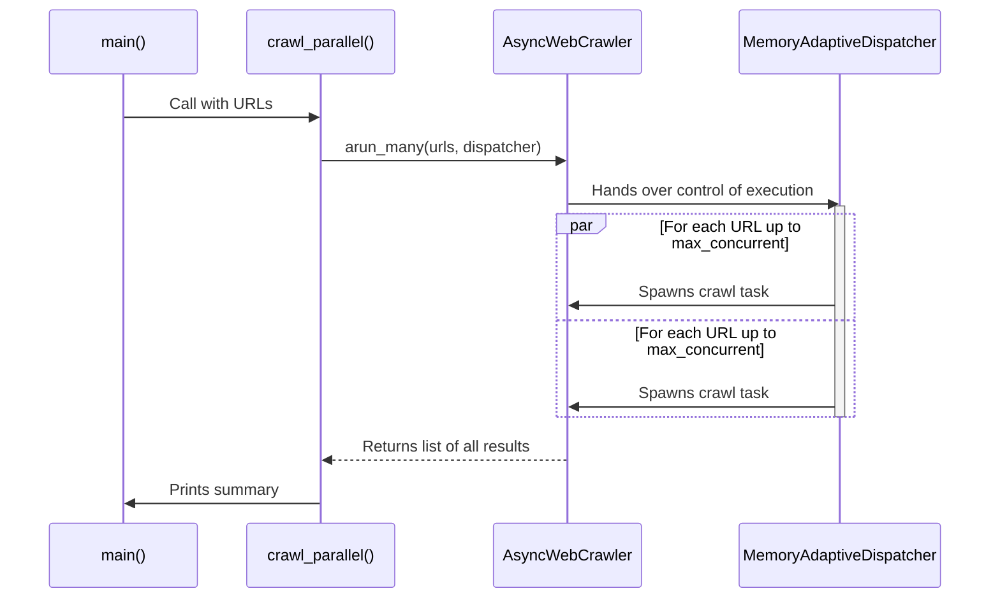
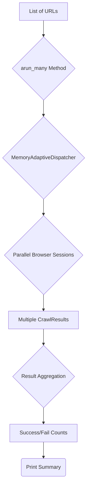

# As-Is Specification: `3-crawl_sitemap_in_parallel.py`

**Analysis Date:** 2025-09-24  
**Component:** `3-crawl_sitemap_in_parallel.py`  
**Version:** `fc7ceaf`  
**Analyst:** @manus-ai  

---

## 1. Component Overview

### **What is this component?**
`3-crawl_sitemap_in_parallel.py` is a high-performance example script that demonstrates how to crawl a list of URLs concurrently. It uses Crawl4AI's `arun_many` method in conjunction with a `MemoryAdaptiveDispatcher` to manage parallel browser sessions, respect system resource limits, and efficiently process a large number of pages.

### **Where is this component?**
- **Location:** `prototype/crawl4ai/examples/3-crawl_sitemap_in_parallel.py`
- **Type:** Example Script

### **Why does this component exist?**
This script exists to showcase the advanced, performance-oriented features of Crawl4AI. It provides a template for production-level ingestion tasks where speed and resource management are critical. It contrasts sharply with the `2-crawl_docs_sequential.py` example by illustrating a much more efficient approach to bulk crawling.

### **When is this component used?**
This script is a reference for developers who need to ingest large websites or document sets quickly. It's the recommended pattern for any task involving more than a handful of URLs.

---

## 2. Execution Analysis

### **How is this component executed?**
The script is executed directly from the command line without any arguments.

#### **Execution Context**
- **Prerequisites:** `PYTHONPATH` must be set correctly.
- **Command:** `PYTHONPATH=prototype/crawl4ai python prototype/crawl4ai/examples/3-crawl_sitemap_in_parallel.py`

#### **Step-by-Step Flow**
1.  **URL Fetching:** The `main` function first calls `get_pydantic_ai_docs_urls()` to fetch the list of URLs from the sitemap, identical to the sequential example.
2.  **Dispatcher Configuration:** The `crawl_parallel` function is called. It configures a `MemoryAdaptiveDispatcher`, setting a memory usage threshold (70%) and a maximum number of concurrent sessions (10).
3.  **Crawler Initialization:** It initializes an `AsyncWebCrawler` within an `async with` block.
4.  **Memory Logging:** A helper function `log_memory` is defined to track current and peak memory usage using the `psutil` library.
5.  **Batch Crawl Execution:** The script calls `crawler.arun_many()`, passing the entire list of URLs and the configured dispatcher. This single call is the core of the script.
6.  **Internal Dispatching:** The `arun_many` method, managed by the dispatcher, takes over. It starts spawning browser sessions and assigning URLs to them, up to the `max_concurrent` limit, as long as the memory threshold is not breached.
7.  **Asynchronous Processing:** All crawl operations run concurrently in the background.
8.  **Result Aggregation:** The `await` on `crawler.arun_many()` completes only after *all* URLs have been processed. The method returns a list containing all the `CrawlResult` objects.
9.  **Process Results:** The script then iterates through the returned list of results, tallying the number of successes and failures and printing any error messages.
10. **Final Summary:** After processing all results, it prints a summary of the counts and the peak memory usage observed during the run.

### **Verbatim Code Block (As-Is)**
```python
# Full code of 3-crawl_sitemap_in_parallel.py is omitted for brevity but is identical to the version in the repository at commit fc7ceaf
# Key sections are analyzed in the flow description above.
```

---

## 3. Visual Diagrams

### **Sequence Diagram**


### **Data-Flow Diagram**


---

## 4. Environment & Dependencies

### **Environment**
- **Python Version:** 3.11+

### **Dependencies**
- **`crawl4ai`:** The core crawling library, specifically using the `MemoryAdaptiveDispatcher`.
- **`requests`:** For fetching the sitemap.
- **`psutil`:** For monitoring system memory usage.
- **`xml.etree.ElementTree`:** (Python standard library) For parsing the sitemap XML.

---

## 5. Inputs, Outputs & Limitations

### **Inputs**
- **Primary:** The list of URLs fetched from the hardcoded sitemap URL.
- **Configuration:** A hardcoded `max_concurrent` value of 10.

### **Outputs**
- **Primary:** A final summary of successful and failed crawls is printed to standard output.
- **Secondary:** Memory usage statistics are printed before and after the crawl.

### **Exit Semantics**
- **Success:** Exits with code 0 after printing the summary.
- **Failure:** If fetching the sitemap fails, it prints an error and exits. Individual crawl failures are caught and reported in the final summary but do not stop the script.

### **Known Limitations**
- **No Data Persistence:** Like the other examples, the generated Markdown content is not saved or used; it is discarded after the crawl.
- **Hardcoded Configuration:** The `max_concurrent` value and dispatcher memory threshold are hardcoded.
- **Observability:** While it tracks memory, it lacks more detailed observability, such as timing for individual crawls or total execution time.

---

## 6. Performance Characteristics

- **Execution Time:** Significantly faster than the sequential approach. The total runtime is determined by the longest-running crawl in the largest batch, not the sum of all crawls. For ~40 URLs, this can reduce runtime from minutes to under a minute.
- **Resource Usage:** High. This script will use significantly more memory and CPU as it runs multiple browser instances in parallel. The `MemoryAdaptiveDispatcher` is crucial for preventing resource exhaustion on constrained systems.

---

## 7. Optional Enhancements (Future State)

- **Dynamic Concurrency:** Adjust the `max_concurrent` value based on system specs (e.g., number of CPU cores).
- **Configurable Dispatcher:** Expose dispatcher settings (memory threshold, check interval) as command-line arguments.
- **Integration with Ingestion:** Feed the results from `arun_many` directly into a parallel ingestion pipeline.

---

## 8. Conclusion

`3-crawl_sitemap_in_parallel.py` is a powerful example that showcases the true potential of Crawl4AI for large-scale data ingestion. It introduces the critical concepts of parallel execution and resource management via a dispatcher. This script serves as the blueprint for any production-level crawling task, demonstrating how to achieve high throughput while maintaining system stability. It is the most architecturally significant of the crawling examples.

