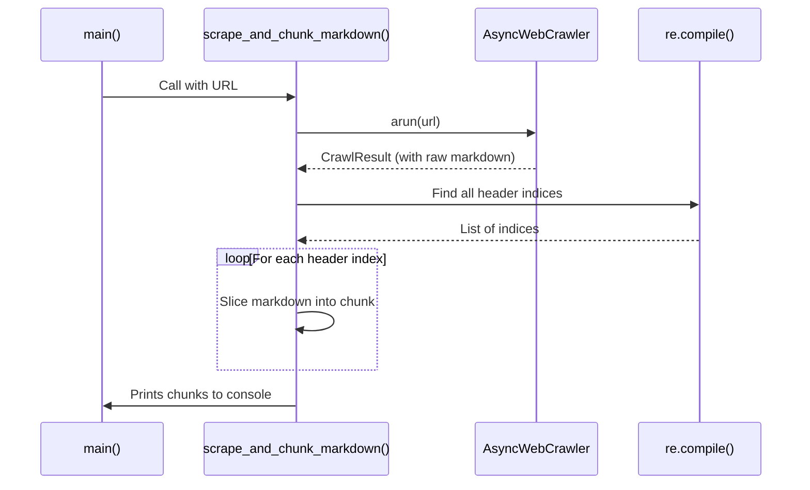
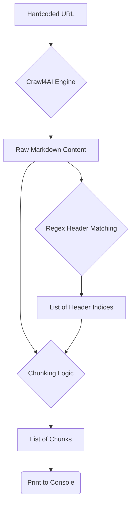

# As-Is Specification: `4-crawl_llms_txt.py`

**Analysis Date:** 2025-09-24  
**Component:** `4-crawl_llms_txt.py`  
**Version:** `4b3f776`  
**Analyst:** @manus-ai  

---

## 1. Component Overview

### **What is this component?**
`4-crawl_llms_txt.py` is an example script that demonstrates a more advanced processing technique. It crawls a single URL pointing to a raw text file formatted as Markdown, and then applies a custom chunking strategy to split the content into smaller pieces based on `#` and `##` headers.

### **Where is this component?**
- **Location:** `prototype/crawl4ai/examples/4-crawl_llms_txt.py`
- **Type:** Example Script

### **Why does this component exist?**
This script exists to show how developers can implement their own content processing logic after the initial crawl and Markdown generation. It provides a concrete example of a common RAG pre-processing step: chunking large documents into smaller, semantically relevant sections before embedding and ingestion.

### **When is this component used?**
This script is a reference for when the default Markdown generation is not sufficient and custom post-processing, such as chunking, is required. It's particularly relevant for ingesting long-form articles or book chapters where semantic boundaries (like headers) are important.

---

## 2. Execution Analysis

### **How is this component executed?**
The script is executed directly from the command line without any arguments.

#### **Execution Context**
- **Prerequisites:** `PYTHONPATH` must be set correctly.
- **Command:** `PYTHONPATH=prototype/crawl4ai python prototype/crawl4ai/examples/4-crawl_llms_txt.py`

#### **Step-by-Step Flow**
1.  **URL Definition:** The `main` function defines a hardcoded URL pointing to a raw text file.
2.  **Crawler Initialization:** The `scrape_and_chunk_markdown` function is called. It uses an `async with` block to manage the `AsyncWebCrawler` lifecycle, ensuring the browser is started and shut down correctly.
3.  **Crawl Operation:** `crawler.arun()` is called to fetch the content from the URL. Since the URL points to a `.txt` file, Crawl4AI treats it as pre-formatted Markdown and its content is passed through directly.
4.  **Header Detection:** After a successful crawl, the script uses a regular expression (`re.compile(r'^(# .+|## .+)$', re.MULTILINE)`) to find the starting index of all lines that begin with `#` or `##`.
5.  **Chunk Creation:** It creates a list of these indices, adds the total length of the document to the end, and then iterates through the indices to slice the original Markdown into chunks. Each chunk starts at one header and ends just before the next.
6.  **Print Chunks:** The script then loops through the generated list of chunks and prints each one to the console, separated by a `--- Chunk X ---` marker.

### **Verbatim Code Block (As-Is)**
```python
# Full code of 4-crawl_llms_txt.py is omitted for brevity but is identical to the version in the repository at commit 4b3f776
# Key sections are analyzed in the flow description above.
```

---

## 3. Visual Diagrams

### **Sequence Diagram**


### **Data-Flow Diagram**


---

## 4. Environment & Dependencies

### **Environment**
- **Python Version:** 3.11+

### **Dependencies**
- **`crawl4ai`:** The core crawling library.
- **`re`:** (Python standard library) For the regular expression-based chunking.

---

## 5. Inputs, Outputs & Limitations

### **Inputs**
- **Primary:** The hardcoded URL: `https://ai.pydantic.dev/llms-full.txt`.

### **Outputs**
- **Primary:** The script prints the number of chunks found and then prints each chunk's content to standard output.

### **Exit Semantics**
- **Success:** Exits with code 0 after printing all chunks.
- **Failure:** If the initial crawl fails, it prints an error message and exits.

### **Known Limitations**
- **Hardcoded URL:** The script is not reusable as the URL is hardcoded.
- **Basic Chunking Logic:** The regex-based chunking is simple and may not handle all edge cases, such as headers within code blocks. It also doesn't handle headers beyond level 2 (`###`, etc.).
- **No Data Persistence:** The generated chunks are printed to the console and then discarded. They are not saved or passed to an ingestion pipeline.
- **Assumes Markdown:** The script assumes the crawled content is Markdown, which is true for the target URL but may not be for others.

---

## 6. Performance Characteristics

- **Execution Time:** Very fast. The script performs only one crawl operation, and the local regex processing is negligible.
- **Resource Usage:** Minimal. It loads the entire document into memory to perform the chunking, but for a typical text file, this is not a significant resource drain.

---

## 7. Optional Enhancements (Future State)

- **Advanced Chunking:** Implement a more robust, parser-based chunking strategy (e.g., using a proper Markdown parser) that can handle nested structures and different header levels.
- **Configurable Chunking:** Allow chunking parameters (e.g., header levels, chunk size) to be configured via arguments.
- **Integration with Ingestion:** Instead of printing, pass the generated chunks to an ingestion function (like one from `doc_ingest.py`).

---

## 8. Conclusion

`4-crawl_llms_txt.py` is a crucial example that demonstrates the next logical step after crawling: custom content processing. It provides a clear and simple illustration of a semantic chunking strategy, a fundamental concept in building effective RAG systems. While the implementation is basic, it effectively communicates the pattern of extending Crawl4AI's output for more advanced use cases, making it a valuable piece of documentation for developers.

