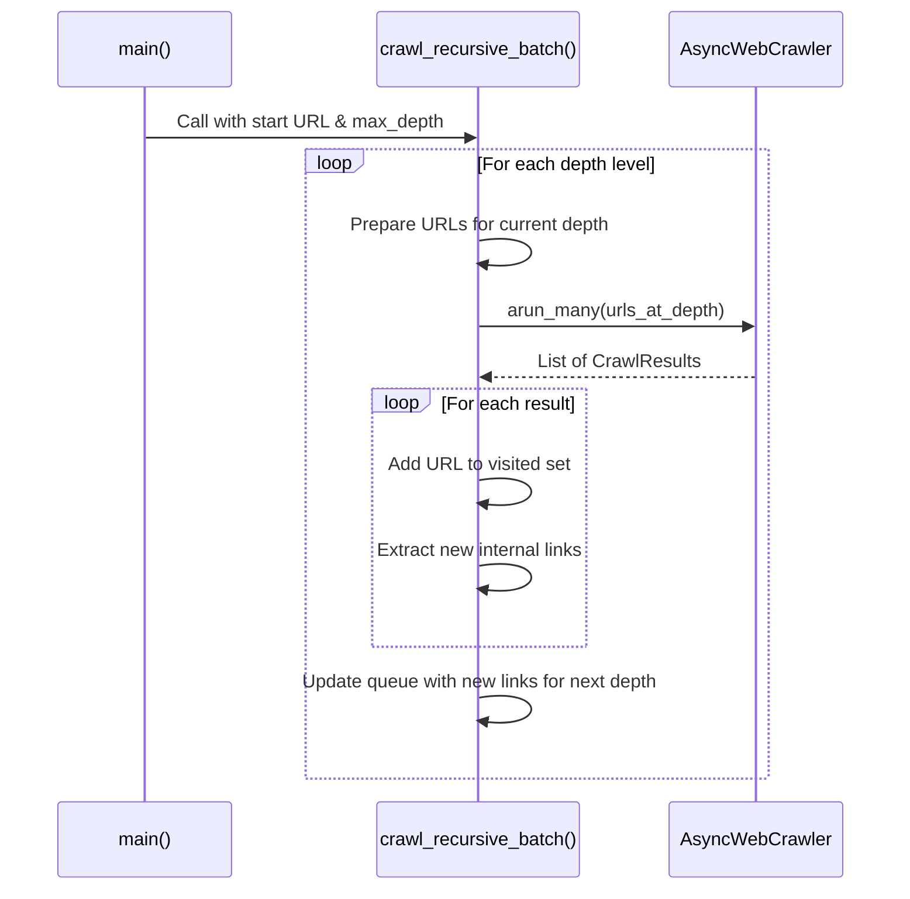

# As-Is Specification: `5-crawl_site_recursively.py`

**Analysis Date:** 2025-09-24  
**Component:** `5-crawl_site_recursively.py`  
**Version:** `ec1f05e`  
**Analyst:** @manus-ai  

---

## 1. Component Overview

### **What is this component?**
`5-crawl_site_recursively.py` is the most complex and powerful example script in the prototype. It demonstrates how to perform a recursive, depth-limited crawl of a website starting from a single root URL. It discovers internal links on each page and adds them to a queue for the next level of crawling, effectively exploring a website on its own.

### **Where is this component?**
- **Location:** `prototype/crawl4ai/examples/5-crawl_site_recursively.py`
- **Type:** Example Script

### **Why does this component exist?**
This script exists to showcase a fully automated site ingestion strategy. Unlike sitemap-based approaches, this method can discover pages that may not be listed in a sitemap, making it suitable for crawling less structured websites. It combines parallel processing with state management (tracking visited URLs) to perform a comprehensive and efficient crawl.

### **When is this component used?**
This is the go-to reference for developers who want to ingest an entire website without a pre-existing list of all URLs. It's the pattern for building a generic, automated web scraper.

---

## 2. Execution Analysis

### **How is this component executed?**
The script is executed directly from the command line without any arguments.

#### **Execution Context**
- **Prerequisites:** `PYTHONPATH` must be set correctly.
- **Command:** `PYTHONPATH=prototype/crawl4ai python prototype/crawl4ai/examples/5-crawl_site_recursively.py`

#### **Step-by-Step Flow**
1.  **Initialization:** The `main` function calls `crawl_recursive_batch` with a starting URL and a `max_depth`.
2.  **State Management Setup:** Inside the function, a `visited` set is created to track URLs that have already been processed to prevent re-crawling and infinite loops. A `current_urls` set holds the queue of URLs to be crawled at the current depth.
3.  **URL Normalization:** A helper function `normalize_url` is defined to remove URL fragments (`#...`), ensuring that `page.html` and `page.html#section` are treated as the same page.
4.  **Depth Loop:** The script enters a `for` loop that runs from `0` to `max_depth - 1`.
5.  **Queue Preparation:** At the start of each depth level, it determines the `urls_to_crawl` by taking the URLs from `current_urls` that are not yet in the `visited` set.
6.  **Batch Crawl:** It calls `crawler.arun_many()` to crawl all URLs for the current depth in parallel, using the `MemoryAdaptiveDispatcher` for resource management.
7.  **Result Processing:** After the batch crawl completes, it iterates through the results.
8.  **Update Visited Set:** For each result, the normalized URL is added to the `visited` set.
9.  **Discover New Links:** If a crawl was successful, it extracts all new, unique internal links from `result.links.get("internal", [])`. These new links are added to a `next_level_urls` set.
10. **Queue Update:** After processing all results for the current depth, `current_urls` is replaced with `next_level_urls`.
11. **Loop Continuation:** The process repeats for the next depth level, now with the newly discovered URLs.
12. **Termination:** The loop terminates when the `max_depth` is reached or when no new URLs are discovered.

### **Verbatim Code Block (As-Is)**
```python
# Full code of 5-crawl_site_recursively.py is omitted for brevity but is identical to the version in the repository at commit ec1f05e
# Key sections are analyzed in the flow description above.
```

---

## 3. Visual Diagrams

### **Sequence Diagram**


### **Data-Flow Diagram**
```mermaid
graph TD
    A[Start URL] --> B{URL Queue (Depth 0)};
    B --> C{Parallel Crawl};
    C --> D[Crawl Results];
    D --> E{Extract Internal Links};
    D --> F{Update Visited Set};
    E --> G{URL Queue (Depth + 1)};
    G --> B;
```

---

## 4. Environment & Dependencies

### **Environment**
- **Python Version:** 3.11+

### **Dependencies**
- **`crawl4ai`:** The core crawling library, using `arun_many` and `MemoryAdaptiveDispatcher`.
- **`urllib.parse`:** (Python standard library) For URL normalization.

---

## 5. Inputs, Outputs & Limitations

### **Inputs**
- **Primary:** A hardcoded list of starting URLs (in this case, just one) and a `max_depth` integer.

### **Outputs**
- **Primary:** Status messages for each crawled URL (`[OK]` or `[ERROR]`) are printed to standard output.

### **Exit Semantics**
- **Success:** Exits with code 0 after the crawl is complete (either by reaching `max_depth` or exhausting all discoverable links).

### **Known Limitations**
- **No Data Persistence:** The generated Markdown is not saved.
- **Hardcoded Start Point:** The starting URL and `max_depth` are hardcoded.
- **Domain Boundary:** The script implicitly stays on the same domain because it only follows links marked as `internal` by Crawl4AI, but this is not explicitly enforced with a domain-checking function.
- **No `robots.txt` Respect:** The crawler does not check or respect `robots.txt` rules, which is a major issue for a production scraper.

---

## 6. Performance Characteristics

- **Execution Time:** Highly variable, depending on the number of links discovered at each depth. Can be very long for large sites.
- **Resource Usage:** Can be very high. The number of URLs can grow exponentially with each depth, leading to significant memory and CPU usage. The `MemoryAdaptiveDispatcher` is essential to prevent crashing.

---

## 7. Optional Enhancements (Future State)

- **`robots.txt` Compliance:** Add a mechanism to fetch and respect `robots.txt` before crawling.
- **Domain Scoping:** Add an explicit check to ensure that discovered links belong to the allowed domain(s).
- **Configurable Start:** Allow the start URL, depth, and other parameters to be configured via the command line.
- **Persistent Queue:** For very large crawls that might be interrupted, implement a persistent queue (e.g., using Redis or a database) to allow the crawl to be resumed.

---

## 8. Conclusion

`5-crawl_site_recursively.py` is the capstone example, demonstrating a sophisticated, autonomous crawling strategy. It combines the parallel processing of the third example with the state management required for recursive exploration. It represents a realistic, albeit simplified, blueprint for a generic website ingestion engine. Its limitations, particularly the lack of `robots.txt` compliance, highlight the critical gap between this prototype and a production-ready system, a key finding from the consolidated audit.

