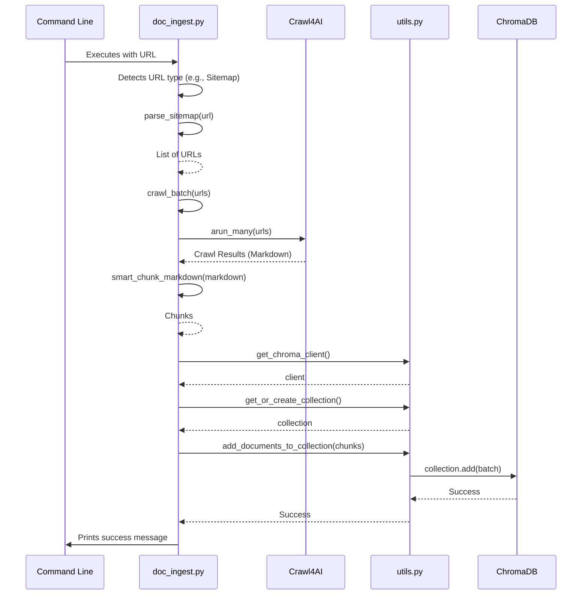
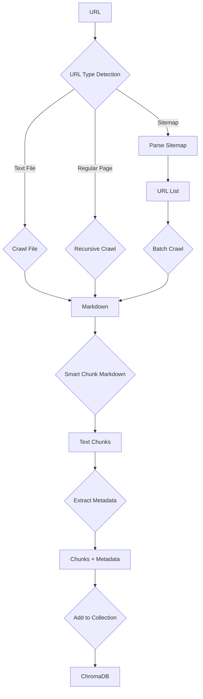

# As-Is Specification: `doc_ingest.py`

**Analysis Date:** 2025-09-24  
**Component:** `doc_ingest.py`  
**Version:** `d56b3eb`  
**Analyst:** @manus-ai  

---

## 1. Component Overview

### **What is this component?**
`doc_ingest.py` is the primary data ingestion engine for the Crawl4AI prototype. It is a command-line utility that intelligently crawls a given URL, processes the content, and inserts it into a ChromaDB vector store. It is designed to handle different types of URLs (plain web pages, sitemaps, and text files) by dynamically selecting the appropriate crawling strategy.

### **Where is this component?**
- **Location:** `prototype/crawl4ai/src/doc_ingest.py`
- **Type:** Command-Line Interface (CLI) Script

### **Why does this component exist?**
This script exists to provide a single, unified entry point for populating the vector database. It orchestrates the entire ingestion pipeline, from fetching web content to chunking it into manageable blocks and finally storing it for retrieval. This automates the process of building the knowledge base that the RAG agent relies on.

### **When is this component used?**
This script is used whenever new content needs to be added to the ChromaDB vector store. It is the first step in the RAG pipeline, executed before any querying or question-answering can take place.

---

## 2. Execution Analysis

### **How is this component executed?**
`doc_ingest.py` is executed from the command line, taking a URL as a required argument and several optional arguments to configure its behavior.

#### **Execution Context**
- **Setup:** The user must have the required Python packages installed and the `PYTHONPATH` correctly set.
- **Command:** `PYTHONPATH=prototype/crawl4ai python prototype/crawl4ai/src/doc_ingest.py <URL> [OPTIONS]`
- **Example (Sitemap):** `... doc_ingest.py https://example.com/sitemap.xml`
- **Example (Text File):** `... doc_ingest.py https://example.com/docs.txt`
- **Example (Regular Page):** `... doc_ingest.py https://example.com/about-us`

#### **Step-by-Step Flow**
1.  **Argument Parsing:** The script parses command-line arguments using `argparse`.
2.  **URL Type Detection:** It checks the URL to determine if it is a sitemap, a text file, or a regular web page using `is_sitemap()` and `is_txt()`.
3.  **Dynamic Crawling:** Based on the URL type, it calls one of three asynchronous crawling functions:
    *   `crawl_markdown_file()` for `.txt` files.
    *   `parse_sitemap()` followed by `crawl_batch()` for sitemaps.
    *   `crawl_recursive_internal_links()` for regular URLs.
4.  **Content Chunking:** The retrieved Markdown content from each crawled page is passed to `smart_chunk_markdown()`, which splits it into smaller pieces based on header hierarchy and character limits.
5.  **Metadata Extraction:** For each chunk, `extract_section_info()` is called to generate metadata, including headers and character/word counts.
6.  **Data Aggregation:** The script aggregates all chunks, their generated IDs (e.g., `chunk-0`), and their metadata into three lists: `ids`, `documents`, and `metadatas`.
7.  **Database Connection:** It connects to ChromaDB using the `get_chroma_client()` and `get_or_create_collection()` functions from `utils.py`.
8.  **Data Ingestion:** The aggregated data is added to the ChromaDB collection in batches using `add_documents_to_collection()`.
9.  **Completion:** The script prints a success message to standard output.

### **Verbatim Code Block (As-Is)**
```python
# Full code of doc_ingest.py is omitted for brevity but is identical to the version in the repository at commit d56b3eb
# Key sections are analyzed in the flow description above.
```

---

## 3. Visual Diagrams

### **Sequence Diagram**


### **Data-Flow Diagram**


---

## 4. Environment & Dependencies

### **Environment**
- **Python Version:** 3.11+
- **Environment Setup:** Requires `PYTHONPATH` to be set to the repository root.

### **Dependencies**
- **`argparse`:** For command-line argument parsing.
- **`asyncio`:** For running asynchronous crawling functions.
- **`crawl4ai`:** The core web crawling library.
- **`requests`:** For fetching the sitemap XML file.
- **`more_itertools`:** Used by `utils.py` for batching.
- **Internal:** `src.utils` for all ChromaDB operations.

---

## 5. Inputs, Outputs & Limitations

### **Inputs**
- **Command-Line Arguments:** A required URL and optional arguments for collection name, database directory, embedding model, chunk size, crawl depth, concurrency, and batch size.

### **Outputs**
- **Primary:** Documents and metadata are inserted into the specified ChromaDB collection.
- **Secondary:** Status messages are printed to standard output.

### **Exit Semantics**
- **Success:** Exits with code 0 after successfully inserting documents.
- **Failure:** Calls `sys.exit(1)` if no URLs are found in a sitemap or if no documents are produced after crawling. However, many other failure modes (e.g., network errors, parsing errors) do not propagate a non-zero exit code and may fail silently.

### **Known Limitations**
- **No Network Robustness:** The `requests.get` call in `parse_sitemap` has no timeout or retry logic.
- **Silent Failures:** Many potential errors (e.g., crawling failures, XML parsing errors) are simply printed to the console, and the script may continue or exit with a success code.
- **Monolithic Design:** The script combines URL detection, crawling, chunking, and database loading into a single, tightly coupled module, making it difficult to test or extend.
- **Non-Robust IDs:** The generated chunk IDs (`chunk-0`, `chunk-1`, etc.) are not unique across different ingestion runs, which will cause collisions.

---

## 6. Performance Characteristics

- **Highly Variable:** Performance is heavily dependent on the URL type, the number of pages to crawl, network conditions, and the `--max-concurrent` setting.
- **Sitemap Crawling:** Can be very fast for small sitemaps due to parallel crawling.
- **Recursive Crawling:** Can be slow and resource-intensive, depending on the site structure and `--max-depth`.

---

## 7. Optional Enhancements (Future State)

- **Modular Architecture:** Refactor the script to separate the concerns of crawling, chunking, and loading into distinct, testable modules.
- **Robust Error Handling:** Implement comprehensive error handling with non-zero exit codes for all failure scenarios.
- **Network Resilience:** Add timeouts and a retry strategy with exponential backoff for all external network calls.
- **Structured Logging:** Replace all `print()` statements with structured JSON logging.
- **Centralized Configuration:** Move all configurable parameters to a central configuration system instead of relying solely on CLI arguments with hardcoded defaults.

---

## 8. Conclusion

`doc_ingest.py` is a powerful and versatile ingestion script that successfully demonstrates a multi-modal crawling and processing pipeline. It is the functional core of the prototype's data loading mechanism. However, its monolithic design, lack of robust error handling, and other prototype-level limitations make it a key candidate for refactoring and hardening in V2 of the project, as highlighted by the consolidated audit report.

