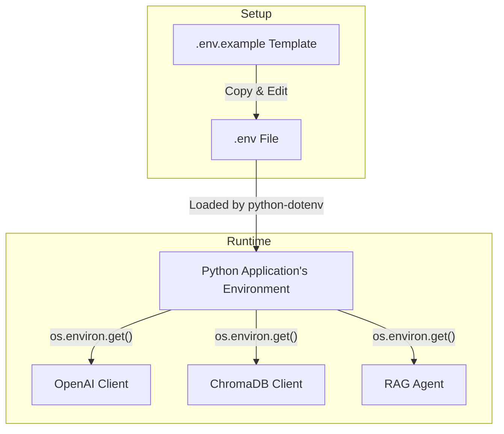

# As-Is Specification: `.env.example`

**Analysis Date:** 2025-09-24  
**Component:** `.env.example`  
**Version:** `9284c9e`  
**Analyst:** @manus-ai  

---

## 1. Component Overview

### **What is this component?**
`.env.example` is a template file that defines the necessary environment variables required to run the Crawl4AI prototype. It serves as a clear, documented starting point for users to create their own `.env` file for local development.

### **Where is this component?**
- **Location:** `prototype/crawl4ai/.env.example`
- **Type:** Configuration Template

### **Why does this component exist?**
This file exists to provide a consistent and documented way to manage environment-specific configurations, such as API keys and database paths, without hardcoding them into the source code. It separates configuration from code, which is a critical best practice for security and maintainability.

### **When is this component used?**
This template is used by a developer before running the application for the first time. They are expected to copy this file to `.env`, and then populate it with their specific values (e.g., their OpenAI API key).

---

## 2. Execution Analysis

### **How is this component executed?**
`.env.example` is not executed directly. It is a passive template. The application scripts (e.g., `rag_agent.py`, `streamlit_app.py`) use a library like `python-dotenv` to automatically load the key-value pairs from a `.env` file (which is a copy of this template) into the environment at runtime.

#### **Execution Context**
1.  A developer copies `prototype/crawl4ai/.env.example` to `prototype/crawl4ai/.env`.
2.  The developer edits the `.env` file to add their `OPENAI_API_KEY` and other custom values.
3.  When a Python script is run, `python-dotenv` (or a similar mechanism) reads the `.env` file.
4.  The variables defined in `.env` become available in the application's environment (e.g., via `os.environ.get("OPENAI_API_KEY")`).

### **Verbatim Code Block (As-Is)**
```dotenv
# OpenAI API Configuration
# Get your Open AI API Key by following these instructions:
# https://help.openai.com/en/articles/4936850-where-do-i-find-my-openai-api-key
# You only need this environment variable set if you are using GPT (and not Ollama)
OPENAI_API_KEY=  # REQUIRED

# The LLM model you want to use from OpenAI. See the list of models here:
# https://platform.openai.com/docs/models
# Example: gpt-4o-mini, gpt-4o, gpt-3.5-turbo
MODEL_CHOICE=gpt-4o-mini  # OPTIONAL (defaults to gpt-4.1-mini if not set)

# ChromaDB Configuration
# Directory where ChromaDB will store its data
CHROMA_DB_DIR=./chroma_db  # OPTIONAL (defaults to ./chroma_db)

# Default collection name for document storage
COLLECTION_NAME=docs  # OPTIONAL (defaults to 'docs')

# Embedding model for document similarity search
EMBEDDING_MODEL=all-MiniLM-L6-v2  # OPTIONAL (defaults to all-MiniLM-L6-v2)
```

---

## 3. Visual Diagrams

### **Data-Flow Diagram**


---

## 4. Environment & Dependencies

### **Environment**
- **Type:** Shell Environment Variables
- **Loading Mechanism:** Implicitly requires a library like `python-dotenv` to be used by the application scripts to load the `.env` file.

### **Dependencies**
- **`python-dotenv`:** This library is listed in `requirements.txt` and is the standard tool for loading `.env` files in Python applications.

---

## 5. Inputs, Outputs & Limitations

### **Inputs**
- **User-provided values** for the variables, especially the `OPENAI_API_KEY`.

### **Outputs**
- **Configured application state** at runtime. The behavior of the OpenAI client, ChromaDB client, and other components is determined by these variables.

### **Exit Semantics**
- Not applicable, as the file is not executed. However, if a `REQUIRED` variable like `OPENAI_API_KEY` is missing from the `.env` file, the application is expected to fail at runtime when it tries to access it.

### **Known Limitations**
- **Security Risk:** Storing secrets like API keys in a plain text `.env` file is a security risk, especially if the file is accidentally committed to version control. The `.gitignore` file correctly excludes `.env`, but the risk remains for local environments.
- **No Validation:** There is no mechanism to validate the format or correctness of the values provided in the `.env` file.
- **No Environment-Specific Overrides:** The current setup does not provide a built-in way to manage different configurations for different environments (e.g., development, testing, production).

---

## 6. Performance Characteristics

- **Loading Time:** Negligible. Loading the `.env` file is a very fast operation that happens once at application startup.

---

## 7. Optional Enhancements (Future State)

- **Secret Management:** Integrate a proper secret manager (e.g., HashiCorp Vault, AWS Secrets Manager, Doppler) for handling sensitive values like `OPENAI_API_KEY` in production.
- **Configuration Validation:** Use a library like Pydantic's `BaseSettings` to load and validate environment variables, providing clear error messages for missing or invalid values.
- **Hierarchical Configuration:** Implement a system that allows for environment-specific overrides (e.g., `config.dev.yaml`, `config.prod.yaml`) for better configuration management.

---

## 8. Conclusion

`.env.example` serves its purpose effectively as a clear and simple configuration template for local development. It correctly identifies required and optional variables and provides helpful comments. However, its reliance on plain text files for secrets and lack of validation make it unsuitable for production environments. The audit's recommendation to implement a formal secret management strategy and a more robust configuration system for V2 is strongly validated by this analysis.

