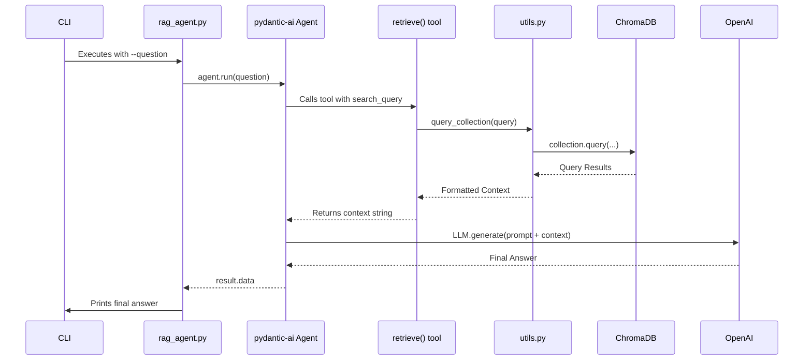
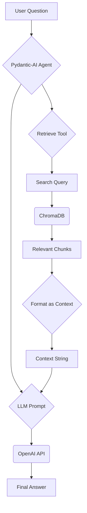

# As-Is Specification: `rag_agent.py`

**Analysis Date:** 2025-09-24  
**Component:** `rag_agent.py`  
**Version:** `6a82ceb`  
**Analyst:** @manus-ai  

---

## 1. Component Overview

### **What is this component?**
`rag_agent.py` is the reasoning and response generation engine of the prototype. It implements a Retrieval-Augmented Generation (RAG) agent using the `pydantic-ai` library. The agent is equipped with a `retrieve` tool that fetches relevant context from a ChromaDB vector store before using an OpenAI LLM to synthesize a final answer.

### **Where is this component?**
- **Location:** `prototype/crawl4ai/src/rag_agent.py`
- **Type:** Core Module & Command-Line Interface (CLI) Script

### **Why does this component exist?**
This component exists to provide the core question-answering functionality. It acts as the "brain" of the system, connecting a user's natural language query to the structured knowledge stored in the vector database, and then generating a coherent, context-aware response.

### **When is this component used?**
This script is used after the vector database has been populated by `doc_ingest.py`. It can be invoked directly from the command line to answer a single question, or it can be imported and used by other components, such as the `streamlit_app.py` web interface, to power interactive chat sessions.

---

## 2. Execution Analysis

### **How is this component executed?**
As a standalone script, it is executed from the command line with a `--question` argument.

#### **Execution Context**
- **Prerequisites:** A `.env` file with a valid `OPENAI_API_KEY` must be present. The ChromaDB database must exist and contain ingested documents.
- **Command:** `PYTHONPATH=prototype/crawl4ai python prototype/crawl4ai/src/rag_agent.py --question "What is Crawl4AI?"`

#### **Step-by-Step Flow**
1.  **Initialization:** The script loads environment variables from the `.env` file and immediately exits if `OPENAI_API_KEY` is not found.
2.  **Argument Parsing:** If run as `__main__`, it parses the command-line arguments, primarily the user's `--question`.
3.  **Dependency Creation:** The `run_rag_agent` function is called, which first constructs a `RAGDeps` object. This object holds the ChromaDB client instance and configuration details.
4.  **Agent Invocation:** The `agent.run()` method is called with the user's question and the `RAGDeps`.
5.  **Tool Selection:** The `pydantic-ai` Agent, guided by its system prompt, determines that it needs more information to answer the question and decides to use the `retrieve` tool.
6.  **Tool Execution:** The `retrieve` tool is executed with the user's question as the `search_query`.
7.  **Context Retrieval:** Inside the `retrieve` tool, functions from `utils.py` are called to query the ChromaDB collection and fetch the most relevant document chunks.
8.  **Context Formatting:** The retrieved chunks are formatted into a single context string.
9.  **Context Return:** The context string is returned to the Agent.
10. **Final Answer Generation:** The Agent makes a final call to the configured OpenAI LLM (e.g., `gpt-4o-mini`), providing the original question, the system prompt, and the newly retrieved context.
11. **Response Synthesis:** The LLM generates a final, context-aware answer.
12. **Output:** The final answer is returned up the call stack and printed to the console.

### **Verbatim Code Block (As-Is)**
```python
# Full code of rag_agent.py is omitted for brevity but is identical to the version in the repository at commit 6a82ceb
# Key sections are analyzed in the flow description above.
```

---

## 3. Visual Diagrams

### **Sequence Diagram**


### **Data-Flow Diagram**


---

## 4. Environment & Dependencies

### **Environment**
- **Python Version:** 3.11+
- **Required Secrets:** `OPENAI_API_KEY` must be set in a `.env` file.

### **Dependencies**
- **`pydantic-ai`:** The core library for creating the agent and tools.
- **`openai`:** The client library for interacting with the OpenAI API.
- **`chromadb`:** The client library for the vector store.
- **`python-dotenv`:** For loading the `.env` file.
- **Internal:** `src.utils` for all ChromaDB helper functions.

---

## 5. Inputs, Outputs & Limitations

### **Inputs**
- **Primary:** A `--question` string provided via the command line.
- **Secondary:** Optional CLI arguments to configure the ChromaDB collection, directory, embedding model, and number of results.

### **Outputs**
- **Primary:** The final, generated answer from the LLM is printed to standard output.

### **Exit Semantics**
- **Success:** Exits with code 0 after printing the response.
- **Failure:** Exits with code 1 if the `OPENAI_API_KEY` environment variable is not set.

### **Known Limitations**
- **OpenAI Dependency:** The agent is hardcoded to use OpenAI's API and models.
- **No Streaming:** The response is returned only after the full generation is complete, which can lead to perceived latency.
- **Simple RAG:** The retrieval logic is basic; it always fetches `n_results` and stuffs them into the context without more advanced strategies like re-ranking or query transformation.
- **Minimal Error Handling:** The script lacks robust error handling for API failures (OpenAI or ChromaDB) or other runtime exceptions.

---

## 6. Performance Characteristics

- **Latency:** The total response time is the sum of the ChromaDB query latency and the OpenAI API latency.
    - **ChromaDB Query:** Typically very fast (<< 1 second).
    - **OpenAI API:** This is the main bottleneck, often taking 3-10 seconds depending on the model and load.
- **Resource Usage:** Memory usage is moderate, primarily driven by the embedding models loaded by ChromaDB and the Pydantic-AI agent's overhead.

---

## 7. Optional Enhancements (Future State)

- **Multi-LLM Support:** Abstract the LLM client to support local models (e.g., via Ollama) or other providers (e.g., Anthropic, Gemini).
- **Streaming Responses:** Implement response streaming to provide a much better user experience, especially in the web UI.
- **Advanced RAG Strategies:** Explore more sophisticated RAG techniques, such as query expansion, document re-ranking, and dynamic `n_results` selection.
- **Stateful Conversations:** Add memory to the agent to allow for follow-up questions and conversational context.

---

## 8. Conclusion

`rag_agent.py` is the intelligent core of the prototype, successfully demonstrating a functional RAG pipeline. It effectively integrates `pydantic-ai` for agentic logic, `utils.py` for data retrieval, and an external LLM for response generation. While its current implementation is a strong proof-of-concept, its limitations in error handling, LLM support, and RAG strategy make it a key area for significant hardening and enhancement in the V2 implementation, as identified in the consolidated audit.

