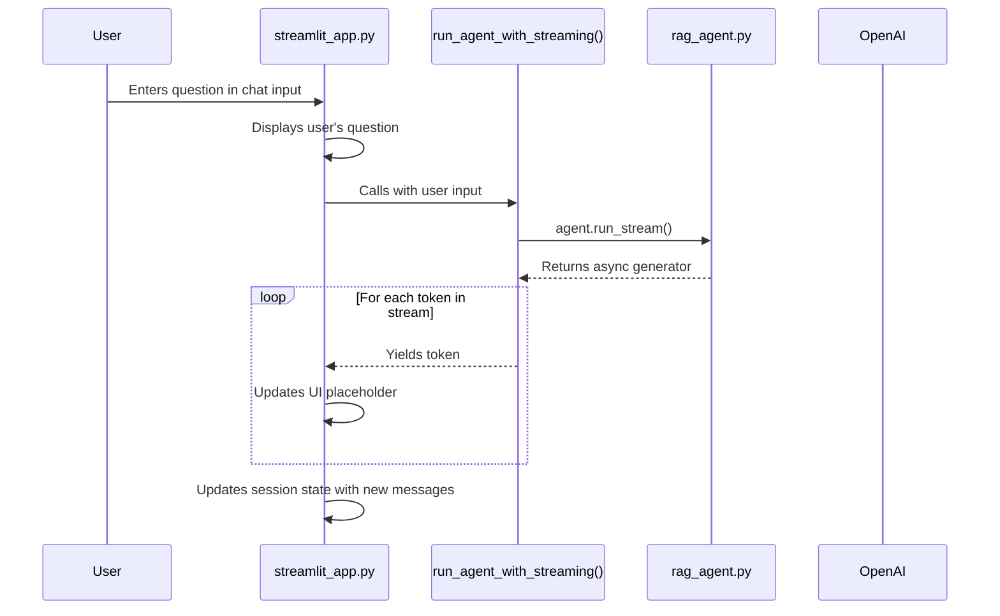
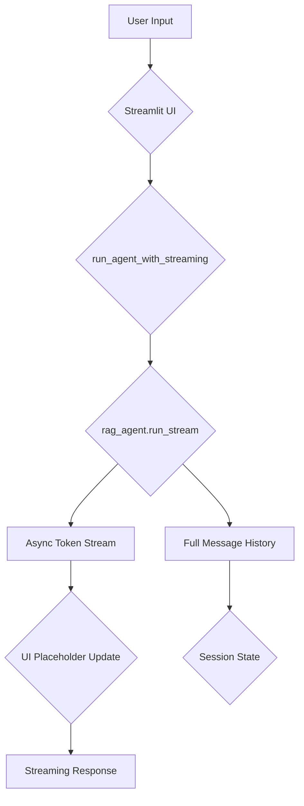

# As-Is Specification: `streamlit_app.py`

**Analysis Date:** 2025-09-24  
**Component:** `streamlit_app.py`  
**Version:** `05da42f`  
**Analyst:** @manus-ai  

---

## 1. Component Overview

### **What is this component?**
`streamlit_app.py` is the user-facing web interface for the Crawl4AI RAG prototype. It provides an interactive chat application, built with the Streamlit framework, that allows users to ask questions and receive answers from the backend `rag_agent` in a streaming fashion.

### **Where is this component?**
- **Location:** `prototype/crawl4ai/app/streamlit_app.py`
- **Type:** Web Application

### **Why does this component exist?**
This component exists to provide a user-friendly and interactive way to demonstrate the capabilities of the RAG agent. Instead of relying on the command line, users can engage in a more natural, chat-like conversation, making the system more accessible and intuitive.

### **When is this component used?**
This is the primary entry point for end-users interacting with the system. It is run after the ChromaDB vector store has been populated with documents via `doc_ingest.py`.

---

## 2. Execution Analysis

### **How is this component executed?**
The application is launched using the Streamlit CLI.

#### **Execution Context**
- **Prerequisites:** A `.env` file with a valid `OPENAI_API_KEY` must be present. The `PYTHONPATH` must be set correctly.
- **Command:** `PYTHONPATH=prototype/crawl4ai streamlit run prototype/crawl4ai/app/streamlit_app.py`

#### **Step-by-Step Flow**
1.  **App Initialization:** When the script is run, Streamlit executes the `main()` function.
2.  **Session State Setup:** On the first run, it initializes `st.session_state.messages` to an empty list and `st.session_state.agent_deps` by calling `get_agent_deps()`. This state persists across user interactions within the same session.
3.  **UI Rendering:** The title is displayed. The script then iterates through any existing messages in `st.session_state.messages` and displays them in the chat UI.
4.  **User Input:** The app displays a chat input box (`st.chat_input`) and waits for the user to enter a question.
5.  **Input Submission:** When the user submits a question, the input is captured.
6.  **Display User Message:** The user's question is immediately displayed in the UI.
7.  **Agent Streaming:** The `run_agent_with_streaming()` function is called with the user's input.
8.  **Streaming Response:** Inside this function, `agent.run_stream()` is invoked. This returns an asynchronous generator.
9.  **UI Update Loop:** The `main` function iterates through the generator. As each new token (`delta`) of the response is received, it is appended to a `full_response` string and the UI placeholder (`st.empty()`) is updated in real-time, creating a typing effect.
10. **Finalize Response:** Once the stream is complete, the final response is displayed without the "typing" cursor.
11. **Update Message History:** The `result.new_messages()` from the agent run (which includes the user prompt, tool calls, tool returns, and the final model response) are appended to `st.session_state.messages`. This ensures the full context is available for the next turn in the conversation.
12. **Re-render:** Streamlit automatically re-renders the app, now showing the complete history including the latest exchange.

### **Verbatim Code Block (As-Is)**
```python
# Full code of streamlit_app.py is omitted for brevity but is identical to the version in the repository at commit 05da42f
# Key sections are analyzed in the flow description above.
```

---

## 3. Visual Diagrams

### **Sequence Diagram**


### **Data-Flow Diagram**


---

## 4. Environment & Dependencies

### **Environment**
- **Python Version:** 3.11+
- **Framework:** Streamlit
- **Required Secrets:** `OPENAI_API_KEY` must be set in a `.env` file.

### **Dependencies**
- **`streamlit`:** The core web application framework.
- **`python-dotenv`:** For loading the `.env` file.
- **Internal:** `src.rag_agent` and `src.utils` to get agent dependencies and run the RAG logic.

---

## 5. Inputs, Outputs & Limitations

### **Inputs**
- **Primary:** User-entered text from the `st.chat_input` widget.

### **Outputs**
- **Primary:** A streaming text response rendered in the chat UI.
- **Secondary:** Updates to the `st.session_state` to maintain conversation history for the duration of the session.

### **Exit Semantics**
- The application runs as a persistent server process until it is manually stopped (e.g., with Ctrl+C in the terminal).

### **Known Limitations**
- **No Persistent History:** Chat history is stored in Streamlit's session state and is lost when the browser tab is closed or the server is restarted.
- **Single-User State:** The session state is tied to a single user session. The application does not have a multi-user architecture.
- **Basic UI:** The user interface is functional but lacks advanced features like conversation management (deleting/renaming chats), user authentication, or configuration options.
- **Blocking Initialization:** The `get_agent_deps()` function is called asynchronously at startup, which could introduce a small delay before the app is fully interactive, though this is minor in the current implementation.

---

## 6. Performance Characteristics

- **UI Responsiveness:** Excellent. Streamlit provides a highly responsive UI.
- **Response Latency:** The "time to first token" is fast, as the response is streamed. The total time to generate the full response is dependent on the backend `rag_agent` and the OpenAI API, which remains the primary bottleneck.

---

## 7. Optional Enhancements (Future State)

- **Persistent Chat History:** Integrate a database (e.g., SQLite, Redis) to store and retrieve conversation histories, allowing users to continue conversations across sessions.
- **Multi-User Support:** Implement user authentication and a multi-tenant architecture to support multiple concurrent users with their own private chat histories.
- **Advanced UI Features:** Add features for managing conversations (e.g., new chat, delete chat, rename chat), a sidebar for settings, and the ability to inspect the context retrieved by the RAG agent.
- **Configuration UI:** Allow users to change settings like the model, collection, or number of retrieved documents directly from the web interface.

---

## 8. Conclusion

`streamlit_app.py` provides an effective and user-friendly interface for the RAG agent. It successfully demonstrates the core functionality in an interactive and accessible way, leveraging Streamlit's strengths for rapid UI development. Its use of `asyncio` and response streaming provides a modern and responsive user experience. While it lacks the features of a production-grade chat application, it serves as an excellent proof-of-concept and a solid foundation for a more advanced V2 user interface.

