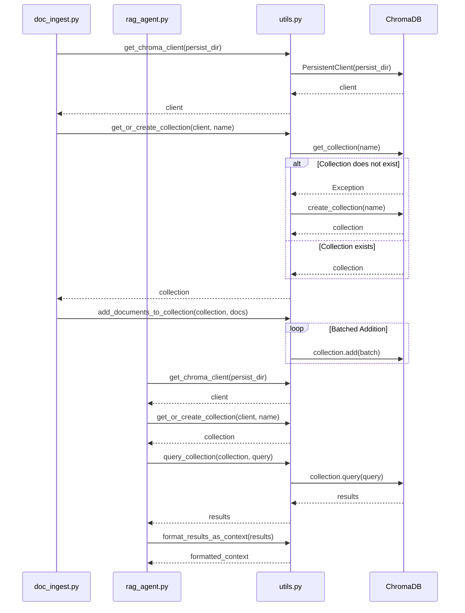
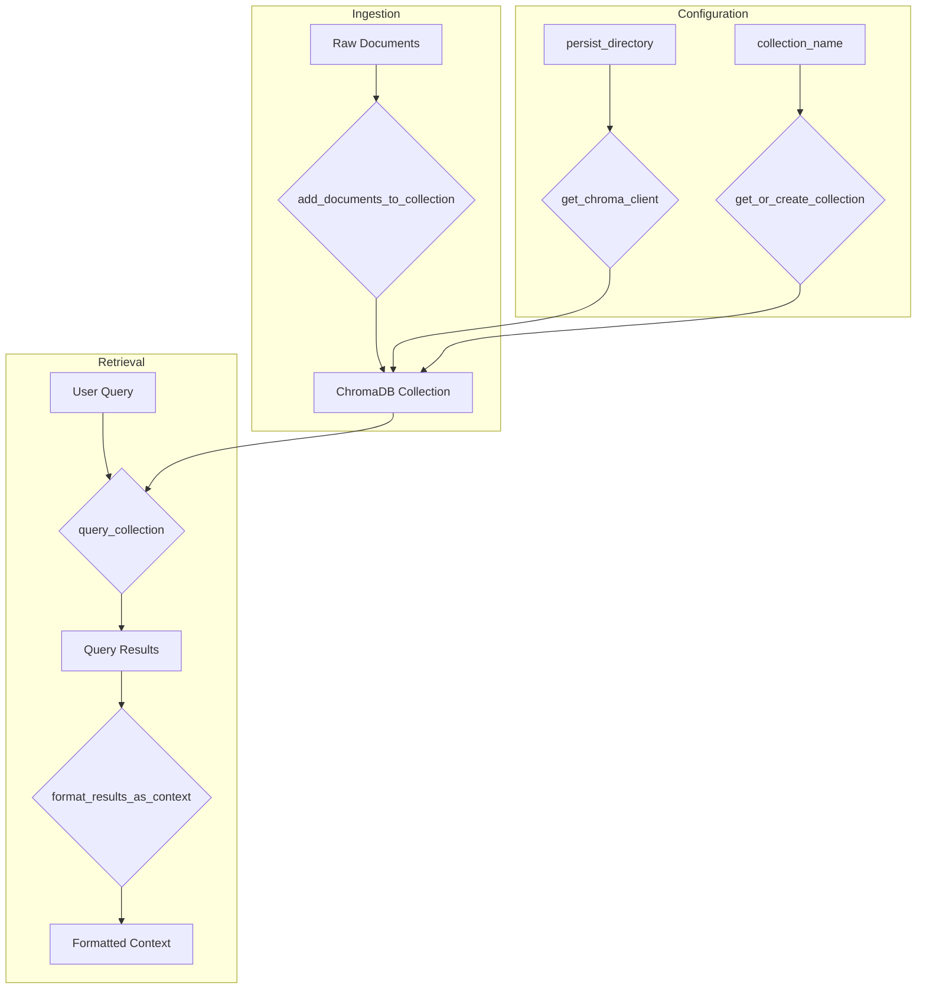

# As-Is Specification: `utils.py`

**Analysis Date:** 2025-09-24  
**Component:** `utils.py`  
**Version:** `3481bbe`  
**Analyst:** @manus-ai  

---

## 1. Component Overview

### **What is this component?**
`utils.py` is the foundational utility module for the Crawl4AI prototype, providing a comprehensive suite of functions for interacting with the ChromaDB vector database. It encapsulates all core database operations, including client creation, collection management, document ingestion, and query processing.

### **Where is this component?**
- **Location:** `prototype/crawl4ai/src/utils.py`
- **Type:** Core utility module (Python)

### **Why does this component exist?**
This module exists to provide a centralized, reusable, and simplified interface for all ChromaDB interactions. By abstracting away the complexities of the ChromaDB API, it enables other modules (`doc_ingest.py`, `rag_agent.py`, `streamlit_app.py`) to perform database operations with minimal code duplication and improved maintainability.

### **When is this component used?**
`utils.py` is used throughout the entire RAG pipeline:
- **During ingestion:** To create or access the vector collection and add processed documents.
- **During retrieval:** To query the collection for relevant documents based on user input.
- **During context formatting:** To transform query results into a structured context for the AI agent.

---

## 2. Execution Analysis

### **How is this component executed?**
`utils.py` is not executed directly. It is imported as a module by other scripts and its functions are called to perform specific database operations.

#### **Execution Context**
- **`get_chroma_client`:** Called at the beginning of any script that needs to interact with ChromaDB to establish a persistent client connection.
- **`get_or_create_collection`:** Called after client creation to ensure the target collection exists before any read/write operations.
- **`add_documents_to_collection`:** Called by `doc_ingest.py` to add crawled and chunked documents to the vector store.
- **`query_collection`:** Called by `rag_agent.py` to retrieve relevant documents based on a user query.
- **`format_results_as_context`:** Called by `rag_agent.py` to format the retrieved documents into a structured context for the AI agent.

#### **Step-by-Step Flow**

**Ingestion Flow:**
1. **`get_chroma_client`:** Establishes connection to ChromaDB persistence directory.
2. **`get_or_create_collection`:** Retrieves or creates the target vector collection with specified embedding model.
3. **`add_documents_to_collection`:** Adds documents in batches to the collection.

**Retrieval Flow:**
1. **`get_chroma_client`:** Establishes connection to ChromaDB.
2. **`get_or_create_collection`:** Retrieves the existing vector collection.
3. **`query_collection`:** Queries the collection for documents similar to the user query.
4. **`format_results_as_context`:** Formats the query results into a structured context string.

### **Verbatim Code Block (As-Is)**
```python
"""Utility functions for text processing and ChromaDB operations."""

import os
import pathlib
from typing import List, Dict, Any, Optional

import chromadb
from chromadb.utils import embedding_functions
from more_itertools import batched


def get_chroma_client(persist_directory: str) -> chromadb.PersistentClient:
    """Get a ChromaDB client with the specified persistence directory.
    
    Args:
        persist_directory: Directory where ChromaDB will store its data
        
    Returns:
        A ChromaDB PersistentClient
    """
    # Create the directory if it doesn't exist
    os.makedirs(persist_directory, exist_ok=True)
    
    # Return the client
    return chromadb.PersistentClient(persist_directory)


def get_or_create_collection(
    client: chromadb.PersistentClient,
    collection_name: str,
    embedding_model_name: str = "all-MiniLM-L6-v2",
    distance_function: str = "cosine",
) -> chromadb.Collection:
    """Get an existing collection or create a new one if it doesn't exist.
    
    Args:
        client: ChromaDB client
        collection_name: Name of the collection
        embedding_model_name: Name of the embedding model to use
        distance_function: Distance function to use for similarity search
        
    Returns:
        A ChromaDB Collection
    """
    # Create embedding function
    embedding_func = embedding_functions.SentenceTransformerEmbeddingFunction(
        model_name=embedding_model_name
    )
    
    # Try to get the collection, create it if it doesn't exist
    try:
        return client.get_collection(
            name=collection_name,
            embedding_function=embedding_func
        )
    except Exception:
        return client.create_collection(
            name=collection_name,
            embedding_function=embedding_func,
            metadata={"hnsw:space": distance_function}
        )


def add_documents_to_collection(
    collection: chromadb.Collection,
    ids: List[str],
    documents: List[str],
    metadatas: Optional[List[Dict[str, Any]]] = None,
    batch_size: int = 100,
) -> None:
    """Add documents to a ChromaDB collection in batches.
    
    Args:
        collection: ChromaDB collection
        ids: List of document IDs
        documents: List of document texts
        metadatas: Optional list of metadata dictionaries for each document
        batch_size: Size of batches for adding documents
    """
    # Create default metadata if none provided
    if metadatas is None:
        metadatas = [{}] * len(documents)
    
    # Create document indices
    document_indices = list(range(len(documents)))
    
    # Add documents in batches
    for batch in batched(document_indices, batch_size):
        # Get the start and end indices for the current batch
        start_idx = batch[0]
        end_idx = batch[-1] + 1  # +1 because end_idx is exclusive
        
        # Add the batch to the collection
        collection.add(
            ids=ids[start_idx:end_idx],
            documents=documents[start_idx:end_idx],
            metadatas=metadatas[start_idx:end_idx],
        )


def query_collection(
    collection: chromadb.Collection,
    query_text: str,
    n_results: int = 5,
    where: Optional[Dict[str, Any]] = None,
) -> Dict[str, Any]:
    """Query a ChromaDB collection for similar documents.
    
    Args:
        collection: ChromaDB collection
        query_text: Text to search for
        n_results: Number of results to return
        where: Optional filter to apply to the query
        
    Returns:
        Query results containing documents, metadatas, distances, and ids
    """
    # Query the collection
    return collection.query(
        query_texts=[query_text],
        n_results=n_results,
        where=where,
        include=["documents", "metadatas", "distances"]
    )


def format_results_as_context(query_results: Dict[str, Any]) -> str:
    """Format query results as a context string for the agent.
    
    Args:
        query_results: Results from a ChromaDB query
        
    Returns:
        Formatted context string
    """
    context = "CONTEXT INFORMATION:\n\n"
    
    for i, (doc, metadata, distance) in enumerate(zip(
        query_results["documents"][0],
        query_results["metadatas"][0],
        query_results["distances"][0]
    )):
        # Add document information
        context += f"Document {i+1} (Relevance: {1 - distance:.2f}):\n"
        
        # Add metadata if available
        if metadata:
            for key, value in metadata.items():
                context += f"{key}: {value}\n"
        
        # Add document content
        context += f"Content: {doc}\n\n"
    
    return context
```

---

## 3. Visual Diagrams

### **Sequence Diagram**


### **Data-Flow Diagram**


---

## 4. Environment & Dependencies

### **Environment**
- **Python Version:** 3.11+
- **Operating System:** Any (tested on Linux)
- **Environment Setup:** Requires `PYTHONPATH` to be set to the repository root to resolve `src` imports.

### **Dependencies**
- **`chromadb`:** Core vector database library.
- **`chromadb.utils.embedding_functions`:** For creating sentence transformer embedding functions.
- **`more_itertools.batched`:** For batching document ingestion.
- **`typing`:** For type hinting.
- **`os`:** For creating persistence directory.

---

## 5. Inputs, Outputs & Limitations

### **Inputs**
- **`get_chroma_client`:** `persist_directory` (string)
- **`get_or_create_collection`:** `client`, `collection_name`, `embedding_model_name`, `distance_function` (strings)
- **`add_documents_to_collection`:** `collection`, `ids`, `documents`, `metadatas`, `batch_size`
- **`query_collection`:** `collection`, `query_text`, `n_results`, `where`
- **`format_results_as_context`:** `query_results` (dictionary)

### **Outputs**
- **`get_chroma_client`:** `chromadb.PersistentClient` object
- **`get_or_create_collection`:** `chromadb.Collection` object
- **`add_documents_to_collection`:** None (modifies collection in-place)
- **`query_collection`:** Dictionary of query results
- **`format_results_as_context`:** Formatted context string

### **Exit Semantics**
- **Success:** All functions return expected objects or None.
- **Failure:** 
    - `get_or_create_collection` uses a broad `except Exception` which can mask specific ChromaDB errors.
    - No explicit error handling for file system errors in `get_chroma_client`.
    - No validation of input data types or formats.

### **Known Limitations**
- **Broad Exception Handling:** The `try...except Exception` block in `get_or_create_collection` is too broad and can hide underlying issues.
- **No Configuration:** Default values for `embedding_model_name` and `distance_function` are hardcoded.
- **No Logging:** Relies on exceptions for error reporting, with no structured logging.
- **No Input Validation:** Assumes all inputs are correctly formatted.

---

## 6. Performance Characteristics

- **`get_chroma_client`:** Fast, typically < 100ms.
- **`get_or_create_collection`:** Can be slow on first run if embedding model needs to be downloaded (up to several minutes).
- **`add_documents_to_collection`:** Performance depends on batch size and document complexity. Batching improves efficiency.
- **`query_collection`:** Fast for small collections, performance degrades with larger datasets.
- **`format_results_as_context`:** Very fast, simple string formatting.

---

## 7. Optional Enhancements (Future State)

- **Specific Exception Handling:** Replace broad `except Exception` with specific ChromaDB exceptions.
- **Centralized Configuration:** Move hardcoded values to a central configuration system.
- **Structured Logging:** Implement structured JSON logging for all operations.
- **Input Validation:** Add Pydantic models for input validation.
- **Dependency Injection:** Use dependency injection for ChromaDB client and collection objects to improve testability.

---

## 8. Conclusion

`utils.py` is the cornerstone of the prototype's data layer, providing a functional and reusable interface for all ChromaDB interactions. While it successfully encapsulates core database logic, its lack of robust error handling, configuration management, and logging makes it unsuitable for production use without significant hardening. It serves as an excellent foundation for a more mature data access layer in V2 of the project.

